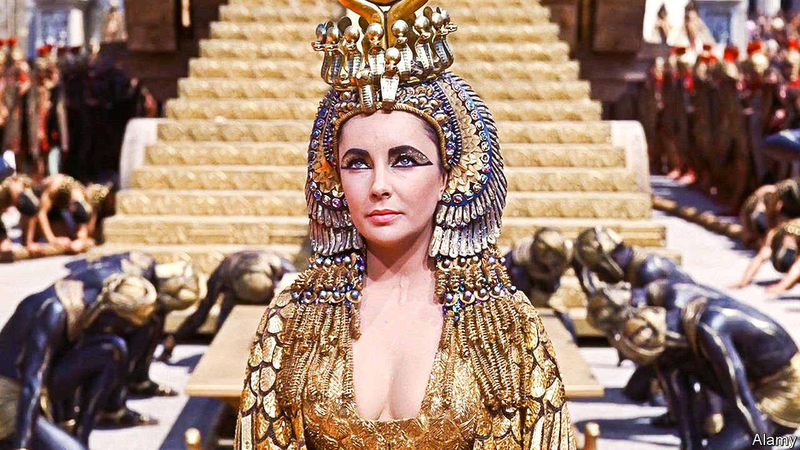

###### Fact and imagination

# The trouble with the past 

##### A biography of Cleopatra exemplifies a fast-and-loose trend in the writing of history 

 

> Jun 12th 2021 

IT IS LIKE reading Suetonius crossed with Danielle Steel. In a new biography of Cleopatra, the queen remembers the feeling of “Caesar’s chest pressing against her body”. As she steps into a bath, “first, her calves disappear, then her harmonious thighs”.

A remarkable woman who smuggled herself into an audience with Caesar in a sack, Cleopatra may well have recalled his embraces fondly. Her thighs may even have been harmonious. No one can know for sure—yet Alberto Angela is unrepentant about the “fictionalised parts” of his book, a smash-hit in Italy and now released in English. This, he argues, is the “only possible approach” if writers are to supply the vivid details readers want. “If reality has gone,” he argues, “we can make plausible reconstructions based on what we know.”


Mr Angela’s Egyptian ruler embodies, if in exaggerated form, a wider trend in the writing of history. Modern readers are keen to discover the intimate aspects of bygone lives, especially those of women and minorities (last year books about feminism and race topped non-fiction charts in both Britain and America). Often, though, the patchy documentary record is, in today’s lurid parlance, not putting out. So, increasingly, authors are putting in what is missing, using their imaginations to add flesh to the skeletons of the dead. Sometimes, as in the case of Cleopatra, quite literally.

History “is not the past”, Hilary Mantel once said. “It’s what’s left in the sieve when the centuries have run through it.” In the case of the classical world, what is left is sparse. Even very basic things are unknown. “Almost anything with a number on, we don’t know,” says Mary Beard of the University of Cambridge. “We don’t know the date of the eruption of Pompeii…We don’t know the population of the Roman Empire.” Evidence regarding women and minorities is especially thin. There are almost no first-person testimonies from Greek or Roman women. Tantalisingly, Nero’s mother is known to have written a memoir, but it was lost (like almost all classical literature). The poetry of Sappho survives only in scraps.

A foreign country, just like this one

Such silences speak volumes. They do not, alas, fill them. That makes the job of scrupulous modern historians painstakingly hard. It took around 12,000 tiny tiles to make a square metre of fine Roman mosaic; to produce a scholarly yet arresting paragraph on classical history, the writer must, like a mosaicist, combine a little colour from a geographer, a sample from a poet and a snippet from an ancient chronicler. Even then, the picture may lack the details and insights modern readers crave.

In part, novels are filling the gap. Authors such as Pat Barker and Madeline Miller have reimagined the classical world and myths from a female perspective. Increasingly, though, books like Mr Angela’s that purport to be non-fiction are blurring the boundaries between history and imagination—leaving readers at a loss to distinguish between documented fact, supposition and fantasy. In “The Kingdom”, Emmanuel Carrère used a bricolage of autobiography, fiction and history to add texture to the story of the earliest Christians; it was a bestseller in France. More commonly, narrative histories that suffuse the past with sights and smells, by authors such as Tom Holland and Helen Castor, have won big readerships.

Academic historians tend to be sniffy about all this. But though their own work may be unsullied by ingratiating ornament, it is also, often, untouched by readers. In one exemplary if extreme comparison, Diarmaid MacCulloch’s exhaustive biography of Thomas Cromwell sold a respectable 32,000 copies in Britain. Ms Mantel’s “Wolf Hall” trilogy, which also recounts Cromwell’s life, has sold 1.9m and counting. As Dan Jones, a popular writer of medieval history, says diplomatically,academic histories tend “not to have crisp readability at the top of their list of priorities”. More bluntly, he reckons that “most academic history is unreadable”.

“People like stories,” Mr Jones explains. What he calls “painful academic textbooks” may be “very useful” to specialists; but they are mostly not intended for a general readership. Academics themselves are beginning to see the problem. Two years ago, Hal Brands and Francis Gavin of Johns Hopkins University wrote an article titled “The Historical Profession is Committing Slow-Motion Suicide”. They lamented the lack of interest in “clear, intelligible prose”, decrying the moment when “academic historians began writing largely for themselves” while “populariser” became “a term of derision”.

The collision of these trends—rising interest in questions not answered in bona fide sources, and the abstruseness of academic texts—represents an opportunity for writers like Mr Angela. He seizes it with aplomb. In “Cleopatra” he evokes the city of Rome so well that you can see its red roofs, and Alexandria so carefully that you can smell the spices in its market (even if the word “ensnare” makes far too many appearances in his rendering of the queen).

To those who think a proper understanding of the past is an important intellectual, even civic, asset, all this is a worry. On the other hand, in the great sweep of history—and of historians—none of it is terribly new. “Everybody has fictionalised history from the very beginning,” says Ms Beard. “That is what Tacitus did. That is what Herodotus did.” Until fairly recently, invention was part of the job description; early historians such as Thucydides openly acknowledged that many speeches in their works were partly made up.

Admittedly, some of the women produced to requite the feminist tastes of modern readers will “be partly fictional”, says Ms Beard. “But then Roman men are partly fictional.” History, she summarises, “is about filling the gaps.” ■

