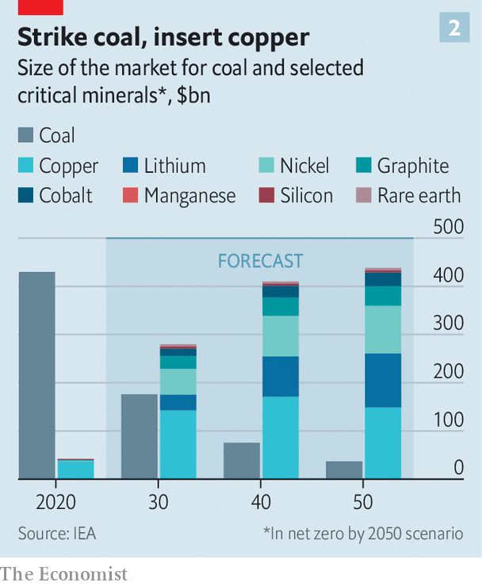
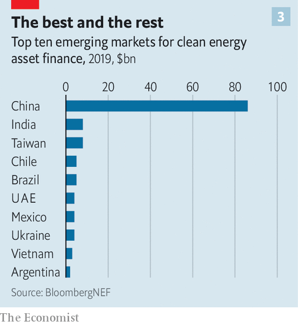
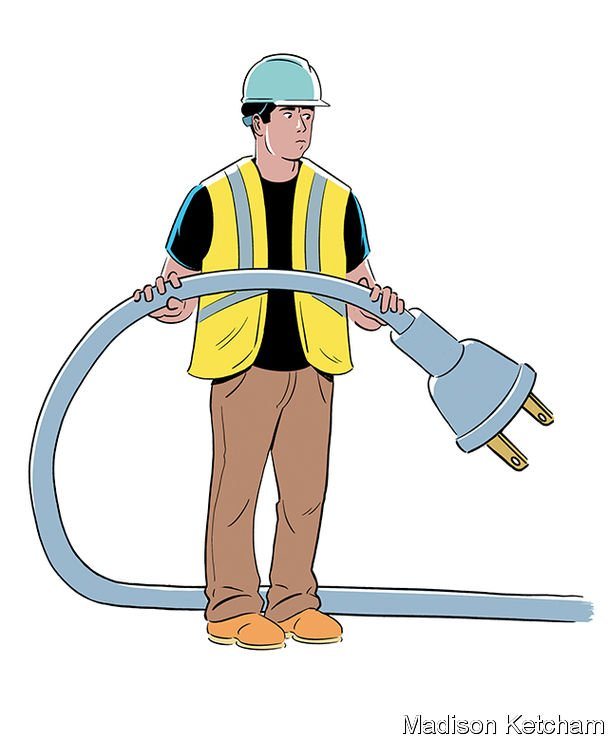

###### Missing ingredients

# The bottlenecks which could constrain emission cuts 

##### The green revolution risks running short of minerals, money and places to build 

 

> Jun 12th 2021 

AT 107 METRES, the three carbon-fibre blades of a Haliade-X marine wind turbine are longer than the wingspan of any airliner ever made. The generator which transforms their rotation—over 300km an hour at the tip—into power requires over 100 powerful magnets made of exotic metals and untold lengths of coiled-up copper. The blades, generator and associated gubbins, weighing around 900 tonnes all-in, have to be installed on a pylon so tall that the blade-tips reach almost as high above the waves as the pinnacle of the Transamerica Pyramid rises over the 600 block of San Francisco’s Montgomery Street.

In May, President Joe Biden’s administration announced the approval of Vineyard Wind, a wind farm off the coast of Massachusetts which will require GE, an American industrial giant, to supply 60 of these airliner-skyscraper-stick-insect hybrids. With a planned capacity of 800 megawatts (MW) Vineyard Wind would on its own increase America’s offshore-wind capacity by a factor of roughly 25. But it will not be on its own. Mr Biden has set a target of 30,000MW (30 gigawatts, GW) of offshore wind by 2030, the equivalent of 37 such projects. Britain, China and Germany have ambitions on a similar scale. Bernstein, a research firm, reckons that the world’s offshore-wind capacity may reach 254GW by 2030, more than seven times today’s level.


A decade ago this would have seemed pure fantasy. Today companies are rushing to meet the demand. A battalion of European energy companies led by Equinor, Orsted and Royal Dutch Shell are competing to build in American waters. Equinor is backing a new wind-tower factory in Albany. Dominion Energy, a utility, is teaming up with a Texan shipbuilder to construct a vessel that can install turbines along America’s east coast. In Britain a rush to secure offshore-wind leases in February led to companies bidding so much for the privilege that the returns risk being nugatory.

Similar booms are under way across the world of renewable energy and electric-vehicle making. The reason is simple. Governments have said they want to cut greenhouse-gas emissions dramatically. Decades of subsidy and support, along with some inspired entrepreneurialism, have made available a range of technologies ready to do so. The time is ripe to push those technologies as hard as possible—both to battle rising temperatures and, governments hope, advance their countries’ role in a new green economy.

However, the fact that wind farms, solar farms and battery-powered vehicles are now cost-competitive does not mean they can be built at whatever pace politicians choose. They require raw materials—sometimes, as with the Haliade-X turbines, in prodigious amounts—siting permits, infrastructure for transmission, recharging and the like. They also need lots of capital. And the necessary materials, sites and capital are all, to various extents in different places, in short supply. The price of lithium has more than doubled in the past year. Copper prices are up by about 70%. Fights are breaking out over permits for new mines, wind and solar farms. Capital remains poorly allocated; while big companies rush for offshore-wind projects around Britain, poorer countries with rising emissions remain starved for investment. If efforts to ease those constraints fail, the world’s decarbonisation plans will stall instead of soar.

 


The Paris agreement of 2015 calls for a world in which average temperatures never climb more than 2°C above those of the preindustrial age, and ideally rise no further than 1.5°C. To that end most large economies have now committed themselves to “net zero” emissions—a notional state where the amount of greenhouse gas emitted is matched by the amount absorbed by natural and artificial “sinks”—by the middle of the century. In the long term, meeting or even approaching those goals is going to require new technologies, even new industries. But any serious attempt also requires the prompt use of the tools already to hand. Over the coming decade urgent research and development aimed at creating future tools must take place in tandem with a massive deployment of technologies which already exist.

Greenie in a bottle

In the past, such energy transitions have been slow affairs, and also cumulative ones; new technologies such as those of steam and oil added to the total energy budget rather than simply replacing what was there before them. Climate action requires the current transition to be both fast and total. A lack of precedent does not make the challenge impossible. But it reinforces the need for foresight and imagination in trying to overcome impediments.

The deployment of renewable technologies is already, by the standards of the past, a remarkable success. In 2019 installed solar capacity was almost 15 times higher than it was in 2010; for wind power, which got started earlier, the figure was a more modest but still impressive 3.4 times. Building capacity has driven down prices, thus making more capacity affordable and driving prices down further. Over the past decade the “levelised costs” of solar, offshore wind and onshore wind—figures that take into account initial investment in equipment and construction, financing and maintenance—dropped by 83%, 62% and 58% respectively, according to BloombergNEF, a research group. Two-thirds of humankind now lives in countries where wind and solar power offer the cheapest new electrical-generating capacity.

By the standards of the future, though, this is, if not paltry, certainly unsatisfactory. Without further intervention, says Seb Henbest, BloombergNEF’s chief economist, “The natural rate of change is far, far too slow to achieve climate targets.” In May the International Energy Agency (IEA), an intergovernmental group founded in the 1970s to protect access to fossil fuels, published a report on how to abandon them that underscored Mr Henbest’s message.

Looking at pathways by which the world could reach net zero by 2050, the IEA confirmed that a lot of what was needed in the near term could be done with existing technologies. With a rapid expansion of renewable generation and electric cars through the 2020s electricity and transport could account for more than 70% of the envisaged drop in energy-related emissions. But following this path sees the world of 2030 building wind and solar farms at about four times the pace of 2020. 60% of new-car purchases would have to be electric, compared with about 5% today. Annual clean-energy investment, already at an all-time high, would have to exceed $4trn by 2030, three times its average over the past five years. And the market for key minerals needed to build clean-energy kit would expand nearly seven-fold.


There is an ethereal charm to replacing fuels won from the depths of the Earth with the barely corporeal powers of sun and wind. But doing so at scale still requires millions of tonnes of raw materials to be mined. Batteries depend on cobalt, lithium and nickel; neodymium and other rare-earth elements (which despite their name are not necessarily rare, though some are) make the magnets for electric generators and motors; the veins and arteries of the green economy run with copper.

The supply chains on which this all depends pose at least two big problems. The first is one of concentration. The mining and processing of minerals needed for renewables is far more geographically concentrated than the drilling of oil and gas; that should be troubling to anyone with a sense of how the distribution of fossil fuels has influenced history and geopolitics. Chinese firms control a large share of many crucial mineral supply chains and of the wherewithal for making batteries, a point anxiously underlined in a review of critical supply chains published by the White House on June 8th.

 


The second problem concerns underinvestment, particularly in metals. Revenues from coal, the dirtiest fossil fuel, continue to exceed those from the minerals that today’s technologies for providing a cleaner future require (see chart 2). Investment in new projects for lithium, nickel and copper were rising before the pandemic, but at less than $25bn the figure in 2019 was only about 5% of the amount invested on upstream oil and gas. And mines require sustained effort; it can take well over a decade to get one up and running.

If the prospect of huge booms in renewables and electric vehicles has not encouraged investment, price signals produced by shortages as those booms get booming may do better. But there are issues that go beyond price. Some investors find a lot of the mining sector off-putting, either because of genuine ethical concern or because they fear tarnishing their environmental and social credentials. They have a point. Lithium mining in Chile has triggered legal fights over water in the Atacama. More than 70% of cobalt is mined in the Democratic Republic of Congo, with a history of corruption and what the sector euphemistically dubs “artisanal” mining by poor men, women and children.

American, European and Asian politicians are eager to boost mining within their countries’ borders. Their citizens may prove less keen. Environmental opposition to a rare-earths mine in Greenland helped topple the ruling party in an election there in April. In Minnesota conservation groups are worried about a proposed copper-and-nickel mine’s effect on creeks and rivers; in May Mr Biden’s government agreed to reconsider the mine’s permits. Its supply-chain review recommends both easing permitting for new mines and limiting their environmental impact; that looks likely to be a hard balancing act.

Rubbed up the wrong way

Benchmark Mineral Intelligence, a research group, recently concluded that in the second half of this decade the world’s lithium demand might be more than twice the level of supply. Truly severe shortages could conceivably reverse the long-term trend towards cheaper batteries. Battery costs have declined by 83% since 2012. But those savings have come more from design and process improvements and economies of scale than from frugality with inputs. Raw materials now represent 50-70% of battery costs, up from 40-50% five years ago, making prices more vulnerable to expensive commodities.

Process changes will still reduce some of the supply gaps. Innovations which spare raw materials can spread very quickly—diamond wire saws, which reduce the amount of silicon wasted in the making of solar cells, went from novelty to industry standard almost overnight. There will be ever more scope for recycling. And there will be substitutions. Driven more by concerns over sustainability than price per se, turbine-makers are moving away from the balsa wood often used in their big blades. Andreas Nauen, the boss of Siemens Gamesa, a turbine manufacturer, says his company will be using foam instead of balsa by the middle of the decade. In February Elon Musk, the boss of Tesla, an electric-car maker, called the availability of nickel the “biggest concern” as the business scales up; he would like to swap nickel-based cathodes for ones made with iron.

Ingenuity can be a powerful force. But it cannot be expected always to offset all the effects of the price signals which drive it. And it cannot do everything all at once. Tesla is still interested enough in nickel to have become an adviser to a nickel mine in New Caledonia.

Another potential shortage is land. Researchers at Princeton University have modelled transition pathways which take America to net zero by 2050. They found that the area occupied by solar and wind farms by 2030 might be about 160,000 square kilometres (62,000 square miles). That is less than 2% of the surface area of continental America. But it is around six times the area currently covered by the water in all the country’s reservoirs—or a little more than the area of Illinois.

Land used for wind farms can be used for other farming, too, and turbines have spread across swathes of America’s Great Plains without too much opposition. But for some technologies and places new projects may still depend less on resource abundance than on concern about local impacts and the political heft or legal budgets of those who live nearby. American offshore wind is still in its infancy in part because rich people who enjoy their views of the open ocean have fought hard to smother it in its crib—a cause which, in Massachusetts, has brought together Kennedys and Kochs. The problem is not restricted to well-off countries. In Indonesia, disputes over land rights have seriously slowed the deployment of renewables.

Building infrastructure to deliver green power from panels and pylons in plains and deserts to the places where it is needed faces some of the same challenges. Grids that are both bigger and smarter than today’s are needed to make use of intermittent renewable sources at the scales being envisaged later this decade. “There will be no renewables without networks,” says Armando Martínez, who leads the grid business of Iberdrola, a big utility. The IEA estimates that annual spending on electricity grids should more than triple by 2030.

But hurdles to grid investments remain stubbornly high. Disagreement over the siting of transmission lines from wind farms in Germany’s north to factories and cities in its south has helped sustain southern coal- and gas-fired power stations. In America a transmission line must receive approval from each state it crosses and, in some states, approval from each county. The result is that such projects can take more than a decade to build, if they are built at all. In Vietnam the growth of solar power in recent years has overwhelmed the country’s ability to transmit it to consumers. Forced curtailments of power from solar farms depress their profitability. Upgrades to the grid are sorely needed, but to date there has been little way for the private sector to provide it—Vietnam Electricity, or EVN, has a monopoly over the country’s transmission and distribution.

Lighting the lantern

Such disincentives point to the biggest supply constraint, especially in developing countries: that of capital. Despite rising interest in green investment, serious attempts to meet the Paris goals will require a further surge in finance for green energy and electrification.

 


The biggest shortfall is in emerging economies other than China, which are expected to account for most of the rise in emissions in the coming decades. Those markets saw just $150bn in clean-energy investment in 2020, down 8% from a year earlier, according to new analysis from the IEA, World Bank and World Economic Forum. In 2019 India attracted just $8bn in clean-energy finance, less than a tenth of China’s total and a sixth of America’s, according to BloombergNEF. Other middle-income and poor countries saw even less investment (see chart 3).

Enel, an Italian utility, is the largest foreign investor in green energy in emerging markets. To warrant the company’s investment, according to Francesco Starace, its boss, a country must have natural resources, such as ample sun or wind, be in need of infrastructure and, most important, “It has to have a legal and regulatory framework we can trust.” A survey by BloombergNEF found that, on average, countries without policies to support clean energy, such as auctions for supply and liberalised electricity sectors, attract one-seventeenth as much clean-energy investment as emerging markets with clearer policies. Government support of entrenched domestic coal production and use, as in India and Indonesia, muddies prospects further.

 


Regulatory and political uncertainties push a country’s levelised costs up. Renewable projects have low operating costs (the sun and wind are free) but require a lot of capital upfront. And in many emerging markets capital is expensive. The average cost of capital for a wind project in Indonesia is about four times that of one in Germany. Investors and politicians in rich countries claim to want to help, but they are not yet doing enough. Signatories to the Principles for Responsible Investment, convened by the UN, aim to promote sustainable finance, but some 90% of signatories are not active in emerging markets. Rich countries have failed to provide the $100bn a year in climate finance that they promised developing countries in Paris.

Politicians and investors are just starting to face these constraints. The G7 meeting on June 11th-13th may see well-targeted green aid announced. Vietnam is contemplating reforms to encourage private investment in its grid. Investors are working to harmonise disclosure of climate risks; governments may do the job for them. The most important catalyst to broader green investment, argues Ed Morse of Citigroup, a bank, would be pricing to account for the environmental and social costs of carbon.

Such measures point to a new phase in the green revolution. The engineering which allows the spinning blades of a single wind turbine to power a thousand homes, or uses lithium from desiccated lake beds to store power from sunlight in the floor of a sedan, is remarkable. But it has to be fed the materials it needs, found places to stand, integrated into the rest of the world’s infrastructure and paid for. Innovation and investment in mining, pressure on the politics of land use and new catalysts for private investment, especially in emerging markets, are less iconic. But they are no less necessary.■

For more coverage of climate change, register for The Climate Issue, our fortnightly , or visit our 

