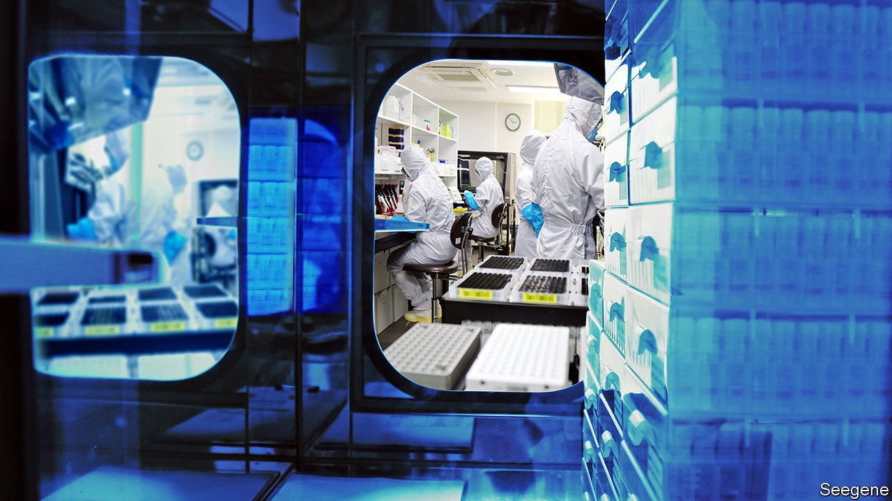

###### Booster shot

# Covid-19 has given South Korea’s biotech firms a shot in the arm 

##### For a booster, they must look to themselves 

 

> Jun 12th 2021 

UNTIL EARLY 2020 Seegene was a medium-sized South Korean purveyor of medical diagnostics with around $110m in annual sales. On January 27th that year Chun Jong-yoon, Seegene’s boss, and his counterparts at other biotechnology firms were summoned to an emergency meeting by the government. Officials asked if they could produce tests for a novel coronavirus which had been spreading rapidly in Wuhan, China. Seegene’s test kit was given the go-ahead by regulators. When cases began spiking soon afterwards in Daegu, in South Korea’s south-east, the company went into emergency mode. “We stopped all other activities and just threw everything we had at covid-19,” says Mr Chun.

Seegene’s employees worked around the clock, snatching a few hours of sleep in hotels near the office. Dozens more were hired overnight. Within weeks the firm was exporting millions of test kits to dozens of countries around the globe. It ended the year with $1bn in sales and $440m in net profit. Other South Korean biotech firms have had a similarly good pandemic. Five of the ten most valuable companies in the KOSDAQ index of medium-sized firms now come from the biotech sector, up from two at the end of 2019. So do two out of the ten biggest companies in the benchmark KOSPI index.


As well as tests, they have been producing treatments and vaccines for covid-19. SK Bioscience started making the AstraZeneca jab this year and in February signed a deal to make the Novavax one. The next month it raised $1.3bn in an initial public offering; its share price shot up by 30% on the first day of trading, which it ended with a market capitalisation of nearly $12bn. In May Samsung Biologics, a listed subsidiary of South Korea’s biggest conglomerate, signed a deal to help distribute hundreds of millions of Moderna shots from next month. It is building a new factory in Incheon which, the company claims, will leave it with a third of the world’s contract-manufacturing capacity for “biosimilars”, generic versions of biotech drugs.

Even before enlisting biotech firms to fight covid-19, successive administrations have used tax incentives, partnerships and grants for research and development to foster the industry. Partly thanks to such largesse it had been growing at nearly 7% a year before the pandemic, twice as fast as South Korea’s GDP. But that was from a low base, and concentrated at the less lucrative me-too end of the market. South Korean firms have yet to come up with a blockbuster treatment licensed around the world. As such, they account for less than 2% of the global biotech market, says Lee Seong-kyou of Korea Biotechnology Industry Organisation, a trade group.

The industry’s boosters believe that, in the words of Kwon Oh-sung of the Korea Institute for Industrial Economics and Trade, a government think-tank, “the pandemic has been a turning point”. Companies have probably “learned more and accumulated more technology over the past year than in the ten years before that”, thinks Mr Lee.

Some lucky ones, such as Seegene, have also accumulated profits which they can put to use. Mr Chun had long hoped to perfect diagnostic kits that can test for more diseases with less complex equipment. This would allow him to widen his customer base from governments and big hospitals to smaller clinics and even individual practices. “We have always had the plan but we never had the cash to work on it,” he says. “Now we do.”

 


Can the cash keep flowing? Some investors may be getting cold feet. After soaring in 2020, South Korean biotech’s share prices have faded somewhat (see chart). Earlier this year six of KOSDAQ’s top ten firms were in biotech: one has joined them since but two have dropped out. Seegene’s shares are worth half as much as at their peak last August. The market value of SK Bioscience has dipped below what it was after its sparkling debut. Shares of Samsung Biologics and Celltrion, the industry’s two giants, are trading below their recent peaks.

Given the relatively simple technology involved in products such as test kits, companies like Seegene now find themselves exposed to intense competition, including from industry behemoths such as Roche of Switzerland. Startups gripe that financing is hard to come by. Everyone grumbles about a shortage of skilled workers. The pandemic has given the industry a shot in the arm. For a booster, the companies must look to themselves. ■

Dig deeper

All our stories relating to the pandemic and the vaccines can be found on our . You can also listen to , our podcast on the race between injections and infections, and find trackers showing ,  and the virus’s spread across  and .

