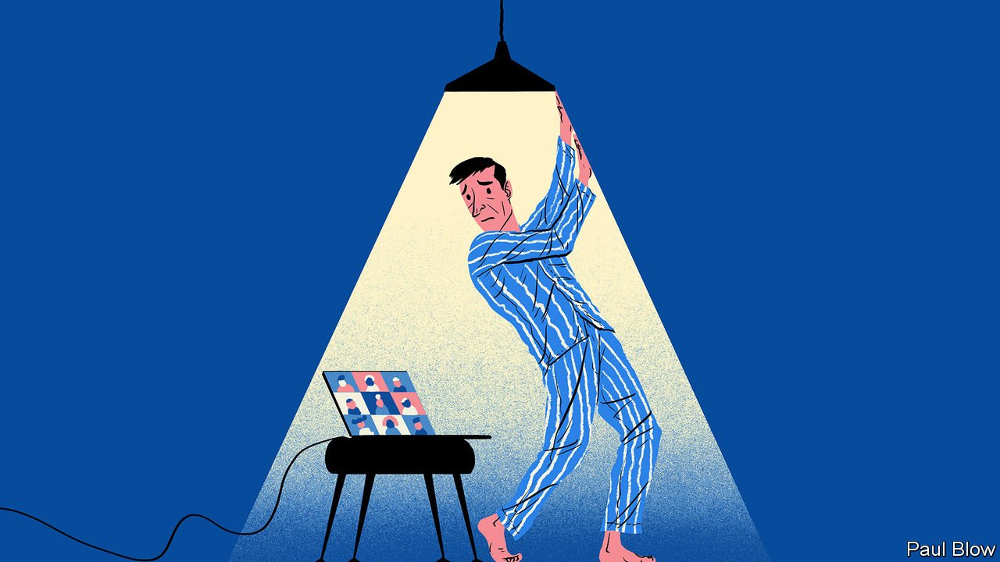

###### Bartleby

# Remote workers work longer, not more efficiently 

##### A new study on remote working 

 

> Jun 10th 2021 

THE RETURN to the office is well under way, just as summer in the northern hemisphere begins. Pretty soon, people will be able to resume the habit of staring wistfully out of the window, hoping it will still be sunny at the weekend. As many workers embrace a hybrid pattern, perhaps commuting 2-3 days a week, the experiment in full-time home-working is ending. At the same time, assessments of its effectiveness are proliferating.

Early surveys of employees and employers found that remote work did not reduce productivity. But a new study* of more than 10,000 employees at an Asian technology company between April 2019 and August 2020 paints a different picture. The firm uses software installed on employees’ computers that tracked which applications or websites were active, and whether the employee was using the keyboard or a mouse. (Shopping online didn’t count.)


The research certainly concluded that the employees were working hard. Total hours worked were 30% higher than before the pandemic, including an 18% increase in working outside normal hours. But this extra effort did not translate into any rise in output. This may explain the earlier survey evidence; both employers and employees felt they were producing as much as before. But the correct way to measure productivity is output per working hour. With all that extra time on the job, this fell by 20%.

The interesting thing is why this happened. The academics were able to analyse how much time the employees spent in “collaboration hours”, defined as various types of meetings, and how much time they had as “focus hours”, uninterrupted by calls or emails, where they could concentrate on their tasks. Despite working longer hours, the employees had less focus time than before the pandemic. Instead, all their extra time was taken up by meetings. Long-time readers may recall Bartleby’s law: 80% of the time of 80% of the people in meetings is wasted. This study certainly offers evidence for the proposition.

One possibility is that managers are less certain of their team’s commitment and are holding more meetings to check on them. Another is that managers call so many meetings to validate their own existence when they are not in the office. However, the academics suggest the greater need for meetings is the result of the greater difficulty of co-ordinating employees when they are working remotely—another hint that the process is inefficient. When working remotely, employees also spend less time being evaluated, trained and coached.

This seems a raw deal for the employees. They received no more money for the overtime. Although they saved commuting time, this did not offset the extra hours spent in meetings. Not all workers behaved the same way. Those who had worked at the company the longest tended to be more productive, suggesting that they found it easier to navigate the hazards of home-working. Employees with children worked around 20 minutes a day more than those without, implying an even greater fall in their productivity, presumably because they were distracted by child-care duties.

So does this mean companies will abandon remote working altogether, even its hybrid version? The academics point out that the staff at the firm under study are nearly all college-educated and their roles “involve significant cognitive work, developing new software or hardware applications or solutions, collaborating with teams of professionals, working with clients, and engaging in innovation and continuous improvement”. Such work may have posed a particular challenge in remote settings, compared with occupations like responding to customer calls, say, where employees may work to a scripted set of replies.

It is hardly surprising that there would be some teething and co-ordination problems involved with remote working. The practice was, after all, imposed suddenly. The study stopped last August and one wonders whether employees have learned to use their time more efficiently since then. And the research shows that employees were able to achieve as much output with slightly less “focus time” than they had at the office. The real source of inefficiency—surprise, surprise—was the time spent in meetings. And the answer is simple; don’t call as many, and keep them short.

* “Work from home &amp; productivity: evidence from personnel &amp; analytics data on IT professionals”, by Michael Gibbs, Friederike Mengel and Christoph Siemroth

