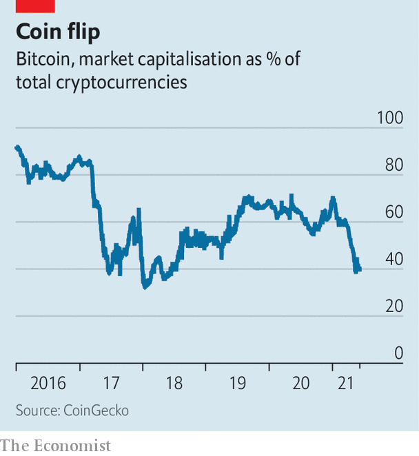
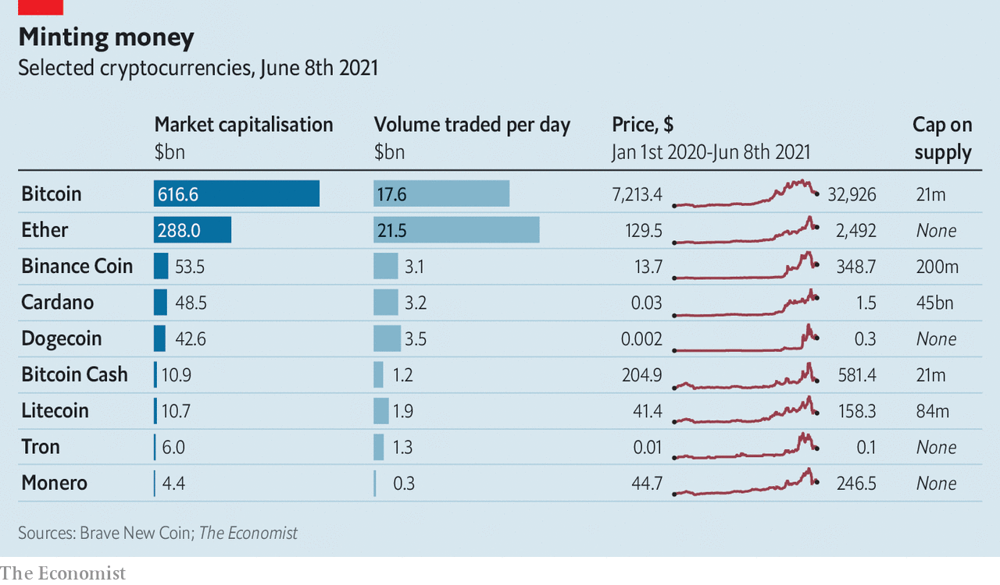

###### Beating bitcoin

# Cryptocoins are proliferating wildly. What are they all for? 

##### They range from fads to potential rivals to bitcoin 

 

> Jun 10th 2021 

MIAMI IS THE mecca of anti-establishment finance. Or so it seemed on June 4th and 5th, when 12,000 people clad in everything from flannel suits to festival gear and whale-shaped hats descended on the world’s biggest  conference. On stage crypto gurus such as Jack Dorsey, Twitter’s boss, praised those striving for fortune and freedom. The crowd erupted when Nayib Bukele, El Salvador’s president, announced plans to make bitcoin legal tender. (On June 9th lawmakers approved his proposal.) “This is not a moment,” beamed the mayor of Miami. “This is a movement.”

The movement is far from its destination. Now in its 13th year, bitcoin has become an investment sensation. But, Mr Bukele’s enthusiasm aside, it remains a poor and hardly used medium of exchange. A host of smaller cryptocurrencies, meanwhile, are rushing in. Fully 10,000 are listed on CoinMarketCap, a website, nearly twice as many as a year ago. Bitcoin accounts for 40% of the total value of all cryptocurrencies today, compared with 70% in January. Elon Musk, an electric-car tycoon whose tweets seem to make the weather in crypto markets, says he now favours younger rivals. Could one of them steal bitcoin’s crown?

 


Most do not want to. Many listed on exchanges are “tokens”, which can become tools of speculation but, in contrast to “coins”, do not aspire to the full functions of money. The purpose of “security” tokens, like that of stocks and bonds, is investment: they represent ownership in firms or other assets, recorded on a distributed ledger. “Utility” tokens, meanwhile, are tradable credits that can be bought and used in exchange for a service. Crypto exchanges, for example, sell tokens that punters use to pay transaction fees.


That still leaves 779 coins. Many are tiny: just 110 have a market capitalisation exceeding $100m. Some are fads and will prove fleeting. The more serious contenders fall into two categories: the “bitcoin clones” seek to fix the cryptocurrency’s flaws as a means of payment; and the “ether clones” aim to perform new functions.

Consider the bitcoin clones first. One problem with bitcoin is its volatility: in the space of a few hours on May 19th, for instance, prices fell by 30%. To avoid such swings, so-called “stablecoins” track government-issued (or “fiat”, in the crypto-lingo) currencies instead.

Other clones try to fix bitcoin’s privacy problems. Since all bitcoin transactions are recorded on its blockchain, which is public, they leave a trail. On June 7th American officials said they had recovered $2.3m-worth of a ransom paid in bitcoin to the hackers who  in May, after identifying the virtual wallet they had used. Some coins try to provide greater anonymity by using masking tech. Monero, for instance, tries to make it hard to link flows to a fixed identity, trace funds or observe transaction size.

Still other clones try to make payments cheaper and quicker to process. To ensure that transactions are legitimate without relying on a central authority, bitcoin relies on a system called “proof of work”, where “miners” compete to validate blocks of transactions by solving time-consuming numerical problems. Yet bitcoin’s design is such that it can handle only around seven transactions per second. The creator of Litecoin therefore tweaked the algorithm so that new blocks are processed more often. Dogecoin, a coin that was developed as a joke and which often features in Mr Musk’s tweets, has no cap on its supply.

More radical alternatives, such as Cardano and Tron, have switched to “proof of stake”, under which validators are rewarded in proportion to the number of coins they lock into an escrow wallet while transactions are verified. The process involves less hardware and fewer energy costs.

But for every flaw that the clones try to fix, a desirable attribute of bitcoin seems to be lost. Stablecoins, for instance, require users to trust both the issuer (which must hold hard cash in reserve) and a government, defeating crypto’s original anarchic aims. Some may not be trustworthy. In February the issuer of Tether, the biggest, was fined $18.5m by authorities in New York for lying about its dollar stash.

Big exchanges have delisted the ultra-private Monero, fearing its potential for . Dogecoin is even more volatile than bitcoin. The proof-of-stake system, meanwhile, encourages hoarding, limiting liquidity. It also favours concentration, which goes against decentralisation, says Eswar Prasad of Cornell University. These trade-offs may be why none of the clones has come close to overtaking bitcoin (see table). According to analysts at Brave New Coin, a research firm, alternative measures, such as activity on GitHub, a platform used by programmers to collaborate on projects, show that bitcoin remains uniquely popular.

 


The threat comes instead from currencies with nimbler blockchains that can do more than record payments. Ethereum, which hosts ether, the second-most-valuable cryptocurrency, can execute automated programmes that, for example, move money between wallets only after a specific event. Ether and its clones have become central to the budding field of decentralised finance (DeFi), where “smart contracts” replicate sophisticated financial transactions, such as making loans or offering insurance, without a trusted intermediary. That is boosting adoption. Over the past 12 months DeFi drove 40% of ether transactions, up from 7% in the previous period, reckons Chainalysis, a data firm.

With around $59bn in capital deposited in its applications, DeFi remains small. But it is growing fast, and bitcoin, with a blockchain that cannot accommodate smart contracts, is ill-equipped to ride the wave. Its first-mover advantage and scarcity make bitcoin likely to remain attractive as a speculative asset. Yet that could prove poor consolation. ■

A version of this article was published online on June 9th 2021

