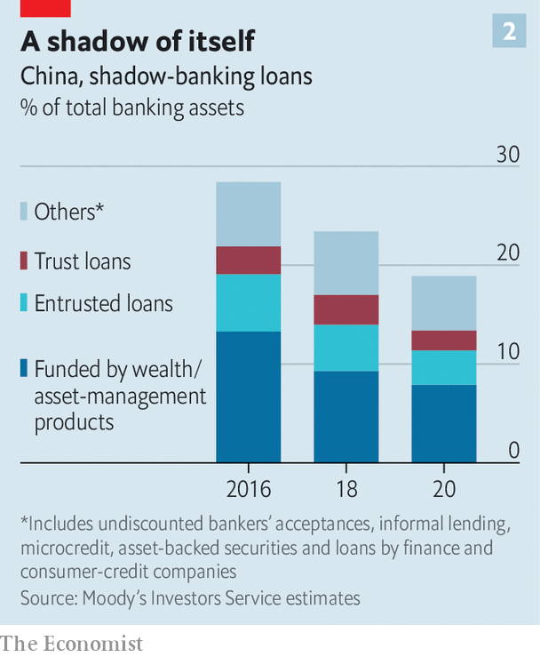

###### Chasing pots of gold

# Foreign asset managers are eyeing China’s vast pool of savings 

##### Do they stand a chance against home-grown competitors? 

 

> Jun 10th 2021 

ZHANG KUN is the rock star of Chinese fund management. His name often makes headlines; whole articles are dedicated to his investment calls. Investors vie to get into his funds, one of which has reportedly delivered a return of 700% since it was launched eight years ago. He is among a growing number of managers who generate more hype than the firms that employ them. With personalities like Mr Zhang on its payroll, E-Fund, a state-owned investment group, hardly needs to advertise.

Now a swathe of  hopes to take on Mr Zhang and his ilk by entering China’s asset-management industry. Last month Goldman Sachs, a Wall Street bank, announced a wealth-management venture with ICBC, China’s largest commercial lender by assets. BlackRock, a giant American asset manager, will join forces with China Construction Bank (CCB). Amundi, a French firm, has linked up with Bank of China and Schroders, a British investment group, with China’s Bank of Communications. In March JPMorgan Asset Management said it would buy a 10% stake in China Merchant Bank’s wealth business. Nearly 20 global investors are setting up fund-management firms; others are launching private securities funds.

 


The prize is access to a pot of money worth 120trn yuan ($18.8trn), which includes investments made by everyone from the average saver to the ultra-rich in mutual funds, trusts, wealth and other asset-management products. Though the pool of funds is smaller than in the West—asset managers in North America oversaw $59trn last year, according to PwC, an accounting firm—it is expected to expand rapidly. As more people grow comfortable giving their money to managers instead of picking stocks or buying property, China’s pot could nearly treble, hitting 320trn yuan by 2030, reckons Oliver Wyman, a consultancy (see chart 1). But foreigners’ attempts to crack other parts of China’s financial market have yielded underwhelming results. Could this time be different?


 


For China’s regulators, the new ventures are a high-stakes experiment meant to transform how savers think about investing. For years retail investors ploughed cash into deposit-like investment products sold and backed by state banks. The principal on such products was considered guaranteed, but the banks funnelled the cash towards high-risk borrowers such as small property developers or coal-mining outfits. By 2016 the banks’ wealth-management arms oversaw around 13% of total banking assets (see chart 2). But regulators cracked down, no longer willing to see banks and ordinary savers exposed to the intensifying risks.

Guaranteed products have been banned. Meanwhile banks’ wealth assets have been spun into new subsidiaries. These must wind down the old deposit-like products and design new ones based on net asset value. In 2020 the new units had 26trn yuan in assets under management, reckons CICC, an investment bank. It is with them that foreign investors have been invited to establish joint ventures.

The call sounds familiar.  for generations, with an eye to every corner of the industry, from retail banking to securities. In 1995 CCB and Morgan Stanley, another Wall Street bank, set up CICC; in 2004 Goldman was allowed to establish the first foreign securities joint venture. But when you look back over the past two decades, the developments seem underwhelming and the returns meagre.

That was largely because China opened up only when home-grown firms were big enough to withstand competition. Some foreign retail banks launched gung-ho expansion plans only to quit the market later, defeated by domestic giants’ extensive branch networks. Securities joint ventures have taken more than a decade to pass majority control to foreign investors. Payments firms such as Visa and Mastercard were shut out until mobile payments became dominant and competition futile.

Wealth management could be different. For one, the foreigners do not face a mature market with insurmountable competition. Regulators’ sweeping reforms mean that they are in fact entering what could become the world’s largest market for retail wealth at an early stage.

This is evident in the financial products on offer today. China’s mutual-fund industry has grown at a fantastic pace in recent years. Many firms now oversee 1trn yuan in assets. Money-market funds are ubiquitous. But product design is still in its infancy. Global firms are expected to bring a new level of sophistication. Tuan Lam of Goldman says his group will offer quantitative products such as algorithmic and factor-based strategies, and cross-border and alternative-asset investments. “These are not present in China right now,” he notes.

Another benefit of the joint ventures is their links to China’s largest financial firms. The banks and their tens of thousands of branches were key intermediaries during the first era of wealth management and, say experts, may also define the next. Their wealth-management subsidiaries have vast portfolios and huge numbers of clients. Take CCB. It has more than 14,700 branches; last year it managed 2.2trn yuan in wealth-management products and attracted more than 4.4m new investment and wealth-management clients. Access to customers is “one of the benefits of partnering with one of the largest banks in China”, says Susan Chan of BlackRock.

Yet success will depend on foreigners’ ability to establish and market themselves. Goldman and BlackRock have some name recognition in China by virtue of their size. Amundi and Schroders, by contrast, are unknown outside financial circles. And teaming up with home-grown banks has some downsides. A potential customer at a bank branch will be offered a suite of products, which will include those designed and branded by the joint ventures, but also those designed solely by the bank. Online, joint-venture offerings will probably appear on smartphone apps on a list of commoditised products. The foreign groups will therefore have to make sure their offering is advertised sufficiently to clients—no easy task given that tens of thousands of banks’ relationship managers will be responsible for sales. It can be done, but only with hefty investment in staff training, says Philip Leung of Bain, a consultancy.

Another problem is competing with superstars such as Mr Zhang, who often manage money for giant mutual funds. Financial news in China is abuzz with stories on the performance of star managers. Many retail investors make decisions based on such information. Few clients are interested in a fund’s risk controls, notes Fabrice Maraval, an executive who has worked at two Sino-foreign financial ventures. Instead, they ask, “What’s your ranking on the list of top fund managers?”, he says.

Executives at several joint ventures bristle at the idea of hiring stars who market their funds. “It’s just not our culture,” says one. Instead they must slowly build trust with clients through solid performance and prudent risk controls. Zhong Xiaofeng of Amundi describes his group’s strategy in China as a “long-haul effort”. If foreigners are to give the stars a run for their money, it will have to be. ■

A version of this article was published online on June 8th 2021

