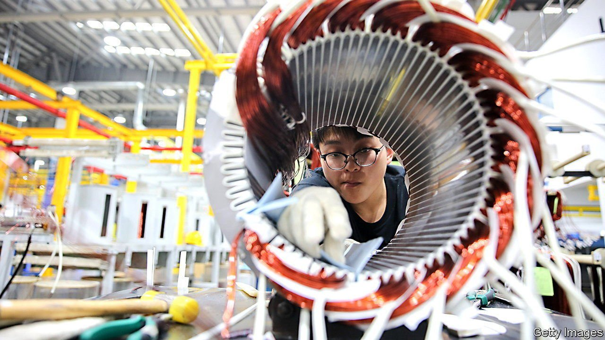
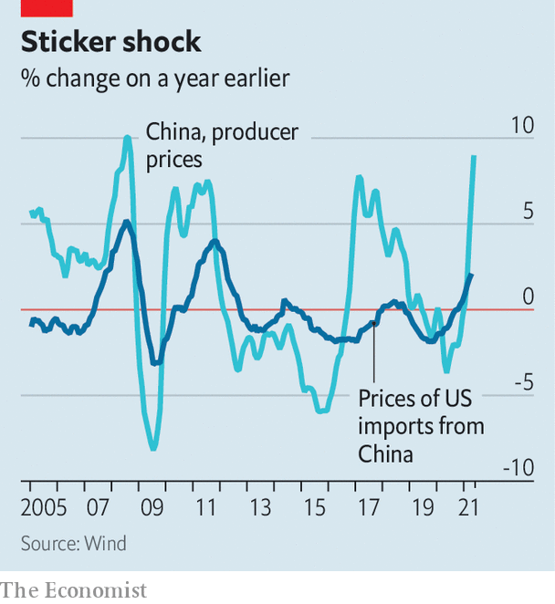

###### Paid in China

# Soaring factory prices in China add to global inflation fears 

##### Long a source of cheap goods, is China now exporting higher prices? 

 

> Jun 10th 2021 

ERIC ZHU, an international sales manager at a Chinese forklift-maker, has just sent his second letter of the year to customers, explaining that prices are going up once again. “We need to share some of the price increases with our partners. We cannot absorb them all ourselves,” he says. “The world is crazy now.” Although not standard economics terminology, crazy is a good description for the price movements now coursing through global markets. Inflation in America is running at its fastest since 2008. Energy and commodity prices have soared. And as Mr Zhu can attest, investors and company bosses are worried that China, the world’s workshop, is itself starting to export inflation.

It is easy to see why people are concerned. On June 9th China reported that factory-gate prices rose at an annual rate of 9% in May, the highest in more than a decade. That, along with soaring shipping costs and a stronger yuan, will probably push up the prices of made-in-China goods, from phones to futons. America’s imports from China already cost 2.1% more in April than they did a year ago, the fastest rise since 2012 (see chart).


Yet the danger of China-exported inflation can be overplayed. Only part of the rise in China’s producer prices reflects domestic causes. Its strong economic recovery was led by investment in homes and infrastructure, which pushed up the price of steel. In order to meet green targets, the government has reined in both coal and steel production. Officials have also vowed to crack down on “excessive speculation” in domestic commodity futures, suggesting that this helped the run-up in prices.

 


Most of the price pressures instead reflect the peculiarities of the covid-clouded world. The global demand for consumer goods—things you can buy online while confined at home—has soared. Chinese exports are about 20% higher than their pre-pandemic trend, and factories have struggled to keep up with orders. Disruptions to global commodity supplies, such as lockdowns that limited copper mining in Chile and Peru, have also pushed up prices.

Rather than transmit the shock, Chinese companies have absorbed much of it. Compared with the end of 2019, before covid-19 upended the world, factory-gate prices in China have risen by nearly 6%. But an index measuring the cost of manufactured consumer goods in China went up by just 0.6%. Companies have had to get by with thinner margins. No wonder Mr Zhu wants to share the pain with customers.

Moreover, the policy environments in China and America are very different. Whereas the Federal Reserve eased monetary policy dramatically, the People’s Bank of China was much more conservative. It has cautiously begun tapering its support. This may help explain the divergence between the two countries’ inflation trajectories. In America, the Fed’s preferred measure of “core” consumer prices, excluding food and energy, rose by 3.1% year-on-year in April, the most since 1992. In China, the core index rose by just 0.9% year-on-year in May. (China’s farmers have also helped quell inflation. A recovery in pig stocks after an outbreak of African swine fever has brought pork prices down by nearly a quarter compared with last year.)

Taking a longer view, some analysts think that China’s ageing population will transform it into an inflationary force. In the early 2000s, China’s low wages helped make consumer goods cheap around the world. That suggests that shrinking labour supply and rising wages should have the opposite effect. Yet this is not so clear-cut. Low-end manufacturing is already moving to cheaper places like Vietnam and Bangladesh, while a rapid increase in automation in China has also helped restrain prices.

Now, though, the pressing question is whether China’s input-price inflation will be transitory or more enduring. The answer lies outside China. As the vaccine roll-out gains traction and something closer to normal life resumes in America and Europe, people are likely to spend more on services such as tourism and eating out, not just on goods bought online. That would ease the pressure on commodities and, by extension, on China’s factories. ■

A version of this article was published online on June 9th 2021

