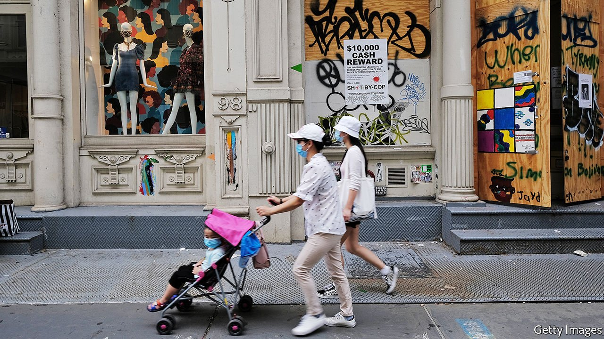

###### Vacancies in the Village

# Will empty shopfronts revive as New York comes back to life? 

##### A mismatch between what landlords and tenants want could hold things up 

 

> Jun 12th 2021 

SIT BY BAR Pisellino, a chic watering hole in the West Village, a swanky neighbourhood in Manhattan, and the world seems to have righted itself. Patrons munch on fat green olives and sip fizzy aperitifs as they watch well-heeled shoppers, newly returned to the streets, go by.

Just across the street, however, an empty shopfront crumbles from neglect. Despite ample government support during the pandemic many business owners cut their losses, terminated their leases and closed down, pushing retail vacancies in New York to new highs. Fully 13% of shopfronts in the West Village are vacant, compared with 1.9% in 2007 and 8.2% in 2017, according to data compiled by Scott Stringer, the city’s comptroller and now a candidate for mayor. The story is the same across most of Manhattan. Though activity is now resuming, it may be some time before the shopfronts return to life.


Retail rents have fallen sharply: in some neighbourhoods, like SoHo, they have dropped by more than 20% since 2019. That should make spaces more affordable—and attractive—to prospective tenants. But there is still a mismatch between what landlords and tenants want. Though it is costly for residential tenants to move, they rarely have to incur the expense of building a kitchen or a bathroom when they arrive. Retail tenants and their landlords, by contrast, can spend a fortune turning a space into a restaurant or a boutique. To make this worthwhile, leases often span a decade or longer. In a downturn, landlords want to sign shorter leases in the hope that rents will soon recover. Tenants, however, are unwilling, fearing that landlords may jack up the rent once they have gone to the trouble of fitting out the space.

An added complication comes from structural shifts in shoppers’ habits. Many observers, including Mr Stringer, reckon that the rise of online shopping explains why vacancy rates were rising even before the pandemic. The continued trend may lead landlords to accept that rents could stay low for a while. But faced with the uncertainty of whether a retailer will survive or not, they may prefer to wait for the right sort of tenant. “If you find the market-clearing rent for a shop, do the tenant improvements with them, sign a ten-year lease and then 24 months later they go bankrupt, are you really any better off?”, says Don Mullen, the founder of Pretium, a property- and mortgage-investment firm. Many commercial landlords want “Amazon-proof” tenants, like nail salons and salad bars, rather than retailers.

Even if landlords are willing to sign a lease with a lower rent, those with a commercial mortgage can find their hands tied. “Lenders often include covenants in their loan agreements,” says Dan Rosenbloom of Cadre, another investment firm. These might stipulate that the rent must at least cover the interest owed. If landlords want to sign a lease with a lower rent the lender might let them sign it, says Mr Rosenbloom, but they might require the borrower to stump up the cash to reduce the loan balance. That can make rents sticky, even if there is lots of vacant space.

The queues snaking around the corner of Magnolia Bakery and the throngs browsing in the pricey shops along Bleecker Street suggest that there is no shortage of demand for cute bakeries and boutiques in the West Village. But that does not mean the empty properties next door will be snapped up soon. ■

