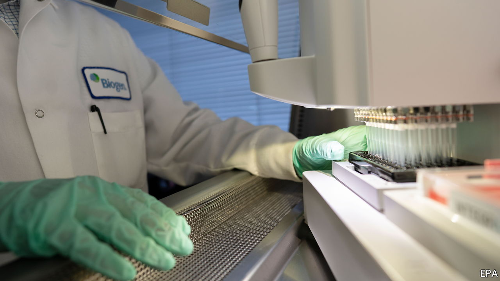
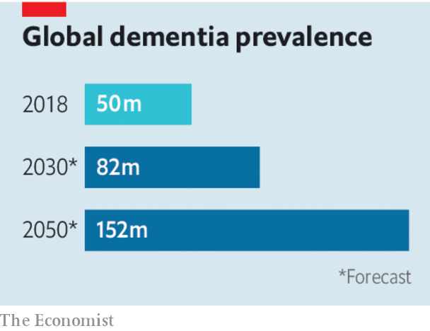

###### False positive

# America’s approval of an Alzheimer’s drug is premature 

##### It may offer false hope and divert resources from more promising therapies 

 

> Jun 12th 2021 

ON JUNE 7TH America’s Food and Drug Administration (FDA) approved the first new drug since 2003 to treat Alzheimer’s disease. The euphoric reaction in some quarters is understandable. A century of research has produced no effective treatment for Alzheimer’s, which is marked by ever-worsening cognitive decline, and accounts for 60-80% of cases of dementia, a condition affecting perhaps 50m people worldwide and becoming ever more common as the world ages.

But, sadly, the FDA admits that it is not proven that the new drug, a monoclonal antibody to be sold under the name Aduhelm, actually works. The approval is misguided. It risks raising unrealistic expectations, wreaking financial harm on health-care systems, damaging the FDA’s reputation for scientific impartiality and perhaps even diverting attention from more hopeful approaches to treating dementia.


It is also hard to understand. Last November ten of the 11 members of the FDA’s own expert advisory panel voted to reject the application by the producer, Biogen of Cambridge, Massachusetts, for approval of the drug (the 11th was “uncertain”). The FDA’s approval does not mean it accepts that the data so far show that Aduhelm is effective in slowing cognitive decline. Biogen’s trials were at best ambiguous on this point, and indeed in 2019 were called off as failures. Rather, the agency is rewarding the drug’s success in clearing brains of beta-amyloid, a protein that clumps between neurons and disrupts their functioning.

 


An “amyloid hypothesis” holds that the protein is not just a symptom of the disease, but a prime cause. This is widely believed (all brains with Alzheimer’s exhibit beta-amyloid build-ups). But it is just a hypothesis (not every brain with beta-amyloid exhibits cognitive impairment). The FDA has demanded a further trial, even as the drug goes into use, and has warned it may pull the drug if it is unsatisfactory. Biogen has said that the trial may take nine years. And if the drug is in wide use, withdrawing it would be difficult.

At $56,000 a year, the cost of Aduhelm treatment will create huge problems for health insurers and providers. Certainly the stockmarket has rewarded Biogen’s shares in the belief that a new blockbuster drug has just been given clearance. It is recommended only for people in the early stages of Alzheimer’s, diagnosed by a costly PET scan, and will require a course of monthly intravenous administration at a medical facility. Patients will require close monitoring as many develop brain swellings. But given the lack of any alternative, millions of Americans will be clamouring for the treatment for loved ones with Alzheimer’s.


The FDA’s approval also risks actually impeding some dementia research. Aduhelm might make it hard to recruit participants for clinical trials for new drugs, and to assess the results of them (if many patients are already taking the drug). And it may divert more resources into fresh efforts to validate the disputed amyloid hypothesis.

That the evidence argued against the approval of Aduhelm does not mean that research into treatments for dementia is going badly. On the contrary, whereas a few years ago some pharmaceutical firms were withdrawing from the field, having written it off as a dead end, some neurologists now expect big breakthroughs. A better understanding is emerging of how the risk of developing dementia can be reduced, by living a healthier life. The age-specific incidence of dementia is actually declining in some Western countries. Blood tests make it far easier to diagnose those at high risk before symptoms appear. And, according to Pharmaprojects, an industry database, another 148 drugs for Alzheimer’s alone are in clinical development, only about 15% of which are directed at beta-amyloid.

Dementia remains one of the 21st century’s greatest health, social and economic problems, and, for some neurologists, anything that stimulates greater efforts to understanding and treating it is welcome. That is why even some of those who have been baffled by the scientific basis of the FDA’S Aduhelm approval have applauded it. Surely, however, hope lies not in lowering standards out of desperation, but in following the science. ■

