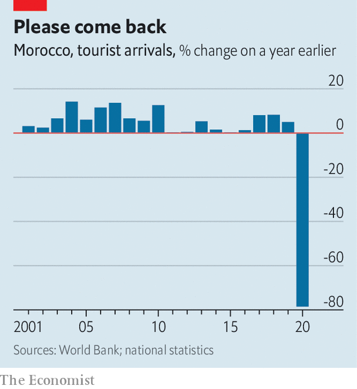

###### An industry in pieces

# Why are Morocco’s famed artisans paving roads in the desert? 

##### Covid-19 has smashed the country’s pottery capital 

 

> Jun 12th 2021 

A LITTLE MORE than a century ago, Boujemâa Lamali, an Algerian by birth, was recruited to Morocco by its French colonial administrators. His mission: to revive the country’s tradition of artistic pottery. So Lamali set up a school in Safi, on the Atlantic coast. The city became a hub for artisans. Before the pandemic some 2,000 of them officially worked in Safi’s 212 registered potteries. Thousands more toiled off the books. In total, Morocco’s craft sector employed 2.3m people, a fifth of the country’s workforce, and accounted for 7% of GDP.

Today, though, the winding alleys of Safi’s famed Colline des Potiers (Potter’s Hill) are quiet. The tourists who thronged the streets—and bought the pottery—have gone, because of covid-19. Morocco’s GDP fell by around 7% in 2020. A large number of Safi’s potteries have closed. For the first time in generations, most of its artisans are jobless or hanging on by a thread.


“Divorces have skyrocketed,” says an elder. “What can a man do when he comes home each day with nothing for his family?” The government has tried to help the jobless, but only those who worked formally are eligible for its monthly handouts of $220. Locals say artisans have been moving “in droves” to the desert in search of work as day-labourers on a big road-building project.

 


To help businesses, the central bank reduced interest rates last year to a record low of 1.5%. State-backed loan-guarantee programmes disbursed 50bn dirhams ($5.56bn) to 80,000 small and medium-sized firms. Still, in September the government estimated that 35% of craft businesses had closed for good.

“Credit alone won’t help,” says Abdelkarim Boudlal, who manages a store selling pottery in Marrakesh. “What we need are ways to lower our operating costs, like rent relief. We don’t want to get into debt when there are no customers.” That is the main problem for many of Morocco’s artisans. “Most of our clients are from Europe and America, so when there are no planes, there are no tourists, no clients, no demand,” says Hicham Tabii, a potter from one of the oldest families in Safi.

The government is working on that, too. A quarter of Moroccans have had at least one dose of the vaccine, more than in most developing countries. The aim is to save lives, of course, but also to send a signal to tourists that the kingdom is safe. On June 15th most international flights will resume.

Even if the tourists trickle back, Safi’s artisans could learn a lesson from other communities. The Berber pottery village of Tamegroute, to the east, has not suffered as much. Its artisans have been selling their wares online for over a decade. Perhaps more of Safi’s craftsmen will soon do the same. Mr Tabii points out that the city’s potters have weathered crises, including war, in the past. “We change our strategy,” he says.

