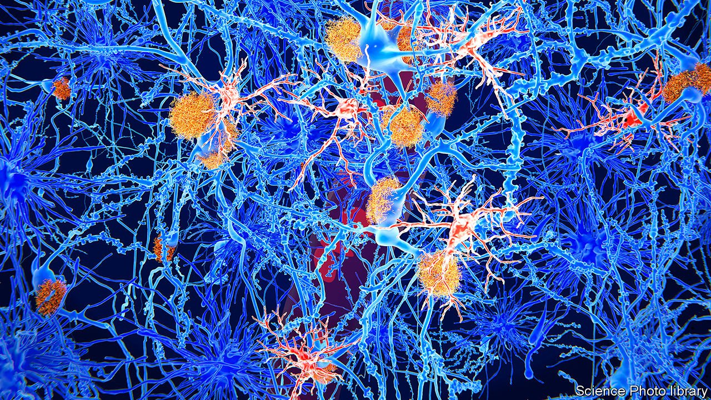

###### A flicker of light

# America’s wary approval of an Alzheimer’s drug offers hope to millions 

##### But its makers still have work to do to prove it can slow the advance of dementia 

 

> Jun 10th 2021 

NEWS THAT America’s Food and Drug Administration (FDA) has granted conditional approval to a new drug, aducanumab, to be marketed as Aduhelm, for the treatment of Alzheimer’s disease, has understandably been greeted as a huge breakthrough. For millions of people with Alzheimer’s, a remorselessly degenerative illness leading eventually to utter helplessness—and for those caring for them—it is a ray of hope. But the benefits it will offer remain uncertain, and the FDA’s decision is controversial.

It was 115 years ago that Alois Alzheimer, a German psychiatrist, conducted the autopsy that helped him identify the disease now known as Alzheimer’s. It is much the most common of the dozens of causes of dementia. It accounts for 60-80% of cases of a debilitating condition that affects an estimated 50m people around the world, and—as the risk of dementia increases with age, and the world is getting older—is spreading fast. The costs in human misery are incalculable. In terms of expenditure in caring for people with the condition, they are estimated at over $1trn now, and forecast to reach $2trn by 2030. 


So even if few have hoped for an imminent cure there is huge pent-up demand for a treatment that at least slows the advance of Alzheimer’s. The FDA claims in its press release on the approval sought by Biogen, a biotechnology firm based in Cambridge, Massachusetts: “Aduhelm is the first treatment directed at the underlying pathophysiology of Alzheimer’s disease.” In November 2019 China granted conditional approval to Oligomannate (gv-971), a drug produced by Green Valley, a company from Shanghai. But Western scientists grumbled the data from the Chinese study were scanty and its conclusions hard to credit. 

So the jubilation in some quarters at Biogen’s coup is understandable. But it is not universal, in part because of the  of the drug’s progress to approval. It is of a type known as a monoclonal antibody—a specialised protein molecule forming part of the immune system—tailored to bind to a protein called beta-amyloid, which forms plaques in the brains of people with Alzheimer’s disease, and which many researchers have long believed is not just a symptom of Alzheimer’s but at least part of the cause (an idea known as “the amyloid hypothesis”). Aducanumab does, indeed, seem to reduce the amount of beta-amyloid in the brain. That is why the FDA has approved it. The theory is that this should, in turn, slow the progress of cognitive degeneration. On that point, the evidence is less clear-cut. The FDA approval allows the drug to be used but requires Biogen to carry out a large-scale clinical trial to prove that it does indeed work, and warns that if not, it could be “pulled from the market”.


Previous efforts to demonstrate its efficacy appeared to have foundered in March 2019, when Biogen and Eisai of Japan announced that they were ending two clinical trials among people with signs of mild cognitive impairment or early-onset Alzheimer’s. Aducanumab had failed a “futility test”—ie, the evidence suggested it had no effect. But then, in October that year, Biogen said a fresh look at the data showed that “patients…experienced significant benefits on measures of cognition and function such as memory, orientation and language.” One of the two trials, it said, showed that higher doses of the drug did have a small but noticeable effect in slowing cognitive decline in people with Alzheimer’s. Biogen said it would seek FDA approval after all. 

A drug prescribed to even a substantial minority of people with dementia would be among the biggest-sellers of all time. The price of Biogen’s shares, which had fallen by almost 30% on the day of its announcement that trials had failed, bounced back almost as much when it changed its mind, and surged again a year later when the FDA made positive comments, as well as after its announcement today. Administered intravenously, monthly, at a clinic, aducanumab is likely at first to cost thousands of dollars a year, and patients will require constant monitoring as many develop brain oedemas. 

Many specialists remain deeply sceptical about aducanumab in particular, and the amyloid hypothesis more broadly. Last November ten out of the 11 members of an expert advisory panel appointed by the FDA voted against approving the drug on the basis of the research presented (the 11th was undecided). More recently, a new statistical study of various drug trials in Alzheimer’s &amp; Dementia, the journal of the Alzheimer’s Association, a charity, shows what one of its authors, Edo Richard, a Dutch neurologist, calls “overwhelming evidence of absence of an effect of anti-amyloid therapy in general”. Dr Richard finds it “amazing” that the FDA has overruled its own advisory panel to reach the “scientifically questionable” ruling on the drug.

His paper argues that the time has come to divert therapeutic efforts away from drugs that try to clear beta-amyloid to other lines of investigation. And, for all the scepticism about this drug, some scientists in the field are optimistic that great progress is being made in combating dementia. Jonathan Schott, a professor of neurology at the Dementia Research Centre, University College, London, and chief medical officer of Alzheimer’s Research, says that 30-40% of the causes of dementia are modifiable. Already there is evidence that the age-specific incidence of dementia is going down in the West as people live healthier lives: obesity, smoking, high blood pressure and excessive drinking in middle age are all associated with a higher incidence of dementia. A study published last year in Neurology followed nearly 50,000 people in America and Europe from 1988 to 2015. It found that 8.6% developed dementia. But the risk of being among them had, remarkably, fallen by an average of about 13% a decade, from about a one-in-four chance for a 75-year-old in 1995 to less than one in five.

 


Meanwhile, great advances have been made in diagnosing dementia. Whereas once this required cognitive tests followed by an expensive brain scan or intrusive lumbar puncture, now a simple blood test can predict, decades in advance, how likely it is that someone will develop Alzheimer’s later in life. Identifying those at risk early means that existing therapies, including aducanumab, largely ineffective once symptoms are far advanced, might be deployed early enough to make a difference. 

And other treatments should, slowly, become available. James Rowe, a professor of cognitive neurology at Cambridge, believes research into dementia is at a “tipping-point”. He expects the first successes with rare genetic conditions such as Huntington's disease and frontotemporal dementia. Alzheimer’s, which may turn out to be an umbrella term for a variety of different contributory pathologies, susceptible to different medicines, would follow later. Those living with Alzheimer’s have had few reasons for optimism. And Professor Schott argues that the main benefit of the FDA ruling may be that Alzheimer’s will no longer be seen as a “lost cause”. Big pharma and publicly funded researchers will take encouragement. Aducanumab offers a small step forward; bigger ones will come.

A version of this article was published online on June 7th 2021

