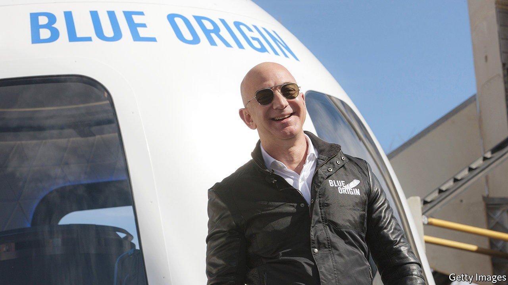

###### Space cadets

# Jeff Bezos’s flight of fancy 

##### Blue Origin’s first crewed mission will have the boss on board 

 

> Jun 10th 2021 

THE BATTLE of the space cadets is hotting up. Elon Musk and Jeff Bezos, a pair of billionaires who made their fortunes bending terrestrial technologies to their will, have long been trying to do something similar in outer space, and have founded companies,  and Blue Origin respectively, to this end. Their motives, however, are not purely commercial. There is a new-frontier zeal involved, too. Both have plans for their firms to build crewed Moon landers. Mr Musk, indeed, has been contracted by NASA to do so. He also hopes to spearhead the human colonisation of Mars. 

Mr Musk won an important round of the unspoken competition last year, by being the first to launch people into outer space, courtesy of SpaceX’s Crew Dragon capsule, lifted atop a Falcon 9 rocket. But he has not yet gone there himself. Mr Bezos looks likely to trump him here, albeit that the definition of “outer space” involved is quite a technical one—being above the so-called von Kármán line, beyond which the air is so thin that the speed required to provide aerodynamic lift exceeds that required to achieve orbit. Conventionally, this is defined as 100km, though 80km might be a more accurate value.


To this end, Mr Bezos announced on June 7th that he and his brother Mark will be two of the three first passengers taken above the von Kármán line in a capsule carried by New Shepard, a launcher made by Blue Origin and named after Alan Shepard, the first American to make such a rocket-propelled trip. A third seat in the capsule will be auctioned on June 12th and the flight will happen on July 20th.

New Shepard is not, however, powerful enough to reach orbit—which is, to be honest, most people’s idea of . Blue Origin’s orbital launcher, New Glenn, named after John Glenn, the first American to orbit Earth, is still in development, whereas Mr Musk has such a launcher at his beck and call.

New Glenn’s first, uncrewed, flight is pencilled in for late next year. That gives Mr Musk plenty of time to overtrump his rival by taking a trip into orbit. Both billionaires, though, may be beaten by another. As The Economist went to press, rumours were circulating that Sir Richard Branson, boss of Virgin Galactic, may try to take a trip above the von Kármán line on July 4th, in his firm’s air-launched rocket plane. Watch, as it were, this space.

A version of this article was published online on June 9th 2021

