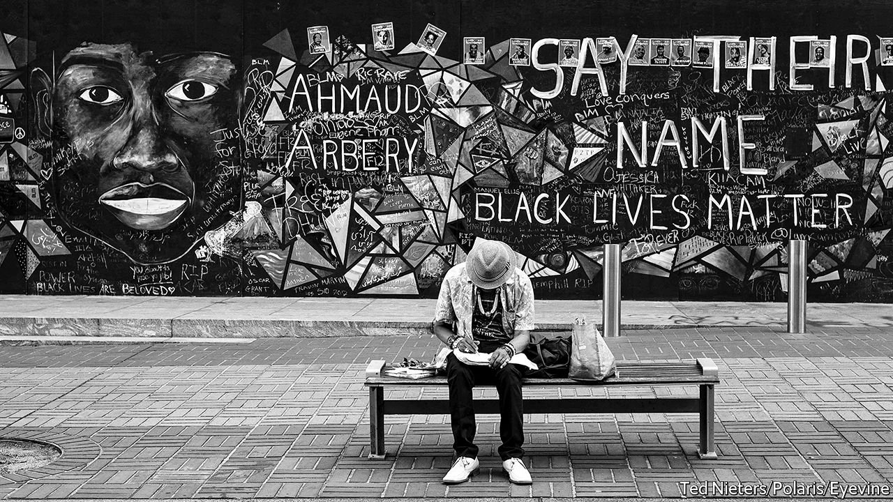

###### Plaid shirts and plywood

# Portland was once a byword for tattooed vegan microbrewers 

##### Now Oregon’s biggest city has become infamous for something else 

 

> Jun 12th 2021 

PLYWOOD WINDOWS can be only so inviting. On what seems to be every block, they still decorate downtown Portland a year after racial-justice protests began peacefully, turned violent, and were met with tear-gas and federal shock troops. They have not been removed because of sporadic bouts of anarchy euphemistically called “direct action”. A recent May Day riot left another round of vandalised buildings and broken windows in its wake.

The federal courthouse remains boarded-up; an Apple store has installed fortifications fit for the demilitarised zone (“Apple stands with you in the fight for racial and social justice”, says a sign outside); Tiffany &amp; Co has put up large, rather chic boards that try to lift the mood by declaiming meaningless platitudes like “Love is love”. Colourful social-justice art adorns much of the plywood, endorsing Black Lives Matter or other progressive causes. (“Expression against oppression” declares one; “Capitalism, why are you like this?” groans another.) Homeless encampments spread along the pavements.


Portland’s woes are especially acute, but they resemble those of many prosperous west-coast cities: a febrile political climate where social-justice activism is ascendant, rising crime rates, declining trust in the police and widespread street homelessness. These pose a threat to the cities’ engine of prosperity.

Before covid-19 downtown Portland housed 100,000 jobs, the heart of the city’s (and to a large extent, the state’s) economy. Its reputation has taken a bruising hit. The Urban Land Institute, a think-tank, runs annual surveys ranking the desirability of cities to property developers. In 2017 Portland ranked third. Now it has dropped to 66th out of 80. Polling in May for the Oregonian newspaper found that 53% of residents in the metro area felt safe downtown during the day; only 20% felt safe there at night. More than 60% of residents worry about protests, crime and homelessness. Ratings for the city government’s handling of those are pitiful. As in most American cities, violence is up markedly. There were 55 homicides in 2020, the most in 26 years. This year looks even worse. Already there have been more than 40 murders.

Data on population and unemployment show that the city’s recovery from covid-19 has not been unusually slow, notes John Tapogna of ECONorthwest, a consultancy. A mass exodus of businesses does not appear to be under way. But a decline in reputation can certainly lead to one. Working out how to recover from a brutal year requires a sense of what went wrong. And yet there is little agreement on that.

The optimists see the tumult as temporary. “Our major employers downtown have said that they're committed. We'll start to see people coming back. And as we have more street life, I think we'll have fewer street problems,” says Mingus Mapps, a former urban-politics professor and member of the city council. Hotel bookings are up, he notes, and “we’re demilitarising our public-safety systems”. Andrew Hoan, president of the Portland Business Alliance, the chamber of commerce, is also upbeat: “It's not that there's this moment like a butterfly emerging from its chrysalis [but] we’re seeing longer and longer gaps between when we noticed destruction, or bad behaviour occurs, or political violence is breaking out.”

Then there are the pessimists, divided into mutually loathing “woke” and “anti-woke” camps. Portland is a progressive town, with a vocal activist class that sees institutions like policing and capitalism as irredeemably racist and oppressive. Because the unrest is a symptom of legitimate grievance, it may not dissipate unless entire systems are dismantled. “I have never once cried over a window. I do cry over the murder of people who look like me,” Gregory McKelvey, a progressive campaign operative, told the local Willamette Week.

Mr McKelvey was the campaign manager for the progressive challenger Sarah Iannarone, who narrowly lost to the more centrist incumbent mayor, Ted Wheeler, in an election in November. Ms Iannarone’s campaign advocated defunding the police, arguing that “it is time to stop wasting money and stop putting good money after bad” and accusing the force of inflicting “waste and violence” on the community. She got 41% of the vote—just five points shy of victory.

The other pessimists think that Portland’s accommodation of anarchy and lawlessness in the name of social justice augurs bleak times ahead. “What's happening is unchecked progressivism, resulting in bad governance that is jeopardising the ability of normal citizens to go about normal life,” says Bret Weinstein, a prominent critic of lefty identity politics. “When municipal authorities withdraw the police—because the claim is that the police are the source of violence—what we then get is the emergence of a policing authority among the anarchists, and it is always brutal.”

The police department is similarly despondent. “The message of social justice and racial equality was overrun, it was overtaken by a group of anarchists,” says Daryl Turner, president of the police union. Many police officers have left, either retiring or resigning. Local progressive organisations like Unite Oregon campaigned for the city government to defund the police by at least 50%, rather than the more modest $3m cut (about 1%) already made.

The Oregonian’s polling from May also found that 50% of residents thought policing needed to be increased downtown; only 15% thought it should be decreased. Mr Turner predicts that things will get worse before they get better. “The city is in a state of hopelessness,” he says. In a few months’ time, it will be clear whether such pessimism has firm foundations. ■

: An earlier version of this story said that Portland had 1m jobs pre-pandemic. In fact, it had 100,000. Sorry. 

