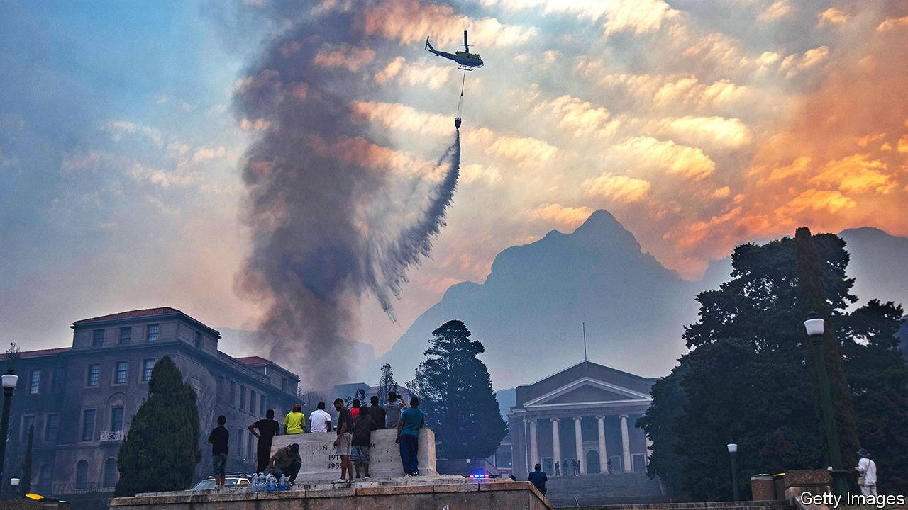

###### The fire this time

# A precious African-studies collection burns in Cape Town 

##### For scholars, the loss recalled those of the libraries of Alexandria, Timbuktu and Rio 

 

> Jun 19th 2021 

THE VIEW from the steps of Sarah Baartman Hall at the University of Cape Town (UCT) is a reminder of the city’s natural beauty and difficult history. The shadow of Table Mountain looms over the neoclassical building, renamed in 2018 to commemorate Baartman, a Khoisan woman who in 1810 was shipped to Europe to appear in freak shows. She replaced Leander Starr Jameson, a lackey of Cecil Rhodes who staged a calamitous attempt to start a war on behalf of his patron. Until 2015 a statue of Rhodes stood at the bottom of the steps, gazing out at the Atlantic Ocean and the city he made his own, the headquarters of his southern African empire.

“And there”, says Ujala Satgoor, director of UCT’s libraries, looking to her right, “is the famous Jagger library.” Or rather, there it was. On April 18th fireballs from a conflagration on the mountainside engulfed the building and nearby halls of residence (the cause of the blaze is unclear). The contents endured the twin effects of flames and, once firemen arrived, hosepipes, leaving thousands of works charred or sodden.


Because they were held in a basement, some books of the highest monetary value were spared. These were mostly from the Western canon. But in a bitter twist for a library that may have done more than any other to enhance scholarship of Africa, the most extensive damage was to its African-studies collection. Almost 100,000 of its roughly 130,000 books were destroyed (the count is ongoing). “It was truly a disaster,” says Ms Satgoor.

The African-studies collection dates back to 1953, five years after the introduction of apartheid in South Africa, and four years before Ghana catalysed decolonisation by gaining independence. At the time, “African studies” was dominated by white male authors. But a succession of quietly radical UCT librarians travelled extensively to acquire materials by African scholars, using funding from the Oppenheimer family, founders of Anglo American, the mining giant. Slowly they built the largest store of research materials for African scholars on the continent.

Ms Satgoor recalls stumbling through the rubble and finding only covers of rare dictionaries, their pages incinerated. Gone were early translations of local languages from countries such as the Gambia, Sierra Leone, Gabon and South Africa. Soon after the fire, a number of San and Khoi scholars (two groups indigenous to the area around Cape Town who, over time, were termed Khoisan, like Baartman) noted that the blow is particularly painful for their field, as much of their oral traditions was lost during the colonial era. “This devastation reminds us of when the great libraries in Alexandria, Timbuktu and Rio were destroyed,” the scholars wrote.

Also thought gone are thousands of official documents. Over several decades librarians collated copies of parliamentary debates, political-party minutes, inquiries and so on, to help African historians. The material included many papers related to underground activities during apartheid. The fire severely damaged a complementary audiovisual archive, which included rare footage from political protests.

Then there was a unique collection of nearly 3,500 African films. One of these, wrote Jeremy Seekings and Chris Saunders, academics from UCT, in a recent article for the Daily Maverick, a South African outlet, was the pioneering “Afrique sur Seine”; it was made in 1955, when Africans in France’s colonies were not allowed to make films in their home countries. Others were banned works sent to Cape Town in secret—a film about the Gukurahundi massacres in Zimbabwe in the 1980s was dispatched in an envelope labelled “Auntie Flo’s home movies”.

Ms Satgoor began the salvage operation before the embers cooled. Some books will be saved with the help of cold storage and moisture-sucking fans. She has received dozens of offers of help, including from universities with copies of lost books and films. But it will take time to rebuild a resource that had an importance greater than the sum of its parts. Walking through the ash-strewn warren of the library, an incongruous smell of charred damp in the air, Ms Satgoor talks of her admiration for earlier librarians who built such a “provocative” collection. Restoring it falls to her. ■

