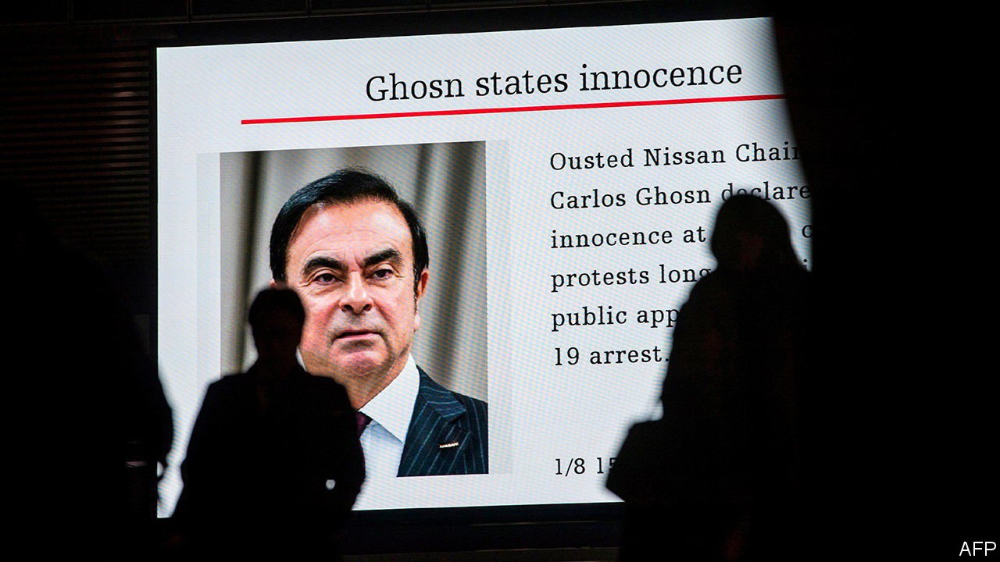

###### Car trouble

# The rise and fall of Carlos Ghosn 

##### A new book explains the spectacular implosion of his relationship with Nissan 

 

> Jun 19th 2021 

Collision Course. By Hans Greimel and William Sposato. Harvard Business Review Press; 256 pages; $30 and £22

THE MAIN events of the scandal that brought down Carlos Ghosn, whose restless energy made other globetrotting bosses look work-shy, are appropriately book-ended by flights on corporate jets. The drama began with grainy television footage of Japanese prosecutors boarding the plane that delivered an unwitting Mr Ghosn to his arrest in Tokyo in November 2018. It culminated in his skipping bail on several charges of financial impropriety around a year later. Stripped of his leadership of a giant conglomerate, he was smuggled out of Japan on another private jet, this time hidden in a box.


Because of that clandestine escape, “Collision Course” by Hans Greimel and William Sposato, two Tokyo-based journalists, at times reads like a spy thriller. But their main aim and achievement is to give the clearest account yet of the deep-rooted causes of Mr Ghosn’s predicament. Underpinning the entire tale—and Mr Ghosn’s status as a corporate superstar—was Renault’s rescue in 1999 of near-bankrupt Nissan, an alliance, later joined by Mitsubishi, which he built into the world’s biggest carmaker.

The terms of Nissan’s bail-out gave Renault, in which the French government has a large shareholding, control of the Japanese firm, but Nissan got no say over Renault in return. The alliance stopped short of a full merger, which, in the car industry, had usually ended in disaster. This arrangement led to seething resentment at Nissan, which gradually became the bigger company and the main source of profits. Mr Ghosn kept a lid on the tensions between the two carmakers—their engineers rarely agreed on anything—through the force of his personality.

But they boiled over as Mr Ghosn sought, at the French government’s behest, to make the alliance “irreversible”. Nissan read this as code for a full merger that would cement Gallic dominance. This, claims Mr Ghosn, led some in Nissan to manufacture charges in order to get rid of him. Nissan’s version is that he was a greedy tyrant who regarded the Japanese firm as a personal bank account. This claim gained more credence when French prosecutors also began an investigation of Mr Ghosn, including into the funding of a lavish party thrown for his wife’s birthday at the palace of Versailles—a far cry from his Japanese prison cell, where a bowl of rice gruel counted as luxury.

The authors point to a clash of corporate cultures as the reason he may have sought to circumvent pay disclosure using a deferred-pay scheme, which Nissan claimed broke the law. In Japan and France CEOs are paid far less than equivalent American bosses; doubtless he thought his skills should be properly rewarded by global standards. The competing narratives were never aired in court, though, after Japan’s criminal-justice system—which relies on prolonged incarceration and intense interrogation to obtain a confession—collided with Mr Ghosn’s stubborn refusal to admit any wrongdoing. Eventually released on bail, he fled in the belief that he would not receive a fair trial and would remain under house arrest for years.

Some readers may be dismayed by the authors’ reluctance to speculate on the verdict should the trial have gone ahead (they conclude that, given the “arcane” accusations of financial irregularities, a “ruling is likely to be just as abstruse”). But the end result is that Mr Ghosn remains trapped, these days in Lebanon, where he is safe from the international arrest warrants that might be executed should he board any more corporate jets. Meanwhile the alliance he created, languishing without its leader, may yet break apart. ■

