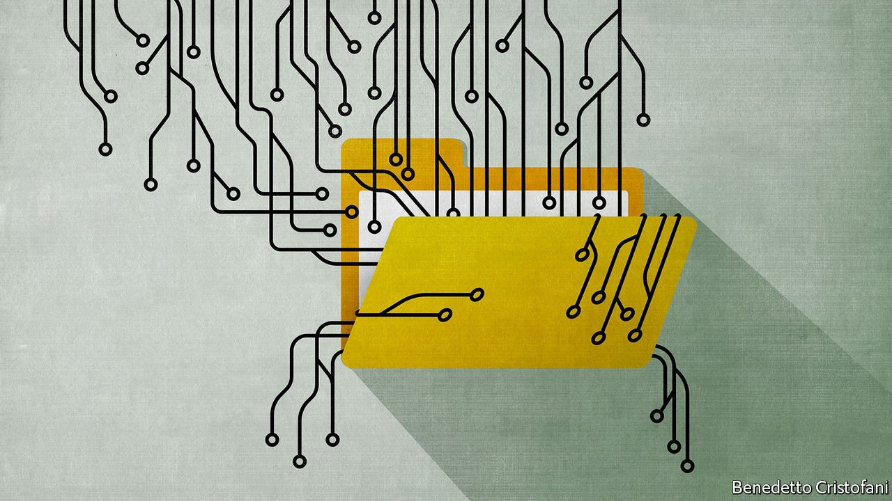
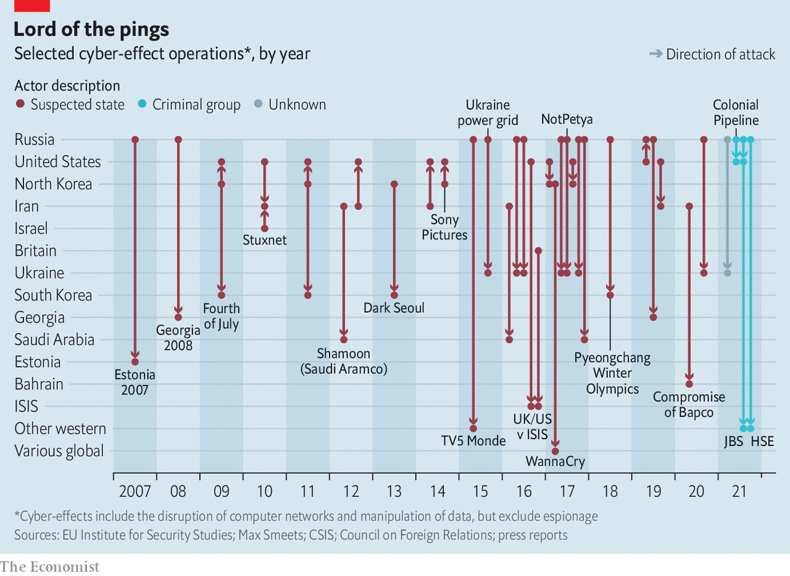

###### Crims and spooks unite and fight

# Ransomware highlights the challenges and subtleties of cybersecurity 

##### Governments want to defend themselves—and attack others 

 

> Jun 19th 2021 

FOR THE past month Ireland’s health-care system has been in disarray. On May 14th the Health Service Executive (HSE), the state-funded health-care provider, was hit by a “ransomware” attack which led it to shut down most of its computer systems. The attackers threatened to release stolen data, including confidential patient records, unless the HSE stumped up $20m (€16.5m). It declined to do so. Its staff were reintroduced to pen and paper, its procedures delayed, its patients inconvenienced. By June 14th services had still not returned to normal.

This out(r)age might have attracted greater attention beyond Ireland’s shores had it not occurred a week after a similar attack had disabled a crucial oil pipeline on the other side of the Atlantic. On May 7th Colonial Pipeline, a company whose namesake asset delivers nearly half the fuel used on America’s east coast, had its systems compromised by a cyber-attack and had to shut down the flow of oil. Some people headed to the pumps in panic. President Joe Biden invoked emergency powers. The company paid a ransom of over $4m; even so, it took several days for the oil to start flowing again.


The two stories are in some ways par for the course. More and more enterprises are being hit by ransomware attacks, and some of the targets are giants. In recent months attackers have struck JBS, the world’s biggest meat producer, and Apple.

In other ways they feel like an escalation. Attacks on core state functions such as health care and crucial infrastructure like pipelines are normally the stuff of war, insurgency or terrorism. They do not lose their capacity to worry governments just because they are being undertaken for cash, especially when the criminals perpetrating them come from unfriendly countries. The gangs responsible for the HSE and Colonial Pipeline attacks both seem, like many of their sort, to be based in Russia. At his summit with Vladimir Putin on June 16th Mr Biden listed 16 types of infrastructure against which he wanted to see no further cyber-attacks.

A permissive attitude to cybercrime is unsurprising for a regime led by an old spook like Mr Putin. The covert things that states have always done to each other—spying, propaganda, subversion and violence—are normally crimes as far as at least one of the parties is concerned. Criminals and spies lurked in the same shadows, shared the same methods and occasionally combined their roles long before the dark recesses of the internet beckoned.

For the most part hostile state activity is non-violent, a matter of harvesting information helpful to your national interest—including the commercial interests of your companies—and discombobulating the opposition. “Most activities in cyberspace have little to do with the use of force,” writes Joshua Rovner of American University, who in 2018-19 was scholar-in-residence at the National Security Agency (NSA), America’s signals-intelligence agency, and Cyber Command, a Pentagon command which conducts cyber-operations. “They are largely an intelligence contest—an effort to steal secrets and exploit them for relative advantage.”

But the scale, speed and ease at which that contest can now play out has been transformed. Robert Hanssen, one of the KGB’s most productive agents ever, supplied thousands of pages of classified material to his handlers. But he did so over a period of 20 years, from 1979 to 2001. Vasili Mitrokhin, a disillusioned KGB archivist, pilfered an astonishing 25,000 pages of material between 1972 to 1984, hiding reams of documents under the floor of his dacha, but it took him another eight years to get those secrets to Britain’s MI6.

By contrast, the Chinese hackers who penetrated America’s Office of Personnel Management in 2014 gained access to the records of 21.5m people at a stroke—a haul which, if printed out, would have filled a fleet of lorries. Some see the capacity to steal secrets in such remarkable quantity as qualitatively different from older forms of espionage: not just spying but warfare, or some hybrid of spying and warfare, or something entirely new.

Last year America uncovered a colossal hacking campaign which, by compromising SolarWinds, a software-maker, had penetrated a panoply of government departments. The justifications the Biden administration offered for its subsequent sanctions against Russia, which it blamed for the attack, were telling. One was the sheer scale and scope of the penetration. But there was also a worry that such a capability could pivot easily from wholesale espionage to wholesale sabotage. The scope of the attack was “virtually a declaration of war by Russia on the United States”, thundered Dick Durbin, a Democratic senator.

 


Demarcation becomes yet more complicated when non-state actors are added to the mix, either as perpetrators or victims. The Colonial Pipeline attack shows that private ransomware rackets are now ambitious—and, considering the new level of concern, arguably foolish—enough to attack vital state interests. The Sony Pictures attack of 2014 showed that states can seek to destroy private corporations; Sony had incurred the wrath of North Korea by mocking its supreme leader, Kim Jong Un, and had a great deal of dirty corporate laundry exposed as a result.

Sony’s good name was not that important to any government; other state action against companies could be. In 2017 Russia launched a ransomware-like cyber-attack, NotPetya, against companies in Ukraine so as to damage the country’s economy. The attack spread well beyond Ukraine’s borders; it has been blamed for $10bn of damage worldwide. One of the companies affected was Mondelez International, an American snackmaker, which made a $100m insurance claim as a result. But Zurich American Insurance declined to pay out, pointing to an exception for “hostile or warlike attack” in the company’s policy. The case has gone to the courts in Illinois, where it is currently pending.

Exceptional thieves

In general, though, there is little indication that the increasing damage done by ransomware is state-directed, as NotPetya seems to have been. It is for the most part merely state tolerated. The extortionists enjoy impunity to the degree that their host countries are indifferent to the harm they do elsewhere—though they may also, on occasion, be required to do their hosts nefarious favours.

The Royal United Services Institute, a think-tank, analysed 1,200 ransomware attacks which mostly took place last year. Two of its findings make the extortionist’s incentives clear. The fact that 60% of victims were based in America or had their headquarters there can be explained by Sutton’s law: that’s where the money is. The fact that there were no victims in Russia or most other post-Soviet countries can be explained by other rules—rules about activities which are inappropriate on your own doorstep, or where you eat.

The rise in the use of ransomware may reflect, and indeed exacerbate, interstate tensions, but it is not directly due to state action. It is mostly down to increased capabilities and opportunities.

The earliest examples of people hacking into computers, encrypting files and demanding payment in return for decryption were penny-ante stuff—a way to extort a few hundred dollars from someone who didn’t want to lose treasured family photos. Its growth into a criminal industry preying on large organisations is in part down to the replicability that the digital domain makes so easy; criminals can launch dozens of attacks as easily as one. As the business got more lucrative the technology became better; larger ransoms allow the criminals to buy more sophisticated “exploits” which in turn allow more ambitious attacks. The growth of remote-working has also helped, providing criminals with far more opportunities to worm their way into corporate networks.

The rise of cryptocurrencies, which provide a convenient and discreet way for law-abiding victims to pay, adds to the crime’s appeal. Chainalysis, an American firm which examines the “blockchain” databases that power such currencies, reckons that hackers took around $350m in cryptocurrency payments in 2020, up fourfold on the year before. Increasingly the hackers prefer newer cryptocurrencies such as Monero or Zcash, which are designed with privacy in mind, to bitcoin. The fact that its blockchain makes transactions using bitcoin “wallets” public helped American police recover around half of the Colonial Pipeline ransom after it was paid.

The cyber-security industry, whose job is to protect its customers from such attacks, looks increasingly ineffective. Microsoft estimates that annual spending on antivirus software, firewalls and the like was around $124bn in 2020, up 64% in five years. Last year Debate Security, a group of cyber-security experts, published a report pointing out that despite all this the average number of breaches recorded each year by Accenture, a consultancy, has risen. Admittedly breaches might have risen faster if spending had not gone up, but it is hard to see the record as encouraging. Ciaran Martin, who led the creation of Britain’s National Cyber Security Centre (NCSC), the defensive arm of its signals-intelligence agency, GCHQ, was one of the report’s contributors. He argues that the way the business works is fundamentally flawed.

Poison pills

The report’s subtitle—“Is cyber-security the new ‘market for lemons’?”—echoes a famous analysis of the effect of “asymmetric information” on the second-hand-car market. George Akerlof, an economist, argued that since buyers cannot reliably identify high-quality second-hand cars, they will be unwilling to pay high prices. The sellers of good cars are thus driven out of the market, ceding the field to those selling cheaper, shoddy “lemons”.

Mr Martin thinks that the cyber-security field is mired in a similar asymmetry. Ian Levy, the NCSC’s technical director, has said that a lot of the industry operates in much the same way as medieval witchcraft: “Buy my magic amulet and you’ll be fine.” It is hard for buyers to pick effective defences against the dark arts out of the dross, and they know it. Almost none of the bosses Debate Security interviewed could agree on how to measure the effectiveness of the software they were buying. There was much talk of the need to “cross our fingers” and “accept what we can get”. Fixing the problem, says Mr Martin, is likely to require the development of common standards for assessing how well cyber-security software really works.

Given that they are on the hook for ever increasing ransomware losses you might expect insurance companies to be pushing for such standards. In 2020 Munich Re, a reinsurance company, estimated that the cyber-insurance market was worth $7bn and could be worth $20bn by 2025. But Kelly Bissell of Accenture says that insurers frequently conclude that the easiest way to deal with an attack on a firm they have insured is simply to pay up; that may minimise costs on a one-off basis, but it encourages more attacks in future.

France—which according to Emsisoft, a cyber-security firm, suffered ransomware losses of more than $5.5bn in 2020, second only to America—is taking a hard line on this. “Regarding ransomware, we don’t pay and we won’t pay,” Johanna Brousse, a French prosecutor, said at a recent discussion at the senate. In May AXA, a big French insurer, having been lent on by the authorities, said it would stop writing policies that allow reimbursement of ransomware payments.

Clamping down on ransom payments and setting standards for cyber-security—something Mr Martin favours—are two ways for governments to defend their corporate citizens and the infrastructure they control against commercial cyber-attacks. In doing so they may go some way towards protecting themselves from direct attack by other states, too.

Offensive cyber-capabilities are now widespread among states, and commonly used in military campaigns. In their war against Islamic State, Britain and America used cyber-attacks to suppress the group’s propaganda, disrupt its drones and sow confusion in its ranks. They are also used to do physical damage in times where no war is officially taking place. Consider the pioneering American-Israeli Stuxnet worm, which induced Iranian centrifuges to tear themselves apart a decade ago, or Russia’s successful sabotage of Ukraine’s power grid in 2015 and 2016.

Achieving dramatic physical effects is exceptionally demanding and vanishingly rare. But in some cases it may offer the perpetrator advantages. Gary Brown, a professor at America’s National Defence University who was the first senior legal counsel for Cyber Command, argues that states are more tolerant of “kinetic effects” caused by online operations than those which result from armed provocations. Had Iranian commandos attacked Israeli water plants in April 2020, the result might have been war. An alleged Iranian cyber-attack which sought to increase chlorine levels in drinking water, prompted instead only a relatively tepid Israeli cyber-riposte against an Iranian port. Israeli forces have, though, launched air strikes against sites in Gaza they associate with cyber-attacks by Hamas, a militant Palestinian organisation.

Retaliating against cyber-attacks in kind may become a norm—more assertive than turning the other cheek or lodging a diplomatic complaint, less risky than responding with physical violence. Such a stance may also provide a deterrent. America, which according to a forthcoming study by the International Institute for Strategic Studies, a think-tank, has “offensive cyber-capabilities...more developed than those of any other country”, is widely thought to have used them to fire a warning shot over North Korea’s bow: the dictatorship’s internet suffered an odd blackout shortly after the Sony hack. Mr Biden’s demand that some areas be exempt from criminal attack was paired with a threat to respond with what he described as America’s “very significant cyber-capabilities”.

 


It is possible that defence, deterrence and attack will blur. In recent years, Cyber Command has embraced a strategy of “Defend Forward”, which involves observing enemy hackers before they enter American networks—something that, given the absence of unowned buffer zones in computer networks, unavoidably requires intruding on the networks of others. “There are no ‘high seas’ or ‘international waters’ in cyberspace,” writes Erica Borghard, who served on America’s Cyberspace Solarium Commission, a national task force.

Welcome to the party, pal

As more states develop stronger and more active cyber-forces, the idea that the best—perhaps the only—form of defence is something which looks very like an attack points to ever-more intense competition over computer networks. “Perhaps defending forward is necessary to frustrate particularly reckless and brazen campaigns,” argue Columbia University’s Jason Healey and Robert Jervis. “But in the long run it may someday spark a larger conflict.” Because Russia and China scarcely admit to conducting cyber-operations at all, it is impossible to say how far they have trodden the same path.

And as state capabilities grow it seems a sure thing that criminal ones will too. Cyber-capabilities are easily spread and available to those of modest means. A ranking of offensive “cyber-power” created by the Belfer Centre at Harvard University last year put Israel and Spain in third and fourth place, with Iran, the Netherlands and Estonia all placed in the top ten. Private firms like Israel’s NSO Group and Italy’s Hacking Team sell powerful hacking tools which allow states to quickly bootstrap their own cyber-forces. It is hard to imagine all these capabilities being kept out of the hands of criminals who inhabit the same demi-monde. Extortionists demanding ransoms, spies pocketing data and states spreading disinformation will sit alongside one another—multiplexed on the same channels as never before. “Cyber as a domain of military and national-security operations co-exists with cyber as a domain of everyday life,” says Mr Martin. “It’s the same domain.” ■

