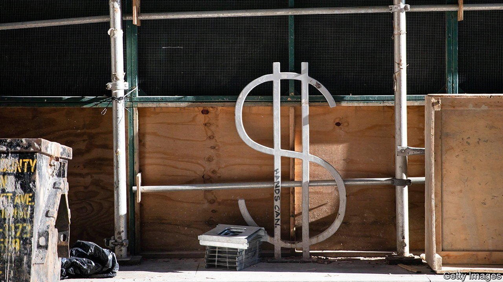
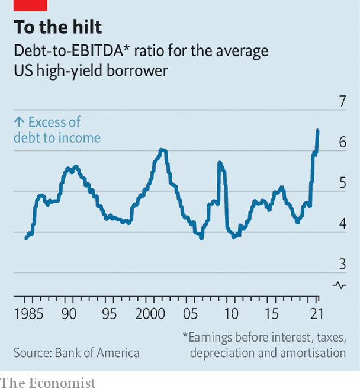

###### The junk heap

# America’s high-yield debt is on ever-shakier foundations 

##### Defaults may be heading lower but the market has become much riskier 

 

> Jun 19th 2021 

INVESTORS IN COMPANIES issuing high-yield or “junk” debt have had a relatively benign pandemic. Usually such highly leveraged borrowers are stung by economic hardship. During the global financial crisis over a decade ago around a seventh of such firms in America defaulted on their debt in one year. Yet according to Moody’s, a rating agency, less than 9% of them went into default in the year to August 2020, and the rate has continued to drop since. By the end of 2021, a booming recovery should put it back below its long-term average of 4.7%

It may be too soon for high-yield investors to congratulate themselves, though. The low default rate masks a market that is much riskier than it was before covid-19 struck. Take high-yield bonds, the market for which is worth $1.7trn. Issuers have record levels of debt relative to their earnings, increasing their vulnerability to higher interest rates or a disappointing economic recovery. Cash-strapped borrowers are taking advantage of less restrictive loan contracts to rough up their creditors. And for the companies that do default, loans that used to be associated with high levels of protection and security are turning out to offer lenders anything but.


Start with the sheer amount of debt. Last year $435bn-worth of junk bonds were issued. As a result, the average high-yield borrower now has debt equivalent to an unprecedented six-and-a-half times their trailing 12 months’ gross operating profits, or EBITDA (see chart). Oleg Melentyev, of Bank of America, cautions that the low default rate may have merely deferred the pain. “Companies are carrying the baggage of capital structures that should have been restructured, but weren’t,” he says. “We will pay the price of elevated defaults at a later point in the cycle.”

 


Meanwhile, borrowers with liquidity problems have the upper hand over their lenders. Evan Friedman and Enam Hoque of Moody’s describe how investors’ hunger for returns during more than a decade of low interest rates has loosened loan agreements. Maintenance covenants, or restrictive clauses that allow lenders to seize the reins if the borrower’s financial position deteriorates, are now mostly absent. Worse, incurrence covenants, which place limits on borrowers’ ability to issue new debt and pay dividends, have lost force over time. “When you go covenant-lite and make your incurrence covenants toothless, you give all the flexibility to the borrower to run the show,” says Mr Friedman.

Running it some of them are. Serta Simmons Bedding, a mattress manufacturer, gained notoriety last year for raising $200m by swapping its debts to some lenders for new ones with a higher level of security. Without their consent, the non-participating creditors were exposed to higher losses in the event of a default. A lawsuit seeking to unwind the transaction was dismissed by the courts, paving the way for similar deals in the future.

What happens to loans that do turn sour? Lenders are used to the idea that so-called “first-lien” debt grants them priority over the borrower’s assets should it go bankrupt. But Moody’s analysis of defaults during the pandemic shows that first-lien lenders are losing nearly twice as much of their capital as they used to: the average recovery rate in 2020 was 55%, compared with a long-term average of 77%.

This is the result of deteriorating debt structures, another decade-long trend. In the past, first-lien loans had high recovery rates because a significant portion of the remaining debt was subordinated—ie, behind them in the queue in the event of a default. But in 2020 over a third of first-lien loans had no junior debt sitting beneath them to absorb losses. If all of a borrower’s debt has a first claim over its assets, the value of that claim is lower, and lenders lose more protection.

None of this necessarily means that America’s high-yield market is heading for catastrophe. Interest rates remain low, and a rapid recovery should restore earnings. But a nasty surprise on either front could quickly spell trouble. The covid-19 default cycle may yet have a sting in the tail. ■

