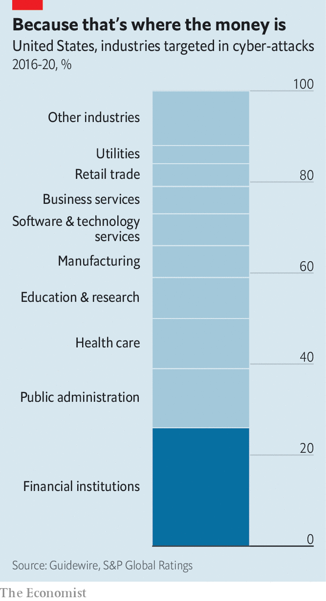

###### Cyber-heists

# The methods and menace of the new bank robbers 

##### Hacker gangs go after the money—and the data 

 

> Jun 16th 2021 

TALK TO BANKERS and some will tell you that when it comes to , they are second only to the military in terms of the strength of their defences. And yet trawl the dark web, as Intel 471, an intelligence firm, did on behalf of The Economist in May, and it is obvious that attempts to breach those walls are commonplace. One criminal was detected trying to recruit insiders within America’s three biggest banks, JPMorgan Chase, Bank of America and Wells Fargo, offering a “seven-to-eight-figure” weekly payment to authorise fraudulent wire transfers. Another was auctioning the details of 30m accounts at Bank Mellat in Iran (a country of 83m).

Such activity represents the handiwork of a new breed of bank robber. Forget the hold-ups of yore. Today’s smartest hackers are likely to be backed by rogue states, such as North Korea and, to a lesser extent, Iran, or tolerated by countries such as Russia and China. They benefit from unprecedented resources and protection from law-enforcement agencies. As well as attempting to empty accounts, they also target data for insider trading.

As one of the first industries to offer online transactions, banks have been fending off hackers since the dawn of the internet. They spend more on cyber-security than any other sort of firm—$2,691 per employee—and manage to foil a lot of the attempted thefts. Nonetheless, since 2016, no industry has suffered more from attacks than banks (see chart).

 


Speaking to Congress in May, Jane Fraser, who runs Citigroup, a Wall Street giant, called hacks the biggest threat to America’s financial system. Jamie Dimon of JPMorgan Chase has said they could become “an act of war”. The result is that banks are under constant pressure to prepare for the worst. “It’s not a matter of ‘if’, it’s a matter of ‘when’,” says the head of cyber-security at a central bank. The bankers need to know the methods and motives of their enemies. What have they learned and can they remain a step ahead?

As in other industries, attempts to rob banks online generally start with “phishing”, or tricking an employee into downloading a benign-looking software, known as a “Trojan”, that, once installed, creates a backdoor for other viruses to infect the company’s systems. The ruses can be elaborate. In 2019, when hackers infiltrated Redbanc, an interbank network connecting Chile’s ATM system, they faked a lengthy hiring process, complete with rounds of video interviews, just to fool one victim into downloading and running a Trojan.

Once the backdoor is installed, the hackers have numerous modi operandi. These have evolved over time. In the early to mid-2010s a popular tactic was to alter banks’ databases to inflate balances on existing accounts in order to drain them with fraudulent online transfers. Another was to steal the names and passwords of employees authorised to access SWIFT, the interbank messaging system that banks use for international transfers, in order to make fraudulent transfers to the robbers’ own bank accounts. In the world’s biggest cyber-heist, in 2016, thieves transferred funds from an account the Bangladeshi central bank held at the Federal Reserve Bank of New York to banks in the Philippines, Sri Lanka and other parts of Asia. They stole $81m.

, such as those common elsewhere in business, are on the rise. But banks are exposed in other ways, too. One example is “”, where malware manipulates ATMs into spitting out lots of cash, accessible to fake cards, even if no funds exist. Thieves then hire packs of money mules, typically from local mafias, to stage multiple withdrawals at once. Using such methods, in 2018 criminals got away with $13.5m from India’s Cosmos Bank through 15,000 cash-machine withdrawals in just two hours.

Another tactic is to turn websites that banks visit regularly into poisoned “watering holes”, most infamously in 2017 when criminals successfully targeted 104 mostly financial firms in 31 countries, including seven banks in Britain and 15 in America. In this case the websites of central banks in Poland, Mexico and others were booby-trapped so that banks would download malicious files and infect themselves with malware. These could be used to spy on the banks, steal their data and ultimately make fraudulent transfers (though in most cases the intrusion appears to have been discovered before money was stolen).

Sometimes it is data, not money, that the robbers are after. The latest trick is to steal financial-market data from within banks in order to facilitate insider trading. A survey by VMware, a cyber-security firm, of 126 financial firms worldwide found that 51% saw a rise in such attacks last year. Portfolio managers in America and Britain that were recently breached saw suspicious activity whenever they were about to trade, says Tom Kellermann, the firm’s strategy boss.

The multiplicity of methods is compounded by the malevolence of those involved. Originally heists were mostly conducted by private thieves from former Soviet states. They included Carbanak, a notorious syndicate that stole over $1bn from 100 banks after 2013 (its masterminds were arrested in 2018). But since America cut North Korea out of its financial system in 2017, the hermit state has doubled down on its relationship with criminal gangs as a way of “making profit and evading sanctions”, says Michael D’Ambrosio, a top investigator in America’s secret service. Variously named Lazarus, Bluenoroff or BeagleBoyz, such state-sponsored entities have access to vastly more resources and personnel than mere criminals. Their members often live under cover in Russia and China, says Mark Arena of Intel 471. An indictment by America’s Department of Justice published in January accuses two individuals, linked to a North Korean military intelligence agency, of attempting to steal more than $1.3bn via cyber-enabled bank heists and ATM raids, as well as extorting cryptocurrency companies.

Moreover, rogue states often form joint ventures with private gangs. One of them, a Russian-speaking outfit that operates an infamous Trojan-for-hire called Trickbot, provides access to many infected computers. Some cyber experts were shocked recently when they found that it had been used in conjunction with North Korean malware in recent attacks.

It is not clear how much money drains out of the back door. Numbers crunched by Advisen, a consultancy, suggest banks have lost about $12bn to cybercrime since 2000, around three-quarters of which have come from data breaches. Studies suggest every hour of business interruption costs a bank $300,000 on average; a typical data breach causes losses of $6m.

But banks usually forbid staff from discussing such attacks, and the reported numbers dramatically understate the problem. Though many institutions are obliged to report serious hacks to regulators and, sometimes, customers, rules change frequently and vary across jurisdictions, meaning disclosure is haphazard.

Moreover, initial losses can be dwarfed by second-order effects. The average incident puts 27% of customers at high risk of closing down their accounts at a targeted firm, and sinks companies’ share prices by 5-7% on average, says John Meyer of Cornerstone Advisors, a consultancy. A Supreme Court case in Britain this summer could make class-action lawsuits by customers affected by cyber-breaches easier, exposing banks to hundreds of millions of pounds in potential damages.

Not everything is going the criminals’ way, though. Forensic firms are doing a good job of attributing attacks to specific hacking groups, and intelligence agencies at linking web handles to real people. Some gangs are neutralised or caught. In September the American army launched a cyber offensive that weakened TrickBot, the North Korea-backed Trojan. In January Ukrainian police, in an operation with European and American counterparts, arrested the thieves running Emotet, another botnet allegedly responsible for at least $2.5bn in theft since 2014.

Banks strive to build nimbler fortifications and hire friendly “white-hat” hackers to probe their own defences. The biggest are spending more: in June Bank of America said it would invest $1bn annually to counter mounting threats. A survey by Deloitte found that financial firms spent an average 0.48% of their revenue on cyber-security last year, up from 0.34% in 2019. Applied to the industry’s total revenue in 2020, that would make for $23bn-worth in spending in America alone.

But things may get worse because, firstly, banks’ networks are becoming costlier to secure. “We recognise that we’re never going to prevent everything,” says the cyber chief of a top American bank. “So we have to have layered defences that assume multiple defences will fail.” The multiplication of internet-connected devices, the digitalisation of banking, and remote working are offering new points of entry for attackers. Akamai, a security firm that serves eight out of the world’s top ten banks, witnessed 736m attacks against financial firms’ web-based applications last year, a two-thirds increase from 2019. The expansion of fintech firms without consistent regulation is creating blind spots. And banks’ migration to the cloud, on paper deemed more secure, could backfire if it ends up concentrating risk on just a few platforms, says Jano Bermudes of Marsh, an insurance broker.

Secondly, the criminals have more resources—both technological and financial—at their disposal. According to security experts, they mainly focus on expelling intruders before they have time to loot. Yet, says one, soon hackers are likely to use artificial intelligence to shorten an attack from start to finish—the “kill chain” in the jargon. Cyber-gangs are also growing rich. Maze, one of them, announced its “retirement” in November after pocketing over $100m in ransoms in a year. Moreover, up-and-coming criminals are attempting to surf on the top tier’s success. Last autumn, hackers posing as Lazarus and Fancy Bear (an infamous Russian group) threatened over 100 financial firms with distributed denial-of-service attacks, in which “botmasters” mobilise vast networks of infected machines to flood their targets with internet traffic if they do not pay a ransom.

Such hackers can count on thriving secondary markets to monetise their loot. On ToRReZ, an eBay lookalike that The Economist recently visited via an ultra-private browser, credit-card details go for $25 a pop—or four for the price of three. For $4.99, a tutorial offers help in building phishing websites copying those of Barclays, a British bank. Purchases are paid in cryptocurrencies that can be cashed out in bank accounts opened with fake IDs (a driving licence from Tennessee costs $150, for instance). The new bank robbers are as criminally entrepreneurial as ever.

