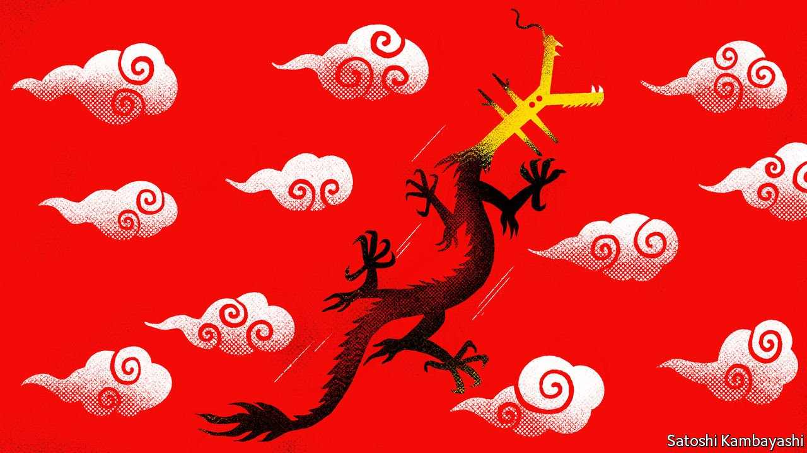

###### Buttonwood

# Why China has learned to relax about its currency 

##### In a sign of tolerance, it has not slammed the door on capital inflows 

 

> Jun 19th 2021 

IN A WORLD in which transparency has become a fetish, it is refreshing to try to get a read on the People’s Bank of China (PBOC). Its various nods and winks give market analysts something to interpret—or over-interpret. On May 31st it announced that it would increase the proportion of foreign-currency deposits that commercial banks must keep on reserve at the central bank, from 5% to 7%. After some chin-scratching, PBOC watchers came to a conclusion: China was sending a signal that the yuan had been rising a bit too quickly.

China used to intervene directly—by buying and selling dollars—to get the exchange rate it wanted. As recently as 2016 it ran down its foreign-exchange reserves from $4trn to $3trn to support the yuan. But for the past four years or so its reserves have been stable; there has been no large-scale intervention to either put a floor under the yuan or to check its rise. The surprise is not that China has thrown a little sand in the gears of its currency market. It is that it has become so tolerant of some fairly big swings in the yuan’s value.


The yuan began its recent ascent a year ago (see chart), as China’s factories reopened and demand for goods surged in the locked-down rich world. Chinese exporters took a greater share of world manufacturing, says Mansoor Mohi-uddin, of Bank of Singapore, which in turn increased the trade demand for yuan. Some headwinds became tailwinds. The yuan had traded at a discount to reflect fears of an escalation in the Sino-American trade wars. Exporters worried about a further hit to their revenues were inclined to hoard dollars—in part as security against their dollar debts. The prospect of Donald Trump’s electoral defeat changed the picture. The chances of further tariffs on Chinese goods were much reduced. Moreover, monetary conditions favoured speculative flows out of dollars and into yuan. In contrast to the Federal Reserve, the PBOC did not slash interest rates when the pandemic struck. The seven-day reverse-repo rate, one of China’s benchmarks, was trimmed by just 30 basis points to 2.2%, while the Fed funds rate was cut to 0.1%. The higher interest on offer in China’s money markets favoured its currency.

 


That is not all. China has been opening its markets to overseas investors. Non-residents can more easily buy and sell stocks and bonds on the mainland’s markets. China’s government bonds and “A” shares have qualified for inclusion in global benchmarks, such as the MSCI equity indices and the Bloomberg Barclays bond index, which are tracked by huge pools of capital. A steady flow of foreign purchases has pushed up the yuan. China has not stood in the way. Tellingly on May 31st the PBOC picked a tool that does not interfere much with portfolio inflows.

Still, there is a paradox. China has relaxed its hold on the yuan at a time when the ruling Communist Party has sought to exert greater control on private-sector businesses and on Chinese life in general. If China-watchers know anything, it is that control is prized in Beijing. Being in control does not mean that everything has to be nailed down, though. In the eternal trilemma between monetary autonomy, openness to capital and currency stability, something has to give. China has chosen to forgo a stable currency. That allows it greater traction over the domestic money supply and credit growth, which its regulators are more fretful about.

China’s global ambitions for the yuan also influence its policy choices. It has the world’s second-largest bond market and third-largest stockmarket. Yet foreigners still own fairly few of its assets. Even central banks, which have had access to China’s bond markets for a while, keep only 2% of their reserves in yuan. That is barely more than they hold in the Canadian dollar. Four years ago there was a vigorous internal debate about the merits of freer capital flows, says Eswar Prasad of Cornell University. But for the past two years the consensus has shifted in favour of them. If the yuan is to be a global currency, it needs first to be set free.

Even so, no one is confusing the yuan with a free-floating currency. There are ways—including all that subtle central-bank semaphoring—for China to exert influence. It is still far from transparent about where its tolerance bands begin and end. Such ambiguity is wise: give the markets a number and they will test it. Perhaps surprisingly China has not stood in the way of a much stronger yuan. But its policymakers reserve the right to keep currency markets guessing.

