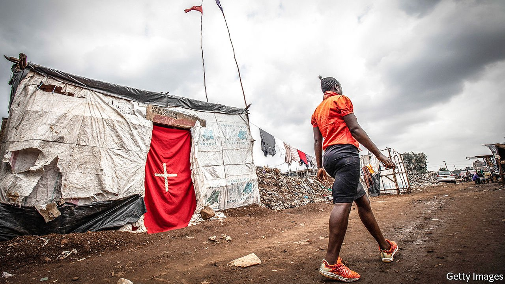
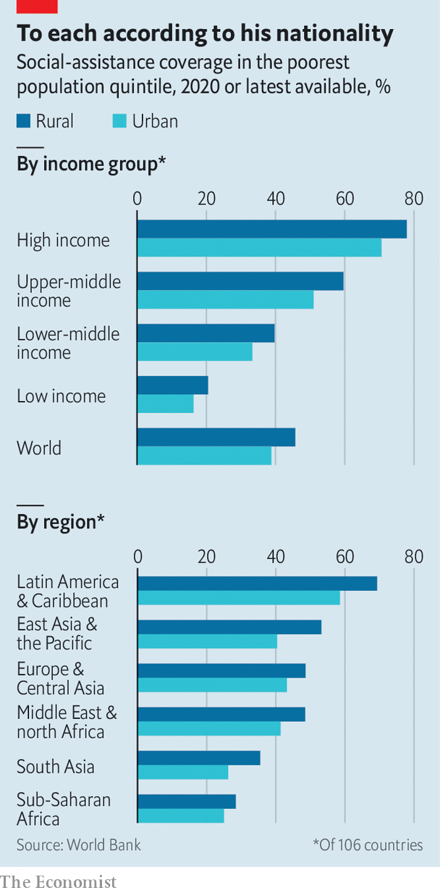

###### Rich slum, poor slum

# Economically, covid-19 has hit hard-up urbanites hardest 

##### This is true in rich and poor countries alike 

 

> Jun 19th 2021 

WINNIE MUHONJA has faced many difficulties in her life. Covid-19 is just the latest. Having grown up in Kibera, a huge slum with 300,000 residents in the middle of Nairobi, she is used to the presence of disease and the absence of money. Ms Muhonja, who is 25, has lived with her sister since she left school eight years ago. She has two jobs but cannot afford 1,000 shillings ($9.30) a month to rent a mud house for herself and her one-year-old son. “I just hope one day I'll get a chance to get out of Kibera,” Ms Muhonja says.

Almost 4,000 miles away in Madrid, another young woman longs to escape her neighbourhood. In Cañada Real, a shantytown of about 8,000, Douaa Akrikez is in her final year of school and studying hard. Life in Europe’s biggest slum is not nearly as grim as it is in Kibera but it is still precarious. Electricity outages this winter left at least 4,500 people there without heat for months, at a time when Spain was hit by record snowfalls. Without light and unable to charge laptops or mobile phones, children struggled with online learning. “I want to finish my studies, start working and get out of here,” says the 17-year-old.


With so many other problems in their lives, neither Ms Muhonja nor Ms Akrikez has much time to fret about covid-19. But the pandemic means policymakers are concerned about them. Around the world over a billion people live in slums, in rickety homes without property rights or basic services such as running water or reliable electricity. Most of the world’s worst-off slum-dwellers are in poor countries but shantytowns exist in rich ones too. Those who live in them tend to have informal jobs: hawking snacks, for example, or cleaning richer people’s houses. In rich countries, this means they miss out on government support such as furlough schemes. In poor countries, they get little support of any kind. In Nairobi, curfews have been imposed to slow the spread of covid-19. Those who have broken them in their efforts to make enough money to survive have been beaten up by the police.

Before the pandemic, policymakers worried most about poverty outside cities (see chart). Rural places often lack basic infrastructure such as roads and internet connections. But with an airborne virus in circulation, the risk of working outside tending livestock or ploughing fields is lower than cleaning houses. And even when no money is coming in, subsistence farming keeps stomachs full.

 


It is hard-up folks in cities who have been hardest hit by covid-19, both economically and in terms of their health. In May over a third of respondents in Kenyan cities told the World Bank that they had skipped at least one meal in the previous week, compared with 27% of those in the countryside. Among city-dwellers 15% said they were unemployed, almost certainly representing a bigger shock to urban areas. By the end of this year the bank predicts the pandemic will have pushed 150m more people into extreme poverty, defined as living on less than $1.90 a day. The new poor are more likely to be in metropolises than previously.

Covid-19 has forced city authorities to acknowledge slums, both for the sake of their inhabitants and their neighbours. The disease spreads fast when people live at close quarters. One study of Mumbai between June and July last year, before India’s second wave hit, found 54% of the city’s slum-dwellers had covid-19 antibodies, compared with 16% of those in formal settlements. That quickly spills into other neighbourhoods. Students from Cañada Real pile into buses to get to schools in and around the capital. Kibera is nestled between posh residential areas of Nairobi, where many slum-dwellers work.

Development wonks tend to focus on poor people in poor cities, such as Ms Muhonja, rather than poor people in rich cities, such as Ms Akrikez. That makes sense. The former are much poorer. Kibera is the sort of slum depicted in fundraising letters from charities: huts made of mud and sheets of corrugated iron; rubbish heaped on unpaved streets.

Extreme poverty makes it harder to stay healthy. Ms Muhonja shares her one-room shack with five other people. Social distancing is all but impossible. They have no running water. Instead they buy jerry cans of water for drinking and cooking and pay to use communal baths.

Residents of Kibera complain less about the risks of covid-19 to their health and more about its economic impact. When the hair salon where she works cut Ms Muhonja’s hours, a friend hired her to look after his mobile-money stall. But the 6,000 shillings a month she earns there is not enough. And she is one of the lucky ones. Many of her neighbours are jobless. Many residents rent their homes from private landlords. These landlords threaten tenants, removing doors and roofs as penalty for non-payment, according to Joe Muturi of Slum Dwellers International, a network of community groups. “The threat of eviction is always there,” he says.

People in Cañada Real are far better off. Many do not pay rent. The settlement sits on public land that was once an ancient drove-road for sheep. The residents include Roma (gypsy) families, poor Spaniards and north African migrants, many of whom worked in the construction industry before the global financial crisis of 2008. As a result parts of the slum look like any other neighbourhood in Spain’s capital, with solid roads lined with neat concrete houses. Only the tangle of wires on top of electricity posts gives away that this is an informal shantytown.

Ms Akrikez lives with her parents and four siblings in a sturdy house with clean water and flushing toilets in Cañada Real. Her father makes a steady living on building sites. They can afford to buy face-masks and new clothes.

The thief of joy

But people in Cañada Real are poor compared with those around them. Relative poverty (ie, how poor people’s incomes compare with the national median) is painful. The stigma is worse. Most people Ms Muhonja knows struggle just like her to get enough food, a roof and clean water.

Ms Akrikez, by contrast, only recently told her classmates where she lives. She had to build up the courage. Many think the residents of Cañada Real are “different”, “delinquents” and “people who don’t work”, she says. That humiliation, says Sabina Alkire, director of the Poverty and Human Development Initiative at Oxford University, can affect the brain in the same way as physical pain. “People feel excluded and it hurts,” she continues. Ms Akrikez goes to school outside Cañada Real. Her friends hang out in the city centre at the weekend. She has no way of getting there. Her only outings are organised by Caritas, a Catholic charity. “It’s not a normal life,” she says.

 


When most Madrileños think of Cañada Real they imagine not diligent teenagers but drugs. One area, Sector Six, is a hub in Europe’s drug trade. At a local church charities hand out food, water and clean needles. “This is the back door of Madrid where people put their trash and don't even look at it,” says María de las Mercedes González Fernández, the central government’s top official for Madrid and a member of the Socialist Party, who blames the right-wing municipal government for failing to help.

The authorities responsible for Cañada Real have long known how difficult life there is. They signed a pact four years ago pledging to move families from the worst-off parts and upgrade the rest. But progress has been sluggish. Ms Akrikez knows of just one family that has been rehoused.

Reliable utilities and clear property rights are a long way off in shantytowns everywhere. In places such as Cañada Real, where relative poverty is the problem, there is no quick fix. Some residents have formal IDs and receive handouts from the government. But social exclusion persists.

Shifting up a gear

In some of the world’s poorest countries, where the problem is extreme poverty, the pandemic is prompting governments to action. Some governments are extending social-protection programmes, like cash transfers, to urban areas. It is not easy. Local authorities do not have complete lists of who lives where or details of their earnings. Few slum-dwellers have the necessary paperwork. But in recent months the Democratic Republic of Congo has used satellite imagery to identify the poorest neighbourhoods by housing density and flood risk to help target its emergency cash-transfer programme. Togo’s government has signed up a third of its adult population, 1.6m people, to a new social-assistance programme using radio, television and social media to spread the word. Now it must find more money for them.

Even such minor successes are all too rare. Covid-19 has turned a spotlight on slums, but most governments are still failing their inhabitants. As they did before the pandemic, charities are trying to plug the gap. People in Kibera joke that there is one for every household in the area. They have set up handwashing facilities and education campaigns during the pandemic. But volunteers can only do so much. Overcrowded, unregulated settlements risk becoming a Petri dish for new variants of covid-19. So far, even that threat has not spurred governments to do much. ■

