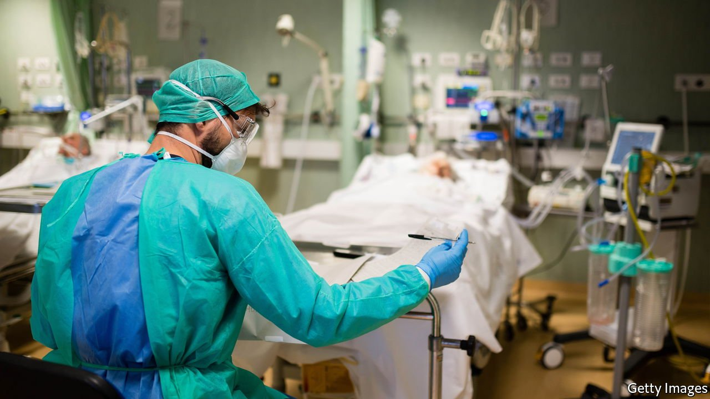
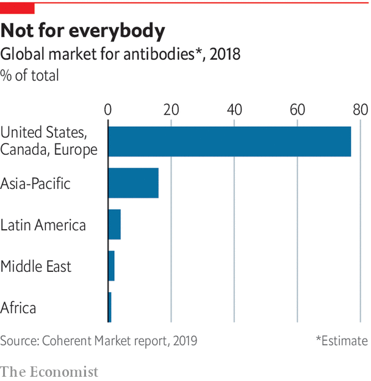

###### Antibody of evidence

# A new weapon in the war against SARS-CoV-2 has been found 

##### It is expensive, though, and in short supply 

 

> Jun 16th 2021 

AN ANTIBODY THERAPY from Regeneron, a firm in upstate New York, improves the survival of patients with covid-19 and offers renewed hope for the treatment of those most seriously ill with the disease. A study in British hospitals found that Regen-Cov saved the lives of many of those unable to make their own antibodies in response to SARS-CoV-2. Such “seronegative” individuals constituted about a third of the 9,785 hospital patients in the study. As compared with a control group given standard treatment (either a steroid called  or, for the sickest, an anti-inflammatory known as ), 20% more patients survived. Regen-Cov also reduced the median length of hospital stays from 17 to 13 days.

Regen-Cov is a combination of two monoclonal antibodies, known as casirivimab and imdevimab. Antibodies are immune-system proteins that disable pathogens by locking specifically onto them. Both casirivimab and imdevimab bind to different sites on the coronavirus’s “spike” protein, preventing the virus from infecting cells. Using two antibodies instead of one reduces the risk of the virus evolving resistance to the treatment.


Until now,  have not made a convincing case for the widespread use of antibody therapies for covid-19. One problem has been a failure to identify a clear group of patients who can benefit from these costly treatments. This is the first study large enough to show that such a therapy reduces mortality in patients admitted to hospital with severe covid-19. A year ago, the same Recovery trial run by British scientists also discovered that dexamethasone would save patients’ lives.

Regen-Cov already has emergency authorisation for use in America, Brazil, Canada, the European Union and India, but remains an investigational drug in Britain and elsewhere. Even if authorisation follows in many other countries, though, access to it is likely to remain extremely restricted.

 


Soumya Swaminathan, the chief scientist at the World Health Organisation, said the result was good news, but warned that access to monoclonal-antibody drugs was “limited globally”. A recent study by the Wellcome Trust, a British medical charity, and IAVI, the International AIDS Vaccine Initiative, showed just how unavailable these drugs are in various parts of the world (see chart). More than three-quarters of the market for them is in America, Canada and Europe. So far, two countries, America and Germany, have bought large supplies of Regen-Cov. In January, America agreed to purchase up to 1.25m doses for $2.6bn. In the same month, Germany spent $487m on 200,000 doses. (Donald Trump was treated with Regen-Cov when he fell ill with covid-19.)

The reasons for this geographical concentration are twofold but related: quantity and price. Production facilities for monoclonal-antibody therapies are few. And, in general, only wealthy countries can afford them. Regen-Cov costs many thousands of dollars a dose.

Dr Swaminathan says more monoclonal-antibody factories need to be established around the world so that such treatments become accessible and affordable. Lack of availability of Regen-Cov will probably become a topic of interest to those who argue that intellectual property in covid-19-related technologies should be waived by the World Trade Organisation.

So far, trials for covid-19 antibody-therapies have generally been disappointing, but news of Regen-Cov’s success is likely to reinvigorate interest in them. Eli Lilly’s antibody therapy, LY-CoV555, failed to provide benefit to hospital patients in a trial reported last December, while on June 15th a similar drug from AstraZeneca also disappointed when given to those who had been exposed to the virus. These drugs might, however, turn out to be beneficial if they are given to the narrower patient group identified by the Recovery trial.

Should demand for Regen-Cov now increase, though, it is not clear how quickly supply could be improved—even in countries that have the money to pay for it. Monoclonal-antibody production lines are currently used to make cancer and arthritis drugs, which are also badly needed. Moreover, supplies of much of the equipment required, including biobags (giant disposable plastic bags used to make drugs), filters and sterilisation gear, are already stretched thin by demands from vaccine manufacturers. Earlier this year, two pharma companies complained that their ability to make monoclonal antibodies was hampered by shortages of equipment, thanks to the global push to make vaccines.

Any attempt to increase the supply of monoclonal antibodies in coming months could thus compete with vaccine manufacturing. America currently has a lock on much of the supply of equipment and raw materials needed to make vaccines, a hold it maintains through the use of the Defence Production Act. If America chose to use the DPA to support monoclonal antibody production, that might have an impact on vaccine production in countries such as Brazil, Britain and India.

The Recovery study also seems to settle a scientific debate about whether it is worth giving antiviral therapies to covid-19 patients when they arrive in hospital. It is. It had been thought that, by the time a patient arrived, only anti-inflammatory drugs, which treat damage already done by the virus, were relevant. Knowledge that patients who are seronegative are able to benefit from antiviral therapies opens up further lines of investigation for antiviral drugs. In the Recovery trial, untreated seronegative patients were twice as likely to die as those who were able to mount an antibody response.

For doctors, the trial raises an intriguing question. If they have patients languishing at home with covid-19, might it be worth offering a cheap lateral flow test to try to identify those who are not mounting an immune response? If it is possible to spot those most likely to end up in hospital, and stop that happening, it would help to weaken the virus’s hold on patients, and on society at large.

Dig deeper

All our stories relating to the pandemic and the vaccines can be found on our . You can also listen to , our podcast on the race between injections and infections, and find trackers showing ,  and the virus’s spread across  and .

