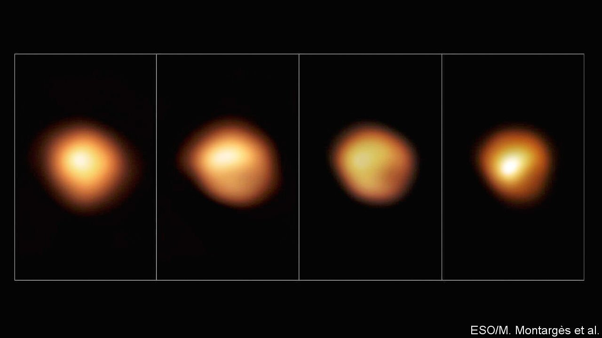

###### Astronomy

# Betelgeuse’s great dimming 

##### Last year’s supernova false alarm explained 

 

> Jun 17th 2021 

THESE IMAGES show Betelgeuse, a star that marks one of Orion’s shoulders, as it was in January and December of 2019 and January and March of 2020. They were assembled from data collected in those months by the Very Large Telescope, an array of four instruments in northern Chile. Between November 2019 and March 2020 there was excitement among astronomers when a rapid dimming of this, the second-closest red supergiant to Earth, suggested that . Regrettably for those who enjoy watching notable astronomical phenomena, it did not, though one is expected within the next 100,000 years or so. Studying these images, as they write in Nature, Miguel Montargès of the Paris Observatory and his colleagues suggest the most likely cause of the diminution was a local cooling of part of the star’s southern hemisphere, associated with an ejection of mass. The much bigger ejection of mass that is a supernova will have to wait.

A version of this article was published online on June 16th 2021

