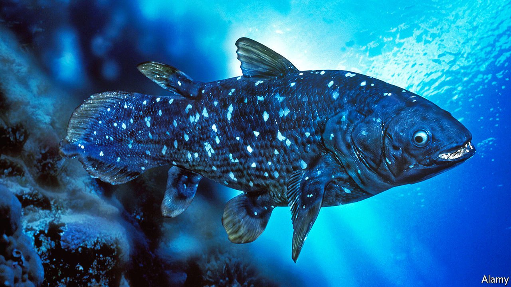

###### Living fossils

# Coelacanths live for as long as people 

##### And their young have a five-year gestation period 

 

> Jun 19th 2021 

ON DECEMBER 23rd 1938 Marjorie Courtenay-Latimer, a curator at the East London Museum, in South Africa, dropped by her local fish market. While there, she spotted the most beautiful fish she had ever seen. It was pale mauve, nearly two metres long, and had silvery markings. Though she had no inkling at the time, it turned out to be part of a group called the coelacanths, hitherto believed to have died out with the dinosaurs.

This find, called Latimeria chalumnae in Courtenay-Latimer’s honour, showed coelacanths are still very much alive. It was hailed as the most important zoological discovery of the century. Now, work just published in Current Biology by Kélig Mahé of the Fisheries Laboratory, in Boulogne, France, suggests that besides having lasted collectively for more than 400m years, coelacanths also hang around for a long time as individuals. Dr Mahé’s study indicates they have similar lifespans to human beings, putting them among the world’s longest-lived vertebrates.


The excitement at Latimeria’s discovery was not just because of the curiosity of its survival. It was also that coelacanths belong to a group which have lobe-shaped fins of a sort thought to have been precursors to the limbs of terrestrial tetrapods. Many experts have therefore sought to study Latimeria more closely. That is, however, hard. Latimeria is reclusive, nocturnal, lives in depths below 100 metres, and is known only from the south-western Indian Ocean and from a second, smaller population, L. menadoensis, near Manado Tua, an island in Indonesia.

In particular, Dr Mahé wanted to know how long Latimeria lives. Previous work, which looked at annual growth rings in its scales, suggested a maximum of 20 years. That does not square with the animal’s slow metabolism and low fecundity, both traits characteristic of long-lived species.

Rather than using standard microscopes, he and his colleagues employed polarised light to study the scales. This revealed extra growth rings so thin that previous work had missed them. Of 27 individuals studied, six turned out to be in their 60s and one was 84.

This was a finding Dr Mahé and his colleagues had more than half expected. What truly surprised them was a discovery made by looking at two unborn youngsters—for Latimeria females bear live young rather than laying eggs. The fetuses’ scales suggested they were five years old, a remarkably long gestation period given the previous vertebrate record of three-and-a-half years, held by the deep-sea frilled shark.

Though interesting, in some ways Dr Mahé’s discovery is bad news. An already-rare, slow-growing animal with a gestation period of half a decade has just about the most extinction-prone profile it is possible to imagine. Latimeria is legally protected, in as much as such protection pertains at sea, and is not a particular target for fisherfolk. But it is already classified as critically endangered by the International Union for Conservation of Nature. It would be both ironic and tragic if, having survived the asteroid impact 66m years ago that did for the dinosaurs, coelacanths were to disappear for good on humanity’s watch. ■

