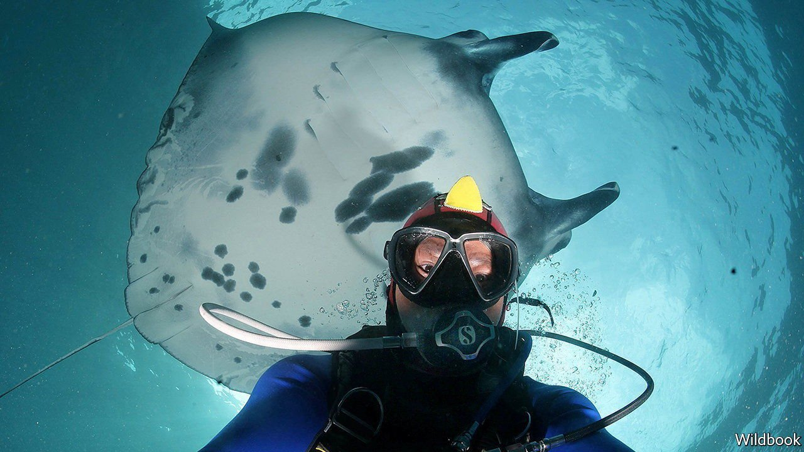
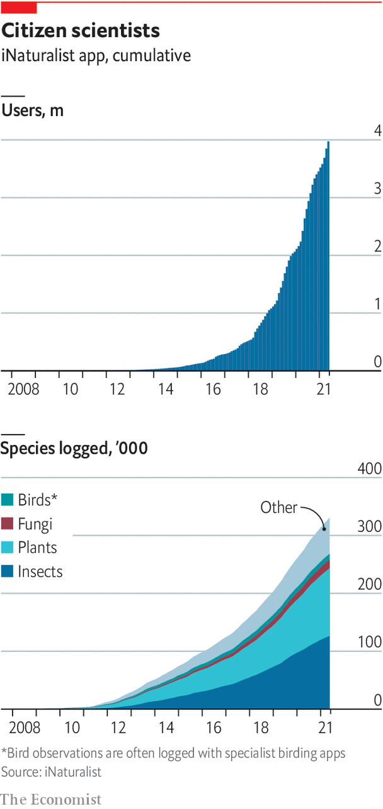

###### Crowdsourced science

# How volunteer observers can help protect biodiversity 

##### Uploading your holiday snaps can make a difference, too 

 

> Jun 15th 2021 

ECOLOGY LENDS itself to being helped along by the keen layperson perhaps more than any other science. For decades, birdwatchers have recorded their sightings and sent them to organisations like Britain’s Royal Society for the Protection of Birds, or the Audubon society in America, contributing precious data about population size, trends, behaviour and migration. These days, any smartphone connected to the internet can be pointed at a plant to identify a species and add a record to a regional data set.

Social-media platforms have further transformed things, adding big data to weekend ecology. In 2002, the Cornell Lab of Ornithology in New York created eBird, a free app available in more than 30 languages that lets twitchers upload and share pictures and recordings of birds, labelled by time, location and other criteria. More than 100m sightings are now uploaded annually, and the number is growing by 20% each year. In May the group marked its billionth observation. The Cornell group also runs an audio library with 1m bird calls, and the Merlin app, which uses eBird data to identify species from pictures and descriptions.


All these data are used to generate detailed maps and forecasts of species distribution, abundance, migrations, and snapshots of how populations are changing and adapting to their environment. They feed into hundreds of academic papers and national conservation assessments such as the 2020 State of India’s Birds, the first attempt to classify Indian birds according to their extinction risk. The analysis of 867 species found that many of those that were thought to be widespread were in fact endangered.

 


There are many other such projects. Nearly 4m amateur ecologists have signed up to iNaturalist, a social network run jointly by the California Academy of Science and the National Geographic Society. Its users have contributed 66m observations of more than 300,000 species (see chart). Such apps engage people in their natural environment, “a really important and overlooked aspect of the interface between technology and conservation,” says Joe Walston of the Wildlife Conservation Society (WCS) in New York. Collective interest on public forums can help create new protected areas. In 2016, WCS worked with the Woods Hole Oceanographic Institution, a research institute, to drop hydrophones in the Hudson river to monitor passing whales. The data were made publicly available and the research was discussed in local news. Pressure from New Yorkers, astonished to find that they had a resident whale population, led to changes in shipping lanes and speeds, in order to create less disturbance for the whales.

Elsewhere, researchers faced with having to sift through thousands of hours of images recorded by camera traps have found willing helpers in armchair ecologists. Penguin Watch, for instance, recruits people to go through images collected by camera traps that are trained on Antarctica’s penguin colonies.

Increasingly, some of this work is being handed to machine-learning algorithms that are trained to recognise particular species. Wild Me, an NGO based in Oregon, has taken the idea one step further. It provides online platforms where users upload pictures that are then run through image-recognition software. Just like facial-recognition systems, the software can recognise specific individuals belonging to species that have identifying features such as spots or stripes. So far, Wild Me has applied this approach to 53 species, including clouded leopards, skunks and leopard sharks. As pictures are added to the platforms, each individual can be tracked as it develops and moves around its region or the globe.

Facebook for zebras

One of the group’s early projects involved a collaboration with the Grevy’s Zebra Trust in Kenya, which organises an annual two-day rally in the Lewa Wildlife Conservancy to capture as many pictures as possible of the eponymous endangered equine. Participants, including scientists and members of the public, are given guidelines on how to photograph animals, record GPS co-ordinates and feed pictures into the Wild Me algorithm, which uses the animals’ distinctive stripe patterns to identify individuals. With repeated surveys, the zebras’ population structure, movements and evolution can be monitored. The work has shown that lions were killing more young zebras than the group could sustain, leading the park to change its management of the lion population. It is now a key component of the official population assessment of the International Union for the Conservation of Nature.

Images uploaded to Wild Me range from tourist snaps to pictures from camera traps or drones. Researchers can reconstruct the recent history of a species by uploading their entire backlog of camera-trap pictures. The Wild Me team has also been harnessing data generated by inadvertent ecologists in the form of pictures and videos posted on Twitter, Facebook, YouTube or Flickr. “In 2018, just by taking publicly posted videos of whale sharks, there were more sightings than all the human contributors combined from all the other sources,” says Tanya Berger-Wolf, a co-founder.

There is, however, a downside to making reams of GPS-tagged data of endangered species publicly available online. In January 2020, within hours of a picture of an elephant being posted on social media, a poaching attempt was made on the very same animal. On that occasion, the elephant escaped. Aware of the delicate balance that needs to be struck between sharing and protecting conservation data, conservationists have started advocating “privacy for tigers”. Groups like Wild Me and iNaturalist strip or hide geotags from their images. But webcams of nature reserves around the world can be watched, live, by anyone with an internet connection. In the space of 30 minutes, your correspondent jumped between elephants drinking from a watering hole to lion cubs playing in long grass to a herd of elk striding across the Canadian Arctic. The location of each camera was clearly indicated—and was thus available to poachers. ■

Full contents of this Technology Quarterly* Crowdsourced science: How volunteer observers can help protect biodiversity

