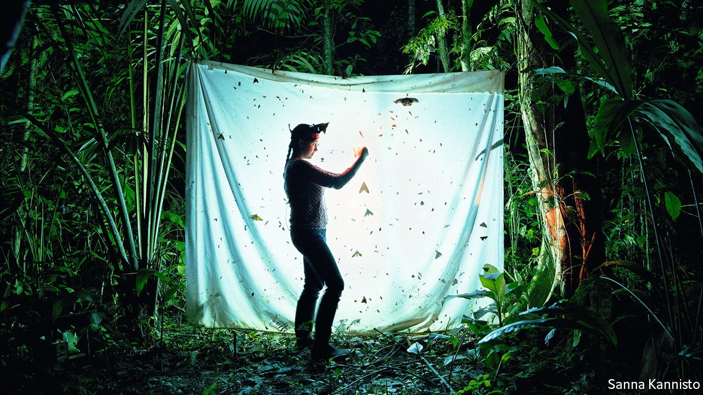

###### The other environmental emergency

# Loss of biodiversity poses as great a risk to humanity as climate change 

##### Technology has a growing role to play in monitoring, modelling and protecting ecosystems, writes Catherine Brahic 

 

> Jun 15th 2021 

HUMAN SOCIETIES depend on healthy ecosystems. People consume their products in the shape of fish, meat, crops, timber and fibres such as cotton and silk. Medicines may be directly harvested from the natural world or inspired by molecules and mechanisms found within it. The ecosystems that crops depend upon are regulated by living things. Through photosynthesis, trees and other plants take in carbon and pump out oxygen. In doing so they remove roughly 11bn tonnes of carbon dioxide from the atmosphere each year, equivalent to 27% of what human industry and agriculture emits (the oceans absorb a further 10bn tonnes).

The services that ecosystems provide to humanity depend, in turn, on there being a diversity of living things. More than 75% of global food-crop types, including coffee, cocoa and almonds, are pollinated by animals. The complex web underpinning every food chain and ecosystem means that the narrow range of species that humans eat and exploit cannot be sustained without the existence of a much greater diversity of animals, plants and bacteria.


More diverse forests store more carbon than monocultures. Skipjack tuna makes up roughly half of the global tuna catch for human consumption. As young animals, they eat zooplankton, which is to say very small floating animals like tunicates, ctenophores and small crustaceans as well as the larvae of larger animals. As adults, they eat smaller fish, squid and crustaceans. To conserve the skipjack, all this diversity in its food chain must also be conserved.

Since the 1990s, alarmed by studies showing rapid declines in animal and plant species around the globe, ecologists have talked of an impending mass extinction. It would be the sixth in the Earth’s history, but one unlike any that has come before. Surveys show that the loss of biodiversity is the result of a combination of factors: climate change, pollution, human exploitation of land, sea, plants and animals, and the displacement of some species into new territories where they play havoc with existing ecosystems. Uniquely in Earth’s history, each of these drivers of ecological change is caused by a single species: Homo sapiens.

When IPBES (the Intergovernmental Science-Policy Platform on Biodiversity and Ecosystem Services, similar to the Intergovernmental Panel on Climate Change) published its assessment of the state of global biodiversity in 2019, it offered a sobering picture. Roughly 1m animal and plant species were deemed to be at risk of extinction, more than at any other point in human history. These included many that are used in farming. At least 9% of the 6,200 breeds of domesticated mammals that humans eat, or use to produce food, had become extinct by 2016, and at least 1,000 more are threatened. More than one-third of continental land area and nearly three-quarters of freshwater resources are used to produce crops or livestock, but environmental degradation has damaged the land’s ability to support these activities. And one-third of marine fish stocks were being unsustainably exploited in 2015.

The biodiversity crisis poses as great a risk to human societies as climate change. Yet it has a fraction of the public profile. In part that is because the loss of biodiversity cannot be neatly quantified, as climate change can, into parts per million of carbon dioxide, or degrees above pre-industrial average temperatures. And the webs that link species within and across ecosystems are even more complex than the processes that drive climate change.

Understanding a problem, however, is a necessary step towards solving it. And that is where technology can help. This Technology Quarterly will consider its role in monitoring, preserving and restoring ecosystems and species. Only by measuring the state of ecosystems can their health be assessed, losses be quantified, and the effectiveness of interventions be evaluated.

As well as monitoring biodiversity, technology can also be deployed to protect it. And in some cases it may even be able to reverse losses, by bringing extinct species back from the dead. Ironically, it is humanity’s use of technology, whether in simple forms such as chainsaws or dragnets, or more complex ones such as modern agriculture and transportation, that is chiefly responsible for biodiversity loss. The challenge now is to deploy it so that it is not just part of the problem, but part of the solution. ■

Full contents of this Technology Quarterly

* The other environmental emergency: Loss of biodiversity poses as great a risk to humanity as climate change


