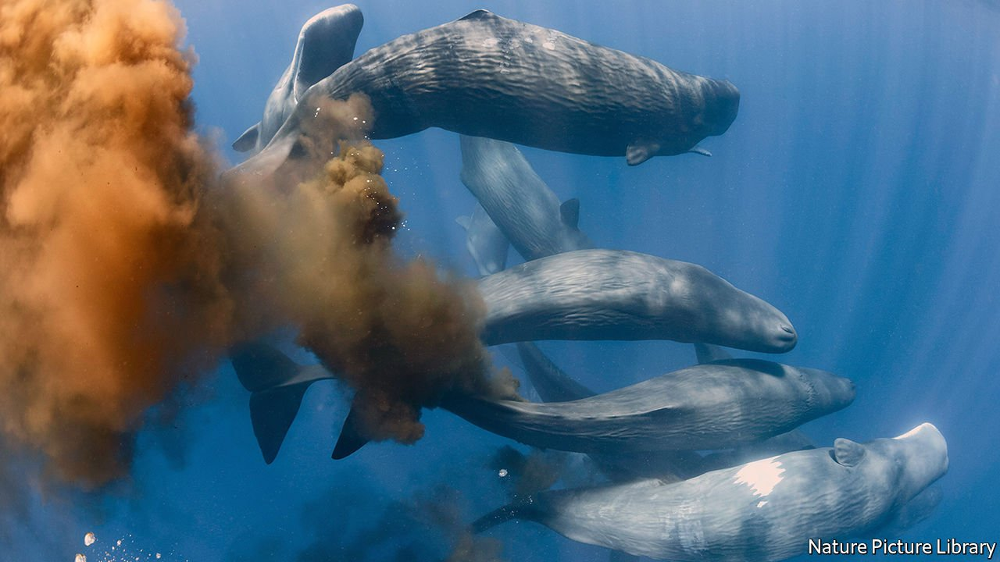
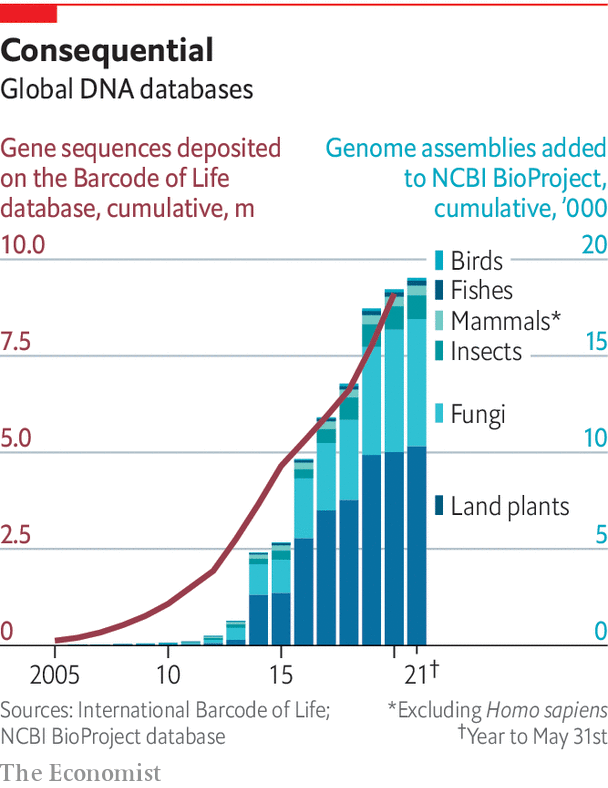

###### Cracking the code

# The sequencing of genetic material is a powerful conservation tool 

##### You can learn a lot from the faeces, skin cells and other traces that animals leave behind 

 

> Jun 15th 2021 

IN SEPTEMBER AND October 2000, the carcasses of several northern hairy-nosed wombats and some fragments of intestine were discovered in Australia’s Epping Forest National Park, apparently left behind by a mystery predator. Cattle farming has shrunk the wombats’ natural habitat and consequently their population, which reached a low of just 20-30 animals in the 1970s before land-management policies helped push numbers back up to roughly 100 in the early 2000s. By sequencing DNA extracted from the Epping Forest remains, researchers identified six males and one female. But what had slain 6% of the known wombat population?

Suspicion fell on either dingoes or wild dogs, and the final answer came packaged inside faeces collected in the park. Some yielded the same genetic sequences as the carcasses. They had been left by dingoes. The team had identified their killers, and in 2002 a 20km protective fence was put up around the forest.


Environmental DNA, or eDNA, has emerged as an increasingly popular tool among conservation biologists and land managers, as DNA-sequencing tools have become progressively smaller, faster and cheaper. The field began in the late 1980s, when microbiologists started using it to look for bacteria in rivers and sediment. This had previously involved smearing water or dirt on Petri dishes to grow colonies of the resident microbes and then identifying them under the microscope, based on the shape of the colonies or how they responded to being stained with dye. It was lengthy and error-prone. Extracting DNA from samples instead, and comparing their genetic sequence to reference libraries, was quicker and more reliable.

The same approach was adopted and built upon in the early 2000s by ecologists, who were aware that the animals they studied were constantly shedding DNA in faeces, saliva, blood, scales and sloughed tissue. Gathering and sequencing this material provided valuable information without needing to interact with the animals themselves. The approach found particular favour early on with researchers studying freshwater systems. By simply dipping a test tube into a stream, they could find out if a target species was present and even how abundant it was.

Because trace amounts of DNA can be amplified before sequencing using a method called polymerase chain reaction (PCR, the same method used to detect SARS-CoV-2 in coronavirus testing), eDNA studies can detect species present in low numbers—a useful tool for tracking down rare species, or spotting invasive ones before they wreak havoc on a fishery. Other studies have sought evidence that escapees from fish farms were mating with wild populations, potentially eroding them.

DNA from scat, as wild animal droppings are known, can map out food chains without having to capture and kill animals in order to examine the contents of their guts. Killing large or rare species like whales, even for conservation purposes, poses ethical and practical challenges. But whale scat has the great advantage of buoyancy. Finding a turd floating in the middle of the ocean is made easier with the help of dogs that are trained to sniff out the signature smells of excrement belonging to a range of endangered species. DNA in the netted excrement can be analysed to determine what the animal ate, or what bacteria live in its gut.

On land, researchers can use eDNA from faeces, urine or hair to see how populations are interacting. In Malaysia, an ongoing project is focused on whether sub-populations of the Malayan tiger are still connected when deforestation has fragmented their habitat. In Britain eDNA is used to monitor a protected newt. Other projects have begun to show that cells left in footprints in snow can yield enough DNA to identify species and possibly sex.

Several groups are attempting to identify all the individuals belonging to a population from footprint DNA, which would transform monitoring of populations, help with the tracking of animals as they roam across wide areas without the need for radiotags, and setting sustainable hunting quotas. Researchers at the US Forest Service are trying this with wolves.

So-called “metagenomic” studies use e DNA to map the genetic make-up of entire communities, such as coral reefs, or the vast, largely unexplored bacterial community that lives deep inside the Earth’s crust and whose biomass is an order of magnitude greater than that of all animals combined. Such studies can offer a genetic snapshot that might take years of field studies to establish.

 


The field is booming, but there are challenges. It can be difficult to tell when eDNA was deposited. DNA sampled at one point in a river could have come from anywhere upstream. And species identification is only as good as the species-specific genetic barcodes and reference genomes that serve as points of comparison. This has spurred a rush of projects to either identify a unique genetic signature for every species, such as the International Barcode of Life, or sequence the whole genomes of as many species as possible (see chart). The $4.7bn Earth Biogenome Project aims to sequence 1.5m species in ten years. As well as collecting and preserving genomes, such genetic databases can be mined for information on susceptibility to disease, or for potential medicines.

But even though genetic sequencing has become much cheaper since the late 20th century, it remains prohibitively expensive for most researchers outside America, Europe and China. Sequencing technologies are improving rapidly, however. In particular, Oxford Nanopore, a British company, has developed portable technology that allows sequencing to be done in the field, not just in the lab. It relies on nanopore sequencing, a technique in which strands of DNA are drawn through a nanometre-sized pore in a biological membrane. Each of the four letters of the DNA alphabet produces a distinct electrical signal as it passes through the pore, allowing the sequence to be read in real time.

Oxford Nanopore’s Min ION, a USB-powered, pocket-sized device, allows every part of the sequencing process to be done in the field. Sequences are produced within an hour. The devices are relatively affordable: prices start at around $1,000, though subsequent recharges are needed to run more samples. They have been used to sequence viruses in Brazil, amphibian DNA in Tanzania and bacteria on the International Space Station.

The technology also opens up new possibilities for investigation and enforcement. Genetic sequencing in the field can be used to identify the nature and origin of illegal bushmeat, fish or smuggled ivory. A paper published in  Forensic Science International: Genetics in March 2021 compared results obtained by the Min ION with the standard sequencing methods used in wildlife forensics. It found the results to be comparable, potentially paving the way for handheld devices to be used in wildlife-crime prosecutions. ■

Full contents of this Technology Quarterly


* Cracking the code: The sequencing of genetic material is a powerful conservation tool


