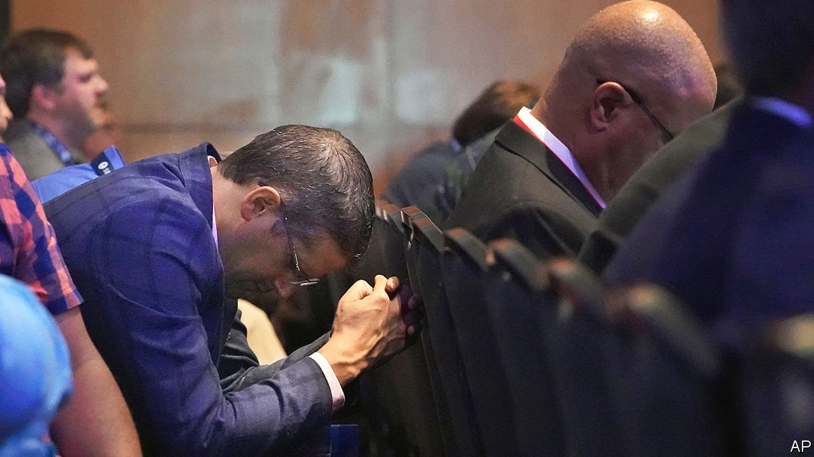

###### A house divided

# America’s largest Protestant denomination holds off an insurgency 

##### But Southern Baptists remain deeply riven 

 

> Jun 17th 2021 

ANNUAL MEETINGS of the Southern Baptist Convention (SBC), America’s largest Protestant denomination, are usually dull. Church representatives, known as “messengers,” debate resolutions about ecclesiological minutiae and hold referendums about referendums. There is a committee on committees that selects officers for a committee on nominations that nominates members of other committees.

This year was different. The agenda included the election of a new president, a vote on whether to allow an investigation into accusations of sexual abuse, and a showdown over race (the denomination was founded in the pre-civil war South after Northern Baptists refused to appoint slaveholders as missionaries). On most of these issues, the SBC’s more moderate wing held off a right-wing insurgency—for now.


Tensions within the SBC had long been building, particularly around accusations that the convention had shielded sexual predators. In a resignation letter leaked on May 29th, Russell Moore, head of the SBC’s public-policy arm and a man broadly respected as a writer and thinker outside the denomination, alleged that the SBC’s executive committee “exonerated” churches in a spur-of-the-moment meeting over covering up allegations of sexual abuse.

Mr Moore was also at the centre of the firestorm within the SBC about race. He called for white Christians to empathise with African-Americans over issues such as police brutality, but said some leaders “want to deflect the issue to arcane discussions that people do not understand, such as ‘critical race theory (CRT),’” an academic niche more condemned than understood. CRT has become a bogeyman for the American right, and incensed some pastors who consider woke ideologies a grave threat to their churches and the country.

Anti-CRT pastors last year formed the Conservative Baptist Network, whose agitation has led some African-Americans to cut ties with the denomination and has tormented anyone seen as insufficiently conservative. In his resignation letter, Mr Moore wrote, “My family and I have faced constant threats from white nationalists and white supremacists, including within our convention.”

The conservative wing’s choice for president was Mike Stone, a pastor from Georgia. He ran against Ed Litton, a pastor from Alabama known for his efforts at racial reconciliation. Mr Litton eked out a narrow victory. Soon afterward, messengers charged him with creating a task force to oversee an independent investigation into the SBC’s historic handing of sexual abuse. Jules Woodson, who says she was abused by her youth pastor when she was 17, tweeted, “Thank you from the bottom of my heart for hearing our cries.”

Some hope that the victory of the less-conservative wing may help staunch the outflow of members. Though more than 14m Americans identify as Southern Baptists, their number has been declined for 14 years in a row: 2020 (when membership shrank by 435,000) was the worst year on record. Southern Baptism is an evangelical denomination, which means that members must choose to be baptised into the faith; according to figures presented at this year’s meeting, the SBC is baptising 40% fewer teenagers than it did in 2000. Churches also struggle to retain young people; half of those raised in SBC churches leave, in part because of how the denomination responds to social questions.

“Either the Southern Baptist Convention rectifies the ways that it has hurt people...or I think that more young people like myself will find new avenues to pursue ministry and denominational affiliations,” says Leah Boyd, a 22-year-old seminary student whose Twitter account is popular among young evangelical Christians. “They told us to read our Bibles and so we did and then we all became...very social justice-minded,” Ms Boyd adds, pointing to Biblical commands to care for the poor and the oppressed.

But the church’s more conservative wing will not simply retreat to lick their wounds in the back pews. Before the vote, Rod Martin, an architect of the conservative resurgence, said, “If we do not prevail today, we will come back next year, and the next and the next.” ■

