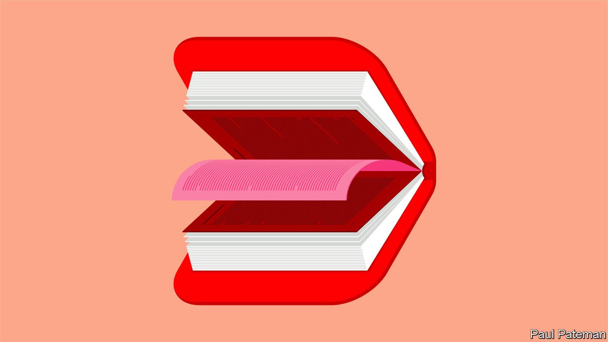

###### Banyan

# A political memoir has South Koreans asking whom politicians serve 

##### A new book by Cho Kuk, a disgraced minister, reignites an old debate about fairness 

 

> Jun 26th 2021 

“IT IS LIKE dipping my pen in my family’s blood,” writes Cho Kuk in the opening lines of “Cho Kuk’s Time”. Mr Cho was forced to resign as South Korea’s justice minister in the autumn of 2019 after just 35 days in office, felled by a scandal that shook the government. In the time-honoured tradition of politicians writing memoirs, he uses his blood-soaked pen to explain how he was wronged, so wronged: Mr Cho and his family were just innocent victims, persecuted by entrenched forces that would stop at nothing to retain their power.

Over 366 pages, Mr Cho compares himself to kindling (for the cleansing fire of reform), a monkey in a zoo (to be treated as a spectacle) and Santiago (the old man in Ernest Hemingway’s novel about an ageing bloke and a body of water). The book is a gigantic hit, selling some 200,000 copies in two weeks.


That is not because South Koreans agree with Mr Cho’s characterisation of his travails. By the time he resigned, many had come to regard him as a symbol of entrenched privilege and political hypocrisy. Mr Cho had been charged by President Moon Jae-in, of the left-wing Minjoo Party, with curbing the powers of the prosecution service, one of the last institutions of the state to remain almost unchanged since the days of dictatorship. But in the eyes of the public, Mr Cho appeared to be taking advantage of the very privileges the government had vowed to dismantle. His memoir has reignited a debate sparked by his downfall two years ago: do politicians promising to make South Korea fairer hold themselves to their own standards?

The reforms that Mr Cho was asked to implement—limiting the investigative powers of prosecutors and creating a specialist agency for crimes involving senior officials and big-cheese businesspeople—were broadly popular. South Koreans have long believed that the prosecution wields too much power and has a tendency to abuse it. But attention quickly shifted from the reforms to the personal conduct of Mr Cho and his family. His daughter, a medical student, had allegedly won prestigious scholarships despite twice failing her university exams. His wife was alleged to have forged certificates for her daughter and to have used her hairstylist’s bank account to conceal wealth that transparency rules required her to disclose.

The charges caused particular anger because of the paramount importance South Koreans place on educational attainment. Young people, in particular, are concerned about shrinking opportunity and slowing social mobility. Pressure from investigations by the very prosecutors whose powers he was supposed to curb forced Mr Cho to resign. His wife has since been sentenced to prison for insider trading and for forging internship certificates and academic awards. Mr Cho’s own trial on related charges is in progress. He claims to be innocent.

The memoir appears to have caused some soul-searching among his former colleagues. Song Young-gil, Minjoo’s chairman, apologised for nepotism within the party and vowed to do better. “We have shouted fairness and justice more loudly than anybody else, but we need to reflect if we have applied this rule to ourselves and our children,” he said. Yet in the same breath, Mr Song stressed that Mr Cho’s behaviour had not necessarily been illegal. Moreover, he pointed out, those who had gone after him had committed irregularities, too.

Unsurprisingly, the apology has not been wholly convincing. A spokeswoman for the opposition conservative party called it “nothing more than self-defence and sophistry”. Several senior lawmakers from the ruling party promptly apologised for the apology, wishing they had done more to protect Mr Cho.

The opposition, meanwhile, has hardly covered itself in glory. It resisted an investigation of illicit land deals within its ranks, mirroring one that recently ended with the expulsion of two members from the ruling party. It has made little effort to look into accusations of nepotism and abuse of privilege among its own. If it wins the presidency and a legislative majority next year, there is a chance that it may try to roll back the reforms which Mr Moon’s government, despite the scandal, did manage to pass.

Such actions harden the impression that, for government and opposition alike, partisan allegiance trumps personal integrity. Mr Cho writes, “A man can be destroyed but not defeated.” South Koreans must hope that, when it comes to their politicians’ self-dealing, defeat and destruction go together.

