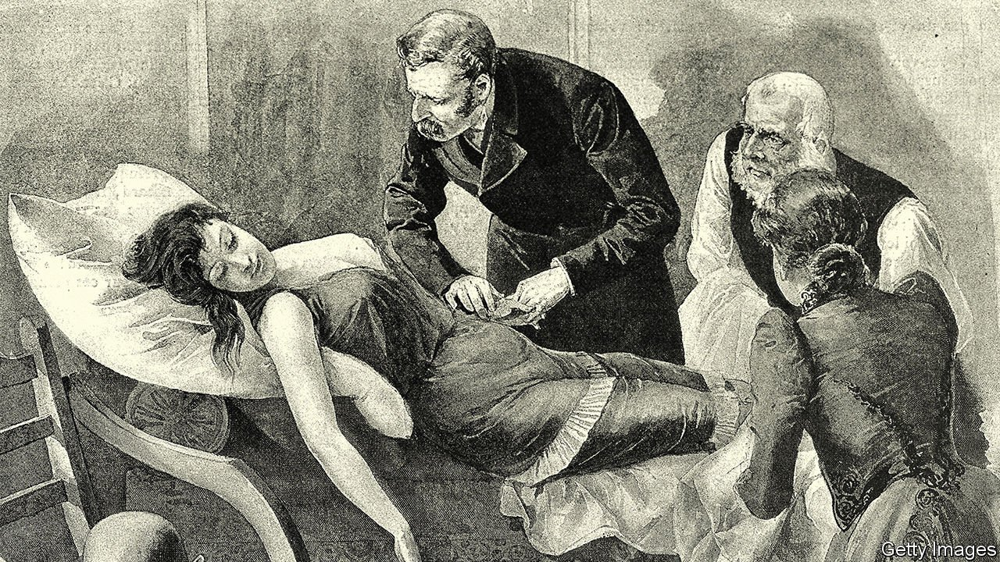

###### Body politics

# Modern medicine still has much to learn about women’s bodies 

##### Alongside her feminist history of illness, Elinor Cleghorn makes a plea for better listening 

 

> Jun 26th 2021 

Unwell Women. By Elinor Cleghorn. Dutton; 400 pages; $28. Weidenfeld &amp; Nicolson; £16.99

WHEN SERENA WILLIAMS struggled to breathe after giving birth in 2017, she knew something was wrong. She also suspected what it was. Six years earlier the tennis champion had endured a pulmonary embolism, or blood clot. But a nurse thought she was delirious from pain medication. Instead of the CT scan Ms Williams wanted, a doctor did a fruitless ultrasound. Eventually the scan was ordered—and revealed clots in the arteries of her lungs.


In “Unwell Women”, Elinor Cleghorn shows that Ms Williams’s problem—not being listened to—is as old as medicine. The author began stitching together the history of women’s health after being diagnosed with lupus in 2010; her pain had been dismissed for seven years. The result combines her own story with a feminist history of illness and a plea for better listening. It shows how centuries of ignorance and condescension led to failings that endure today.

Sexism has underpinned medical practice since the time of Hippocrates, Ms Cleghorn writes. Ranging from classical civilisations to the present, with nods to feminist luminaries and ancient philosophy, her book describes how “hysteria”—from hystera, the Greek word for uterus—was long used as a blanket diagnosis for women. In the 1870s the concept became a reason to remove their ovaries. She recounts how 17th-century witch trials relied on doctors’ diagnoses, and how modern birth control was originally promoted by eugenicists in the 1920s.

Within this panorama, the focus is on women’s health in Britain and America. In the early 20th century some travelled to Germany to try a new treatment called “Dämmerschlaf”, or “twilight sleep”, which promised “painless” births. Given two anaesthetics, morphine and scopolamine (a drug with amnesic effects), women lay awake in darkened rooms as their children were born, but would not remember the pain. The technique was controversial: labour was expected to be laborious, even though Queen Victoria had publicly endorsed the use of chloroform in 1853. She inhaled the gas for 53 minutes, pronouncing it “delightful beyond measure” after her eighth child was born. Women’s choices over where and how to give birth are interrogated and judged even now.

Childbirth was the focus of women’s health care for much of history, but medicine’s shortcomings, and Ms Cleghorn’s book, go wider. The immune system is another concern. Women are more prone to autoimmune diseases; they suffer disproportionately from illnesses such as lupus, multiple sclerosis and chronic fatigue syndrome. New research suggests this susceptibility could be down to the X chromosome—almost all biological females have two—which influences the production of auto-antibodies. Conversely, the chromosome may explain why women are less likely to suffer badly from viral infections such as covid-19, which kills more men.

As Ms Williams’s example shows, birth can still be botched and hazardous. “Unwell Women” calls for improvements in women’s care in reproduction and beyond. The pandemic has demonstrated what medicine can achieve with the right resources and incentives; it is an apt time to shine a light on the stubborn gaps in understanding of women’s bodies. ■

