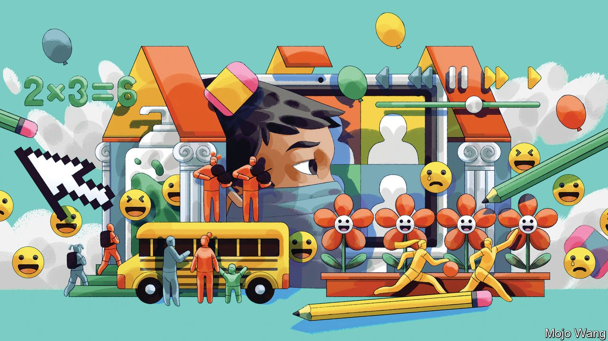
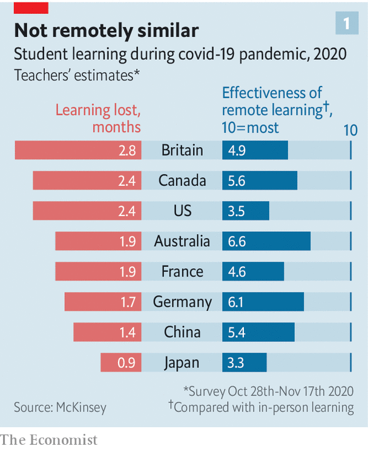
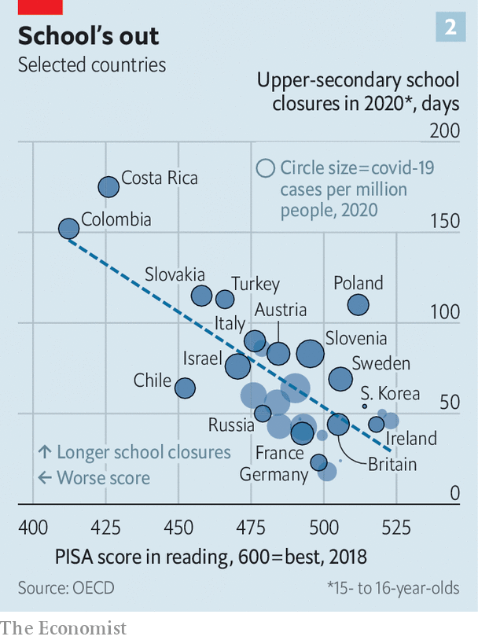
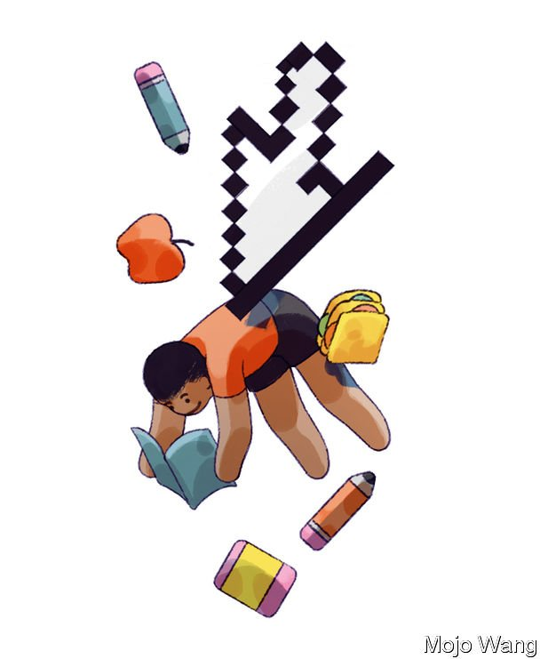

###### Lessons from disaster

# How covid-19 is inspiring education reform 

##### Catching up will be hard to do 

 

> Jun 26th 2021 

IN THE FIRST three months of the pandemic Shawnie Bennett, a single mother from Oakland in California, lost her job and her brother, who died of covid-19. Grief made the trials of lockdown more difficult—including that of helping her eight-year-old daughter, Xa’viar, continue her schooling online. In November Ms Bennett signed her daughter up for online classes provided by a local parents’ group, which arranged for her to see a tutor every Saturday morning. A test this month showed that her reading skills are improving fast.

The weekend lessons are among several online services created over the past year by The Oakland Reach, an advocacy group. Less than a third of black and brown children in Oakland read at their grade level, says Lakisha Young, its co-founder. For five years her group has lobbied for improvements to their schooling. But when learning shifted online it began hiring teachers to work with children directly. Ms Young thinks families who have benefited from this will demand more from their schools in future; the local district has already found cash to adopt and expand some of her group’s work. She says the pandemic brought a moment “to create the things we have been fighting our asses off for”.


Big shocks have sometimes changed schooling for the better. The second world war midwifed the Butler Act in Britain, which increased years of compulsory schooling and abolished the fees still charged by many state schools. After Hurricane Katrina inundated New Orleans, officials there embarked on sweeping school reforms. Nine years later graduation rates had increased by 9-13 percentage points.

Covid-19 disrupted education on a scale never seen before. By mid-April 2020 more than 90% of the world’s learners had been locked out of classrooms. Closures have lasted months, harming children’s learning (see chart 1), safety and well-being. Yet as youngsters in rich countries—the focus of this briefing—return to their classrooms, reformers hope the shock will lead to changes that will make schools more efficient, flexible and fair.

 


Critics of modern schools like to argue that they have barely changed since the 19th century, when teachers began abandoning one-room schoolhouses for large institutions that divided pupils into cohorts by age. That is an exaggeration. But traditional models of school have proved remarkably enduring, says Larry Cuban, a historian of education at Stanford University. He says parents value the efficiency and orderliness of the old-fashioned age-graded school. “People want that and like it, even though they complain about it.”

Yet even before the pandemic there were reasons to wonder if the rich world’s schools were running out of puff. In tests carried out across rich countries by the OECD, an inter-governmental group, children are, on the whole, scoring no better than they did two decades ago even though spending per pupil has been rising (its analysts also find that those with the lowest scores have kept schools closed for longest, as chart 2 shows). Many are bored. In 2017 pollsters at Gallup concluded that only one-third of older high-schoolers in America felt “engaged” by their classes.

 


Covid-19 and the closing of school buildings forced teachers to shift to remote learning in a matter of days, cobbling together online teaching platforms out of business tools. Curriculums were stripped back. Britain, France and Ireland, among others, cancelled big exams. For part of 2020 many American schools eschewed grades entirely, reverting to pass or fail.

For the vast majority of families in America online teaching has been “something between disappointing and disastrous”, says Justin Reich of the Teaching Systems Lab at the Massachusetts Institute of Technology (MIT). Data from around the world suggest that, on average, children have learned much less than they would usually have done. By March 2021 primary-school pupils in England had fallen nearly three months behind. Last summer tests of children in Belgium found similar lags. A study of pupils in the Netherlands found that during an eight-week period of remote learning in the first half of 2020 the average pupil learned nothing new at all.

Children who were already disadvantaged have suffered most. The Dutch study found that learning loss was more than 50% greater for children with poorly educated parents. By autumn 2020, eight- and nine-year-olds in Ohio were behind in English by about a third of a year’s worth of learning, compared with children in earlier years. The test scores of black students declined by nearly 50% more than those of white pupils.

School’s been blown to pieces

School closures have underlined the importance of in-person schooling to children’s mental and physical health. Youngsters in Italy ate less healthily when their school buildings were shut. Reports of child abuse have fallen largely because teachers—often the first to spot it—have not been seeing their pupils in the flesh.

Yoshinaga Sakura, a teacher at a junior high school in Numazu in central Japan, says that when schools were closed some children were left at home alone because their parents still had to go out to work. She thinks cases of self-harm increased. Euan Morton, a secondary-school teacher in Melbourne in Australia, says that some children who have coped with online learning seem less mature in their behaviour and attitudes than might be expected: “Their social development hasn’t matched their academic development.”

Still, there have been some bright spots. The crisis has tightened links between teachers and parents, which studies have shown increase attendance rates and ultimately push up results. Over half of American school leaders recently polled by Johns Hopkins University said they were in closer contact with parents than they had been before school buildings closed. “I have never spoken to parents more than I have in the last year,” says Katerine Dionne, a public-school teacher in Connecticut.

The crisis has thrust technology on a profession that had been slow to adopt it. There was “no alternative” but to invest in computers, says Victoria Richmond, the head of a primary school in south-east England. Now that her children are back in classrooms, the tablets her school issued to all pupils are proving useful in providing live-translation of lessons for children whose first language is not English, for example. Stephanie Downey Toledo of Central Falls district in Rhode Island says the crisis has accelerated her schools’ investment in tech by a decade. One of the district’s schools now has a transmitter on its roof which beams broadband into homes that lack good connections. Meanwhile venture-capital investment in educational-technology firms more than doubled from $7bn in 2019 to around $16bn in 2020, according to Holon IQ, a research group.

Some children, at least, appear to have performed better while studying remotely, including those who suffer from anxiety or are the victims of bullying. Some pupils who are shy about speaking up in class have found video calls and chat-boxes less intimidating. Jal Mehta of Harvard University thinks online learning has probably helped some bright children who are self-motivated and enjoy learning but “find the social aspects of schooling exhausting”. Neema Avashia, a teacher in Boston, says that some students’ attendance improved when all they had to do was switch on a computer. Remote learning made it easy to attend school even when feeling a little under the weather, says Lila Conte, a hard-working 12-year-old from the Bronx.

School closures have heightened awareness of inequality. Even before the pandemic 16-year-olds from England’s poorest families lagged about 18 months behind their richer peers academically. The maths skills of the strongest- and weakest-performing American students were drifting further apart. Watching teachers struggle to deliver laptops, WiFi dongles and meals to poor students has given outsiders a more graphic understanding of how disadvantage outside the school gates affects a child’s ability to benefit from what goes on within them.

It is not too soon to ask how this can be used to improve schools in the future. The experiences of covid-19 will probably embolden reformers who argue that schools need to do more to develop resilience in children to help them cope with shocks. Pupils who were spoon-fed by their teachers before the pandemic have found remote learning hardest, thinks Andreas Schleicher of the OECD. He says this shows that schools should be helping children learn independently, in preparation for a future in which technological disruption forces professionals to retrain frequently.

What did you learn in school today?

Mr Schleicher argues that tailoring schooling to the specific needs of each child is essential to closing achievement gaps. “We impose exactly the same kind of education on every student…so why are we surprised when learning outcomes are a function of social background?” He maintains that in too many places schools are “effectively gigantic sorting systems that are not designed to facilitate individual growth”. Paul Reville of Harvard University is among those who argue that schools must move away from a “factory model” that provides every learner with similar lessons for a similar length of time and move towards a “medical model”—where it is assumed from the outset that learners will need varying kinds of assistance, for different durations. That might include solving problems outside school that stop them from arriving ready to learn.

Before the pandemic a small but growing group of American schools were rejecting traditional structures in favour of “multigrade bands” that combine children from two or three year groups. Under a traditional model, children move up each year, even if their progress in some subjects has been slow. A rare few may have to repeat the year. More flexible systems aim to make it easier to give pupils who are stuck on specific topics the time and help they need, as well as the freedom to move ahead quickly once they have overcome whatever was slowing them down. The pandemic might drive more such experimentation if it makes the status quo less tenable. Even before closures, some American classrooms included pupils whose attainment levels spanned seven grades, according to NWEA, a test-provider. The disparities are now almost certainly wider, making it even harder for teachers to teach an entire class the same material.

Efforts to help children claw back lost learning present the first big opportunity to lay foundations for a better system. Officials in many countries are betting that more one-on-one or small-group tutoring will help struggling students. The evidence to support it is strong. A recent study in Britain found that 12 hours of tutoring could advance a young child’s maths skills as much as three months of conventional schooling would. Much of the £3bn which the government has put into recovering learning in England is earmarked for tutoring (this is only a fraction of what many say is needed; on June 2nd the government’s “education-recovery commissioner” resigned after it refused to cough up more).

You’ll join the high flyers

Struggling learners would benefit enormously if expanded tutoring schemes become core parts of education systems. A long-running tutoring programme at Match Charter Public School in Boston provides one model. Before the pandemic it offered all children in four grades daily tutoring in maths. It operates a longer school day than is common in its neighbourhood, so Match manages to slot these sessions into students’ timetables without them having to give up anything else.

But no amount of extra help will benefit children if problems outside school sap their attention, or prevent them from attending altogether. City Connects, an organisation that works in Ireland and America, provides a useful example of how schools with enough money can overcome this. It encourages schools to create support plans for every pupil that go beyond their educational difficulties, dealing with emotional and health problems or chaos at home. Trained “co-ordinators”—about one for every 400 students—implement them. They maintain a database that helps them speedily connect pupils with services such as food and clothes banks, affordable mental-health care and subsidised eye tests. Mary Walsh, City Connects’ boss, says local governments and charities often offer useful services but families do not know about them or struggle with the paperwork.

Reach Academy, a school in Feltham in west London, has spun out a “Children’s Hub” that helps pupils’ families solve problems such as those related to housing or employment. Incremental improvements to school curriculums will not “address the barriers that prevent young people from being successful in school,” says Ed Vainker, its co-founder. He reckons schools are uniquely placed to co-ordinate the efforts of existing local organisations and to help attract resources from farther away.

What of technology? Mr Reich of MIT thinks the ordeal of the pandemic will lay to rest “crazy stories” that exaggerate how quickly and completely edtech can transform education. But he hopes it will encourage teachers to use it more effectively.

Thomas Arnett of the Christensen Institute, an American think-tank, says that, well before covid-19, teachers were realising that material delivered to a whole class at the start of lessons might be taught through videos provided in advance. This kind of shift would minimise the amount of classroom-time teachers spend lecturing and maximise the time they could spend helping pupils apply knowledge they have already acquired. That might be particularly beneficial to those falling behind. It might also allow for the continuation of novel divisions of labour that some schools put in place during the pandemic, where some especially captivating teachers were put to work producing video lessons that could be shared with all students and others ploughed their efforts into helping individual pupils.

 


Lots of children could benefit if the pandemic raises awareness that not all pupils are well-served by a one-size-fits-all approach to schooling, and if it directs attention and funding to improving alternative models. Even before covid-19 more than 30 American states allowed children who felt they were not getting what they needed from conventional schools to enroll in virtual ones funded by the government. But Gary Miron of Western Michigan University says these children were being let down by the big companies that had been largely left alone to run them. He thinks public-school districts would do a better job. A survey carried out last year by RAND, a think-tank, found that one-fifth of American school districts were considering making a virtual schooling option available even after the pandemic.

Go your own way

And if the pandemic ends up granting more working parents flexibility about where and when they do their jobs, appetite for new models of schooling may grow. Middle- and high-school pupils at Springs Studio for Academic Excellence, a state-funded school in Colorado, have only ever been required to attend school in person two or sometimes three days a week (allowing those who need to work part-time, say, or do extra sports training, to do so). They learn online the rest of the time. David Knoche, the head teacher, thinks his pupils get more out of the time they have with teachers than they would do if they were forced to sit in front of them all week. The time they spend learning independently frees up teachers to provide extra help to children who need it.

In theory such models would not always require children to have the luxury of a parent at home; schools could set aside supervised spaces for independent study. Noam Gerstein, the Israeli founder of Bina, a new online primary school with its headquarters in Berlin, thinks some big firms will be persuaded to pay for employees’ children to access online schooling, as a staff perk. She envisages companies creating places in their buildings for children to learn online. She thinks parents might enjoy seeing their offspring during working hours, over lunch, for example.

There are plenty of reasons to be pessimistic about how quickly and completely schools can recover from the pandemic. Teachers are exhausted. Relations between unions and authorities have frayed. Governments are tightening their belts. Parents who have had to juggle full-time work and full-time child supervision and education are desperate to hand their children over to others for more time, not less. But the swift shift to remote learning has demonstrated that schools are capable of dramatic transformations. Reforms that might once have looked frightening now seem easy, compared with that.

In Oakland Ms Bennett chose not to send her daughter back to school when the district opened its buildings for children who wished to attend in-person. She still worries about outbreaks. But she is determined Xa’viar will return in August, when the new school year begins. Her daughter deserves to be back among her friends and teachers, says Ms Bennett: to be “in a place that she feels is safe for her, and where she also feels loved”.

Dig deeper

All our stories relating to the pandemic and the vaccines can be found on our . You can also listen to , our podcast on the race between injections and infections, and find trackers showing ,  and the virus’s spread across  and .

