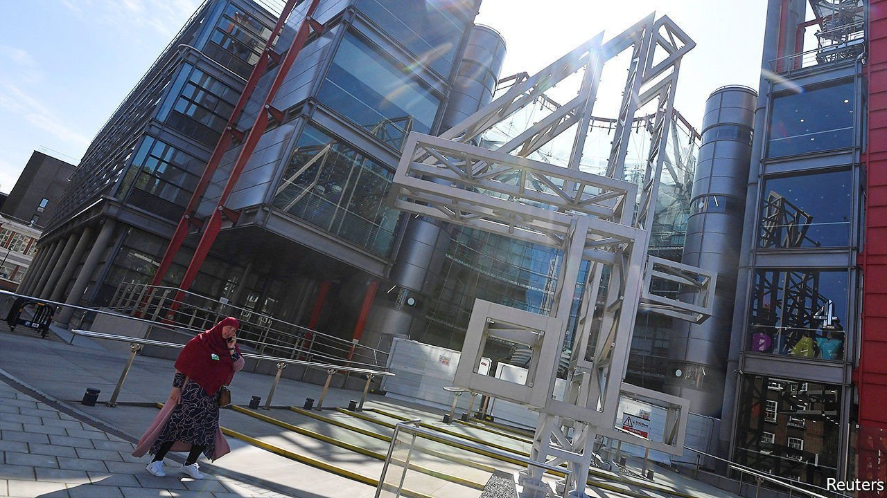

###### Channel-chopping

# Britain proposes—again—to privatise Channel 4 

##### New streaming technology has reignited an old debate 

 

> Jun 26th 2021 

VIEWERS WHO moan about repeats on television must have rolled their eyes at the news on June 23rd. Among the headlines was that Oliver Dowden, the culture secretary, is considering the privatisation of Channel 4, a publicly owned, commercially run TV station. The idea has been aired by governments almost ever since the channel’s first broadcast in 1982.

The timing of this re-run might seem odd. Like his predecessors, Mr Dowden said reform was needed to sustain the channel. But Channel 4’s annual report, published the previous day, boasted of a record year. At first the pandemic crushed the value of advertising, which provides 90% of its revenues. But editors slashed content spending and, following a big rebound in ad rates, the year ended with a record operating surplus of £71m ($99m).


One reason for the return of the privatisation story is political. Boris Johnson’s government is even more peeved than previous Conservative administrations about left-wing bias in the broadcast media. Channel 4 News leans liberal. Many Tories would like to jettison it.

The bigger reason is economic. Conventional “linear” television accounted for little more than half the time Britons spent in front of the box last year, according to Ofcom, the regulator. People under 35 spent twice as long watching streaming services like Disney+ or YouTube as on conventional TV. As Hollywood studios muscle into British living rooms, television cannot avoid change.

Mr Dowden proposes to update broadcasting rules last revised in 2003, when Netflix was sending out DVDs by post. Domestic broadcasters may be given more prominent spots on online services—for instance, by requiring smart-TV manufacturers to pre-install their apps. Streamers may face the same content rules as broadcast channels, where news is required to be impartial and accurate. (Applying this to YouTube, which uploads hundreds of hours of footage a minute, will be hard.)

As for Channel 4, Mr Dowden said that its purpose was to provide choice for viewers, who are far better served than in 1982. That is true, but only half the story. Its other remit is to boost Britain’s independent TV-production companies. It funnels about two-thirds of its revenues there—a bigger share than commercial rivals—and must buy more than 35% of its content outside London. Last year it worked with 274 production companies, each of which kept the rights to its shows, and finished work on a new headquarters in the old Majestic Cinema in Leeds.

No commercial buyer would want to operate this way. The rules could be relaxed, but at a cost to the production industry. “Reinforcement of the remit reduces the attraction to a buyer, while dilution of the remit decreases the benefits that flow from Channel 4,” notes Tom Harrington of Enders Analysis, a research firm. If it is to be sold, the best buyer might be one already operating under public-service requirements, such as the ViacomCBS-owned Channel 5, or STV, a Scottish channel. But opposition from the production industry may yet mean that Channel 4’s privatisation story is destined for future repeats.■

