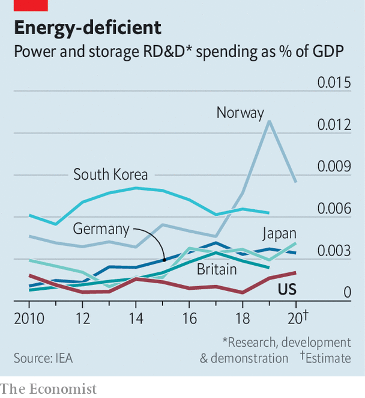

###### Grid luck

# Can American utilities avoid summer blackouts? 

##### Eventually, yes. But the next few months look dicey 

 

> Jun 26th 2021 

“THIS IS THE highest-risk cautionary warning.” That is how John Moura, an official at the North American Electric Reliability Corporation (NERC) recently described the dangers facing America’s power grid this summer. In May the expert group predicted an unusually scorching one in the west and south-west, with a worsening drought and wildfires. This witch’s brew of forces, it warned, threatens a power grid that is already “vulnerable”.

The boffins were quickly proven right. A dramatic heatwave has struck large parts of the American west. The prospect of power cuts is unpleasant for everyone. For electric utilities in the hot zone, it is a nightmare. The meteorological uncertainties wrought by climate change are compounded by the human factor, as people preparing for the scorchers buy air-conditioning units that, if switched on, will hugely increase demand for power.


If that were not complicated enough, electricity providers face retroactive penalties if regulators decide they did not do enough to keep the lights on. Pacific Gas &amp; Electric (PG&amp;E), whose customers suffered blackouts as wildfires raged in northern California in the past two years, may need to pony up fines and legal-settlement fees of nearly $150m for alleged mishandling of those outages. Utilities in New York are threatened with $140m in penalties for alleged failures in responding to storms and demand spikes.

The utilities claim such punishments are unfair, pointing to their investments in the grid. In some respects, they have a point. Across the west, new clean-power capacity generation is helping to offset that lost as dirtier fossil-fuel plants are retired. American solar capacity has more than doubled in the past four years, exceeding 100 gigawatts (GW) for the first time. In the first quarter utilities installed 2.5GW of new wind capacity, chiefly in California, Oklahoma and Texas.

American electricity providers have historically put up big new power plants rather than experiment with distributed energy and demand management. As evidence emerges that these can help stabilise the grid and avoid rolling blackouts, their attitudes are changing, notes Rebecca Miller of Wood Mackenzie, a consultancy.

 


Southern California Edison, a giant utility serving the Los Angeles area, last year added 1.4GW of battery capacity. S&amp;P Global, a research firm, calculates that California could have more than 2.8GW of battery storage on its grid before September, nearly five times more than in 2020. Texas could have about 1.4GW, an eight-fold increase. In March Bloomberg, a news outlet, reported that Tesla, an electric-car maker, has been secretly developing a 100-megawatt grid battery project outside Houston (code-named Gambit).

OhmConnect, a Californian startup backed by Alphabet, Google’s parent company, is now giving away 1m smart thermostats to people who enrol in its automated demand-management service. The firm aggregates the energy saved by remotely turning down thermostats and otherwise cutting demand when the grid nears overload, sells it at peak prices to utilities and shares the gains with consumers. Leap, another startup, creates a “virtual power plant” by aggregating output from distributed power (ranging from electric vehicles to residential batteries). It plans to put 288 megawatts of flexible power onto the grid during the summer peak.

All this should help make America’s grids more robust—eventually. Whether it is enough to avert power cuts in the next couple of months is another matter. For all the protestations about investing in their networks, American electric utilities have lagged behind European ones in spending on research and development of transmission and distribution (see chart). Until that changes, their customers had better get used to the heat. ■

