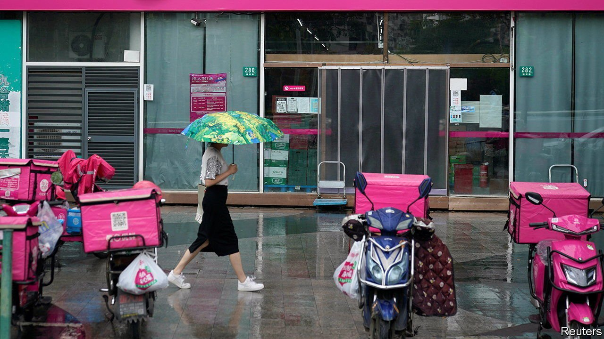
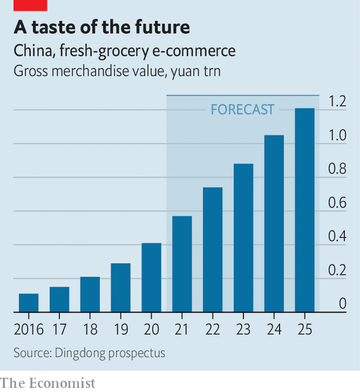

###### Selling like hot cakes

# Investors cannot get enough of Chinese e-grocers 

##### Will this cause indigestion? 

 

> Jun 24th 2021 

WET MARKETS in China have suffered more than most businesses in the pandemic. After one in Wuhan was blamed as the source of covid-19, officials ordered others to shut. Shoppers have been reluctant to frequent bustling outdoor stalls selling fresh meat and vegetables. Many may never reopen—not least because they are being rapidly displaced by online rivals. The value of online sales of fresh produce in China, which amounted to 293bn yuan ($45bn) in 2019, before the pandemic, may rise to 570bn yuan by the end of 2021 (see chart). That would put e-grocers’ share of fresh-food spending at 11%, double what it was before covid-19. It could hit 18% by the middle of the decade.

Until recently e-grocery was a small add-on to other e-commerce offerings of giants such as Alibaba or JD.com, rather than a big business in its own right. No longer. JD.com is busily adapting its logistics network, China’s most sophisticated, to handle fresh produce. Last year Alibaba spent $3.6bn on a grocery-store chain, and it has been building a network of supermarkets that can be used to get groceries to online shoppers. Pinduoduo, another big e-merchant, raised $6bn in 2020 to boost its grocery operations. It ferries produce to neighbourhood shops where buyers can pick up orders, overcoming the problem of the costly last mile, says David Liu, the company’s vice-president of strategy.


At the same time, challengers are taking a bite out of the market. Missfresh claims to control 28% of Chinese e-grocery deliveries that rely of distributed mini-warehouses: small, refrigerated neighbourhood storage centres, which the company is credited with inventing. By keeping the products closer to customers, Missfresh says it was able to fulfil orders in an average of 39 minutes in 16 cities during the first three months of the year. Dingdong Maicai, which has 10% of the domestic market and is the dominant e-grocer in the greater Shanghai region, has built a similar set of units. WM Tech, with a market share of around 17% in northern China, can count on the retail chops of its boss, Zhang Wenzhong, who founded Wumart as China’s answer to Walmart in 1994. Like Alibaba, it can use its hundreds of retail outlets as warehouses.

 


China’s fragmented agricultural sector, a relative absence of industrial farming, poor transport links to rural areas and patchy cold-supply chains beyond cities all add to the costs in what is already a business with wafer-thin margins. Missfresh, Dingdong and dozens of smaller rivals are burning cash as they scramble for market share in the hope of adding millions of new customers. The pair alone notched up a combined 9.7bn yuan in net losses during 2019 and 2020. WM Tech makes a profit, but that is thanks in large part to its conventional retail operation.

All this leads Arun George of Smartkarma, a research firm, to fear a repeat of China’s e-bike boom and bust, which left cities littered with clapped-out bicycles and investors with holes in their pockets. Adding to the uncertainty, Chinese authorities are paying closer attention to dominant technology firms, as well as to the plight of overworked scooter-borne delivery drivers. A government official recently went undercover to reveal their arduous 12-hour days for little pay. In January one desperate delivery worker set himself on fire over unpaid wages.

Pessimists like Mr George are, though, in the minority. Rural infrastructure is improving and the government may, despite the sting operation, prefer millions of drivers with tough jobs to millions of restive jobless. And the e-grocers have deep-pocketed patrons. Tencent, China’s most valuable internet company, has backed both WM Tech and Missfresh. Dingdong has secured an investment from SoftBank, a free-spending Japanese technology group. , an aggressive American hedge fund, which bets on promising markets rather than single startups, is also bullish. It holds a 12% stake in Missfresh and a smaller one in Dingdong.

As for broader appetite for Chinese e-grocers, it is about to be tested. In June both Missfresh and Dingdong unveiled plans for initial public offerings in New York. WM Tech is eyeing a flotation in Hong Kong. The three companies could raise a total of $2bn. That would be enough to keep them fresh for a while—but also to leave investors with indigestion. ■

