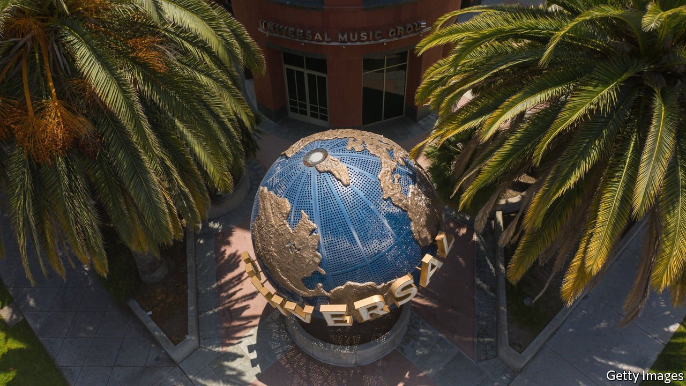

###### Going solo

# Universal, the world’s biggest record label, heads for an IPO 

##### Investors hope to cash in on the streaming boom. But will the hits keep coming? 

 

> Jun 23rd 2021 

MUSIC FANS have had to get used to seeing stars perform via video-link, and the same was true of the big performance held on June 22nd to decide the future of Universal Music Group. Shareholders in Vivendi, the record label’s parent company, tuned in to the annual general meeting to chorus their near-unanimous approval of a plan to spin off Universal as an independent firm. The label will launch as a solo act on the Amsterdam stock exchange in September.

The vote marked the end of a noisy battle for control of Universal, which accounts for 30% or so of global recorded-music sales. In January Tencent, a Chinese media and e-commerce giant, increased its stake in the label to 20%. Earlier this month it emerged that Daniel Loeb, a New York hedge-fund billionaire, had built up a stake in Vivendi. Then on June 20th Bill Ackman, a rival hedgie, announced that his special-purpose acquisition company was to purchase 10% of Universal for €3.5bn ($4.2bn), the biggest SPAC deal so far (and a particularly complex one). Vivendi will itself hang on to 10% of the label; the remaining 60% of shares will be distributed among Vivendi’s shareholders.


The enthusiasm of Universal’s fan club is explained by the recent strength of the recorded-music industry, powered by streaming. Between its lowest point in 2014 and last year, worldwide revenues rose by 54%, to $21.6bn. Some two-thirds of these revenues accrue to the three “major” record labels: Universal, Sony and Warner. Only Warner is publicly listed; its share price has risen by 16% since its own initial public offering a year ago.

Universal may strike investors as more appealing still. Its back catalogue of 3m songs, by everyone from the Beatles to Lady Gaga, is twice the size of Warner’s. Its slug of the recorded-music market is creeping up. That scale gives it more bargaining clout with streamers like Spotify. And at 17%, its operating-profit margin is five points higher than Warner’s and rising, according to Bernstein, a broker, which expects the spun-off company’s value to surpass the €35bn implied by the Ackman deal.

What of the remains of Vivendi? “Black-box governance, an uneven track record of value creation and a motley crew of assets,” sums up Matti Littunen of Bernstein. He warns of share-price volatility in September when growth investors dump Vivendi stock. Some shareholders worry that Vincent Bolloré, who controls the group via a 27% stake, may try to tighten his grip with a round of share buy-backs that would increase the relative size of his holding.

For Universal, the question is whether it can keep the hits coming. Growth will slow as the streaming market matures. Rich countries are already nearing saturation point. In April Spotify raised its subscription prices for the first time, but it is unclear how much higher they can go (Mr Littunen points out that the price of CDs never rose after their launch in the 1980s). Music faces competition from new audio formats, notably podcasts, whose share of total listening has grown during the pandemic. And a rising share of streaming revenues goes to self-published artists, who—like Universal—have decided that they can make a better go of it alone. ■

A version of this article was published online on June 23rd 2021

