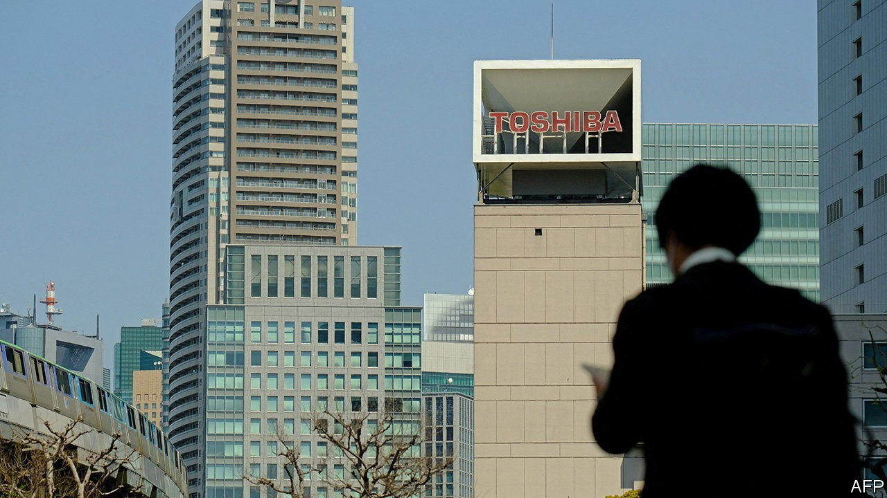

###### Machines and machinations

# What Toshiba’s travails say about Japanese capitalism 

##### The plight of an industrial giant offers ammunition to both sides of the corporate-governance debate 

 

> Jun 26th 2021 

“I  THINK THIS will be theatrical, and we are concerned that it will be sensational,” a senior official at Japan’s Ministry of Economy, Trade and Industry (METI) warned an activist fund last year. The investors were pushing to put more outside directors on the board of Toshiba, a titan of Japanese industry. In the event, it was Toshiba’s management that caused a sensation. An independent investigation published this month alleges that the company worked with government officials to squeeze shareholders ahead of its annual meeting in 2020. The fallout from the pressure campaign has already helped fell the chief executive, Kurumatani Nobuaki, and several board members. As the 145-year-old conglomerate prepares for this year’s shareholder meeting on June 25th, its fate hangs in the balance.

Once a world-famous brand that manufactured Japan’s first incandescent light bulbs and invented flash-memory data storage, Toshiba is now notorious mostly for scandals. Following a big accounting fraud and a ruinous investment in an American nuclear-energy company, it almost went bankrupt in 2017. It had to sell the prized memory-chip business and issue new shares, putting the majority of the firm in the hands of foreign investors. Effissimo Capital Management, a secretive fund based in Singapore and run by two long-time Japanese activist investors, became its biggest shareholder.


A subsequent accounting imbroglio at a subsidiary precipitated Effissimo’s calls for changes to management and the board at last year’s shareholder meeting. The management won a close vote, but counting irregularities clouded the results. After the company claimed an internal probe had found nothing awry, Effissimo called an extraordinary shareholder meeting earlier this year and won backing for the independent inquiry.

The affair holds broader lessons about Japanese corporate governance, and the protracted efforts to improve it. On the one hand, the report’s contents offer plenty of grist for pessimists who believe that, for all the rhetoric about concern for shareholders, Japan Inc remains largely unreformed. Drawing on interviews and email and phone records, the report claims that Toshiba executives and some government officials worked “in unison” to prevent shareholders from fairly exercising their rights. Management discusses vocal funds as troublesome enemies to be neutralised; one executive writes of Effissimo, “We will ask METI to beat them up for a while.”

Government officials invoked new regulations on foreign investments that give the authorities the power to intervene on national-security grounds, but which investors worried might be applied to thwart uppity shareholders. The report suggests that is in fact how the law was used, observes Ezawa Kota of Citigroup, a bank. “It’s more like fighting gear against activists.”

The case has had a poisonous effect on market perceptions more broadly. “Japan is about to exhaust all of the little remaining goodwill it has with the foreign investment community,” says Alicia Ogawa, a scholar of Japanese corporate governance at Columbia University in New York, who also advises an American fund in Japan.

At the same time, the fact that the activists have been able to produce and release an account of a national champion’s backroom machinations is itself a sign of shareholders’ growing clout. And it may be a mistake to extrapolate too far from Toshiba. The firm’s involvement in nuclear energy, chipmaking and defence makes it especially sensitive. METI sees ensuring the stable operation of such firms as within its remit under the new regulations; Kajiyama Hiroshi, who heads METI, insists it “did the right thing” to maintain the steady development of Toshiba’s strategically important businesses and technologies. “A handful of companies will never be fair game,” says Ms Ogawa.

For Toshiba, the coming weeks will be decisive. On June 25th its shareholders will vote on a new slate of directors; more dismissals seem imminent. After backing the management last year, Glass Lewis and ISS, a duopoly of firms that advise investors on such matters, have recommended voting against several directors and the board’s well-respected chairman, Nagayama Osamu (who joined after the alleged misdeeds took place but was in place when the internal investigation was carried out). Given Toshiba’s mediocre financial performance in recent years, private-equity firms are circling. Some investors spy an opportunity: Toshiba’s share price has risen to levels not seen since 2015. They must be hoping that the company’s next act will bring better fortune to shareholders. ■

