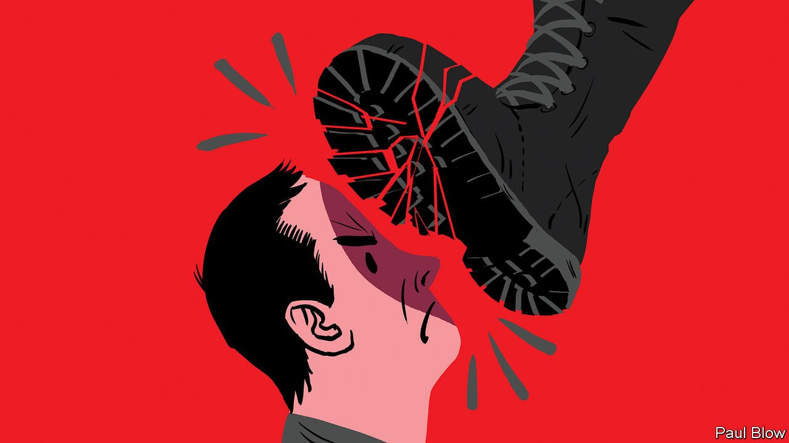

###### Bartleby

# Workers on the march 

##### Labour may be gaining ground on capital 

 

> Jun 24th 2021 

THE CHANCE to take a summer holiday after the long lockdown is very appealing. So Bartleby was excited to book rooms in a pub-cum-hotel in the beautiful Yorkshire Dales in July. Not long after the booking, however, the manager called to warn that the restaurant and bar would be closed on the Wednesday night. “As you probably know”, she said, “it is impossible to find staff at the moment.”

The British hospitality sector has relied on overseas employees and is affected by Brexit as well as covid-19. The same is true of construction. Since 2017 the industry has seen a 4% decline in British-born workers and a 42% fall in those from the EU. Many foreigners returned home for the pandemic, which may mean 750,000 fewer total workers are available than in 2019, according to Michael O’Connor and Jonathan Portes of the Economic Statistics Centre of Excellence, a research outfit.


The shortfalls have prompted employers in the worst-affected sectors to raise wages, often by a lot. According to Reed Global, a recruitment firm, salaries at British hospitality and catering firms are up by 18% compared with April-June 2020. Pay in retailing has risen by 10% over the same period.

And Britain is not the only country beset by labour shortages. In America job vacancies are at their highest level for almost two decades. Manufacturers in eastern Europe are struggling to attract workers, with Hungarian wages up by 9.2% in March, year on year. Australian miners, Tasmanian fruit farmers and Canadian restaurateurs all report trouble with hiring. This has left workers with something they have long lacked: bargaining power.

It may all turn out to be transitory, as may the recent surge in inflation. But, just maybe, the world has reached a turning point. For the past 40 years or so, the tide has strongly favoured owners of capital over labour. The decline of heavy manufacturing and the weakening of trade unions were part of this trend. So was the globalisation of capital and investment flows, which allowed businesses to shift production to countries with lower wage costs, such as post-communist eastern Europe and, critically, China.

It has been widely assumed that capital would continue to dominate, especially with the potential for technology and artificial intelligence to replace workers in the service sector, just as automation took its toll on manufacturing employment. Throw in the power of multinational corporations and the future for workers was caricatured as something out of George Orwell’s “1984”—“a boot stamping on a human face, forever”.

The political reaction to the pandemic suggests sentiment may have changed. Governments were quick to try to safeguard workers’ incomes, either by offering furlough schemes to subsidise wages or by increasing and extending unemployment benefits. They are now pursuing higher taxes on companies. Politicians on both the right and the left are happy to bash business in the belief that this will appeal to voters.

Workers’ psychology may have shifted, too. Before the pandemic, employees who asked for flexible work schedules risked being seen as shirkers. Now they are in a stronger position.

Gerwyn Davies of the Chartered Institute of Personnel and Development, an association of HR executives, says Britain still has a pool of available labour; half a million fewer young people have jobs than before the pandemic. But if those workers are going to enter sectors like hospitality, they want more training and more flexible schedules. Janine Berg of the International Labour Organisation says her sense is that the vacancies are in low-wage sectors where earnings do not compensate for the perceived risks. The “reservation wage” of potential workers may have risen, forcing companies to be more generous to entice workers back.

Finally, demography is changing. In the 1980s and 1990s employers had lots of baby-boomers to choose from. Now, thanks to falling fertility rates, workers are set to become relatively more scarce. Over the next 30 years the working-age population will fall, as a proportion of the total: by three percentage points in America, five points in Britain, seven in the EU and in Japan, and 11 in China.

Maybe all those missing workers will be replaced by robots. But humans often want to interact with other people; many desperately press buttons when calling a company in the hope of hearing another voice. If companies have to chase scarce workers, labour may gain the upper hand over capital, at least for a little while.

