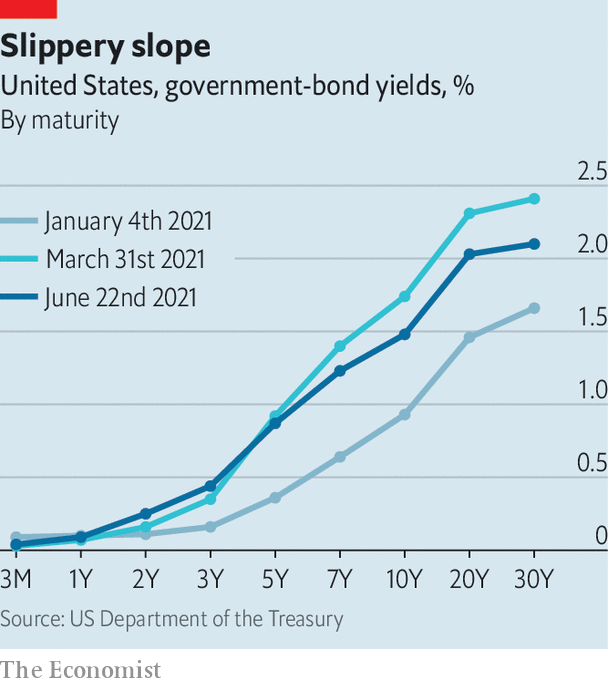

###### Buttonwood

# A new phase in the financial cycle 

##### The Treasury-bond yield curve flattens 

 

> Jun 24th 2021 

GROWING UP IS hard to do but growing old is harder. As the business cycle matures and ages, it goes through phases, just as people do. These are mirrored in financial markets. Strategists like to talk in terms of early-, mid- or late-cycle investing. It is tricky to say when one stage ends and another begins, just as it is hard to delineate adulthood from adolescence. The markets drop some hints, though. The slope of the Treasury yield curve is one.

In the first quarter, the message from the yield curve seemed clear. A steepening in its slope—a rise in long-term yields relative to short-term yields—said the economy was accelerating and inflation was coming. A lot of that steepening has since been reversed, to the surprise of many. Of the many interpretations of this change, one stands out. It says the early-cycle phase is over. The markets have entered a new and more difficult stage.


Start with the shift in the yield curve. A standard measure of its slope is the gap between two- and ten-year interest rates. The wider the gap is, the steeper the slope. At the start of the year the gap was 0.82 percentage points. Three months later it had widened to 1.58 percentage points, almost all because of a rise in long-term yields (see chart). A marked shift in fiscal policy in America was a big influence. By March a bumper $1.9trn spending bill had been signed into law. An even bigger package to finance infrastructure was in the works.

 


Yet in early April the curve began to flatten. The yields on two-, three- and five-year Treasury bonds perked up as money markets began to price in the prospect that the Federal Reserve would raise interest rates in 2023. There were bigger moves at the long end of the curve. By this week the ten-year yield had fallen to 1.5%, more than 0.2 percentage points lower than at the end of March. The 30-year yield fell by even more.

Whatever lies behind this, it cannot really be laid at the Fed’s door. The decline in long-term yields started long before last week’s Fed meeting, which sounded a more hawkish tone on inflation. Some put it down to “technical factors”—bond trades made for reasons of risk management, to rebalance portfolios or follow price momentum. Global influences surely played a role. Ultra-low interest rates in Japan and Europe act as a check on yields in America. They can only go up so far before the weight of buying by yield-starved foreigners pushes them down.

However, there is a deeper message. The bond market is hinting that the early-cycle phase in which risk assets are embraced almost without discrimination has come to a close. The peak in economic growth may have passed. Output and orders readings in the manufacturing purchasing managers’ index (PMI), a closely watched marker of activity, probably peaked in May. Other cyclical indicators have rolled over. The prospect of further fiscal stimulus is also more uncertain. America’s infrastructure bill is stuck; whatever now emerges from Congress will have a far smaller price tag than the $2trn-3trn figure widely touted just weeks ago.

Markets are forward-looking. They now have less to look forward to. If peak GDP growth lies in the past, the scope for further upward revisions to forecasts for stockmarket earnings is limited. The S&amp;P 500 index already trades at a high multiple of prospective earnings. A lot of good news is already priced into risky assets. If you are an active trader, you now need something to go wrong to create a buying opportunity, says Eric Lonergan of M&amp;G, a fund manager. Lacking fresh influences to drive prices up, risky assets are vulnerable to declines.

There are echoes here of early 2004, says Andrew Sheets of Morgan Stanley, a bank. When America’s unemployment rate peaked in 2003, it was a cue for economic recovery and a strong early-cycle rally in risky assets. Stocks, commodities and corporate bonds performed very well, just as they have over the past year. As 2003 turned into 2004, the economy kept going. But markets slipped into something of a funk.

The outlook is similar, reckons Mr Sheets: a period of consolidation in the stockmarket; a slight widening in credit spreads; an episode of modest dollar strength. Not everyone will agree. It is hard to accept that the early-cycle phase might be over. It is barely a year since the trough in global GDP. But if you live as fast and burn as brightly as this business cycle, then mid-life arrives early. You then start to wonder how you got here and what on earth will now drive you on.

