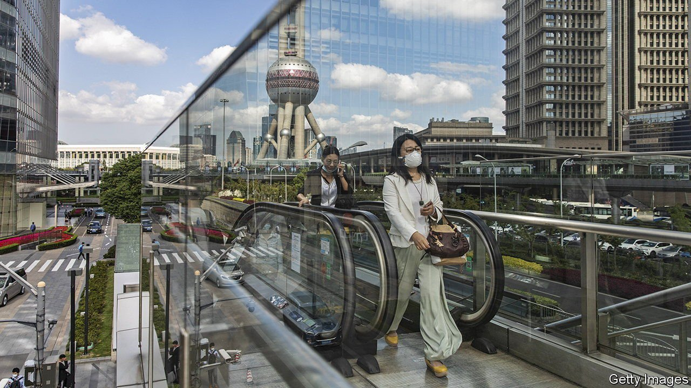

###### Brace, brace

# Three corporate giants are posing a stiff test for Chinese banks 

##### The country’s big lenders dare to be dull 

 

> Jun 26th 2021 

NOT LONG ago the conventional wisdom was that China would do whatever it took to save its biggest companies from failing. Times have changed. Three corporate giants—Evergrande, the country’s biggest property developer; Huarong, its biggest investor in bad bank assets; and Suning, a retail giant—are all suffering from financial distress.

The three firms’ long rush to expand has collided with slower growth, tighter credit and stricter regulatory scrutiny. Their bonds are trading at discounts of roughly 25% to face value, showing that investors have priced in a significant chance that they will default.


People in the financial industry are debating whether the government really will let them fail. An analyst with a large asset manager that holds Huarong bonds says his firm believes the state will eventually rescue the “bad bank”, given how integral it is to cleaning up non-performing loans in the financial system. A former adviser to the central bank says that Evergrande and Suning may be more expendable, posing fewer systemic dangers.

In the first instance, the troubles of these firms are a reflection of their own mismanagement. Evergrande has more debt than any other listed Chinese company. Huarong had a chairman who was executed for bribery. Suning sprayed cash around with abandon, buying trophy assets such as Inter Milan, the football club.

But the government’s willingness to let them go to the brink also points to something else: its confidence that the banking sector is now solid enough to cope with a big bout of turbulence. That was not always the case. In 2015 Chinese banks were struck by a near-crisis when more than $1trn in cash rushed out of the country and corporate defaults rose. Several banks eventually needed bail-outs.

Many investors still see them as being in a weakened position. With few exceptions, Chinese banks listed on the Hong Kong stock exchange trade far below their reported asset values, implying a high degree of pessimism about their prospects. The root problem is their ultra-rapid credit issuance of the past 15 years, when their loan books grew ninefold, nearly twice as fast as the overall economy.

Yet any fair assessment of China’s banks must grapple with changes that have made them safer. Regulators have unwound some of their off-balance-sheet chicanery, exemplified by a curtailment of their loans to other financial firms. Such loans, which make it hard to know where risk resides, had soared to 78% of GDP by the end of 2016. Today they are down to about 54%.

Banks are also better prepared for bumps ahead. They had capital buffers equivalent to 14.7% of their assets at the end of 2020, a record high. Even as bad loans climbed to nearly 2% last year, the highest in more than a decade, banks made enough cash provisions to cover a near-doubling. The government also now requires the biggest banks to prepare resolution plans in case of trouble.

These changes bring China more in line with global regulatory standards, albeit with a twist. In most countries the overriding goal is to avoid having to get the state to save reckless banks. In China, however, the state already owns majority stakes in most large banks.

“The question is, do you wipe out equity which is already public money and then put in fresh taxpayer money? Or do you avoid wiping out equity to begin with?” says Nicholas Zhu of Moody’s, a credit-rating agency. Regulators are, he says, taking a mixed approach, likely to support lower-yielding senior debt but not junior debt such as perpetual bonds.

The weakest banks in China are almost entirely its smallest ones. They generally have dodgier assets, less-professional management and thinner capital cushions. Rather than dealing with them one by one, regulators are working to bind them together. Mergers are under way in the provinces of Liaoning, Shanxi and Sichuan. “Consolidation is something we expect. It allows for higher requirements for corporate governance and risk control,” says Vivian Xue of Fitch, another credit-rating agency.

Perhaps the biggest concern about China’s banks today is not their recklessness but whether regulators are themselves creating new risks with a new set of lending rules. Worried about the property sector, they have told banks to cap their mortgages and other property lending to no more than 35% of their loan books. Meanwhile, regulators ordered banks last year to increase loans to smaller firms by between 30% and 40%.

“In the past regulators complained that banks all looked alike, and wanted them to serve different client bases,” says May Yan, an analyst with UBS, a bank. “Some of the recent regulations are making banks look the same.” Their income trends are already more similar. Take, for instance, the ten biggest banks in China. Virtually all posted profit growth of about 2% last year, with the least differentiation among their results on record.

This trend suggests that the main risk for Chinese banks is a lack of diversification. Along with having similar lending profiles, their assets are overwhelmingly concentrated within China. Overseas loans now account for just 2% of their lending portfolios. All the loan-loss provisions, capital buffers and improved governance may make them safer. But ultimately the only measure that really matters is the health of the Chinese economy. ■

