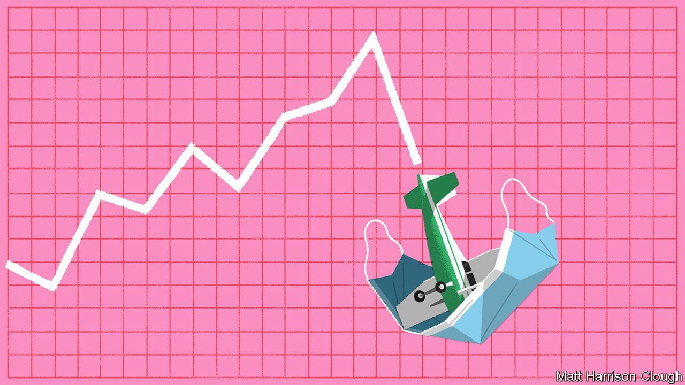
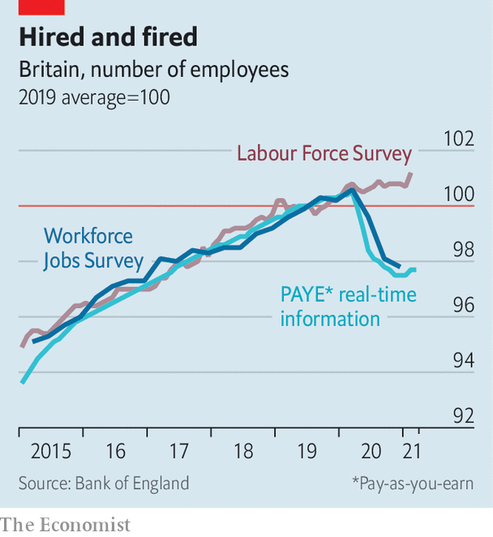
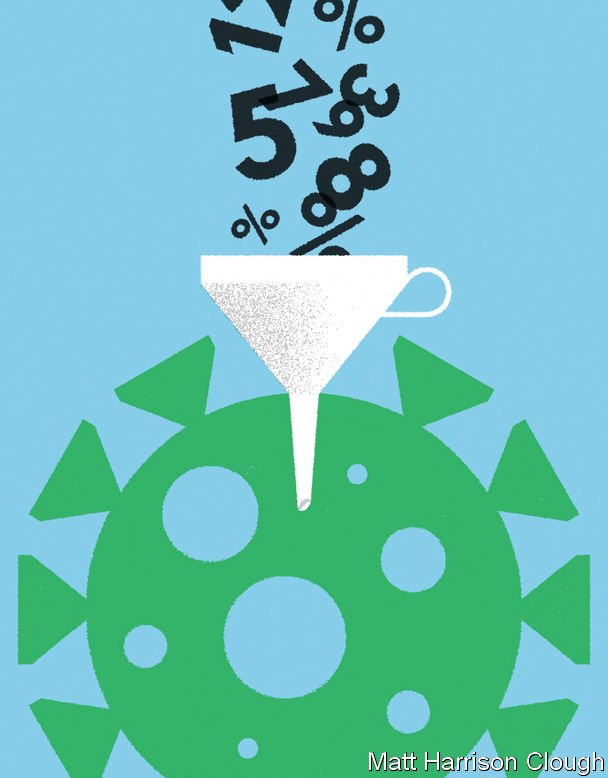

###### Flying blind

# Covid-19 has stymied governments’ efforts to collect data 

##### But the pandemic may spur innovation, too 

 

> Jun 24th 2021 

IN EARLY JUNE Britain’s long-suffering Europhiles got a rare taste of Schadenfreude. Tim Martin, a forthright Brexiteer who is the boss of J.D. Wetherspoon, a chain of pubs, announced that Britain ought to create a more liberal immigration policy to allow more Europeans to move there to work. Over the past 18 months hundreds of thousands of European immigrants, many of whom worked in pubs and restaurants and lost their jobs when everything closed during covid-19 lockdowns, have gone home. Brexit means that many cannot return. He denies it, but Mr Martin’s establishments are almost certainly suffering from the staff shortages afflicting the rest of the British hospitality industry.

Unhelpfully, no one knows how many Europeans have departed. Britain imposes no exit checks at its borders. Foreigners do not have to register their residency as they do in Belgium and France. The British government’s main source of information on migration is the International Passenger Survey (IPS), conducted by the Office for National Statistics (ONS). In normal times, researchers with clipboards at airports ask around 700,000 people each year why they are entering or leaving the country. On the basis of this they estimate migration to and from Britain. Between March 2020 and January 2021 covid-19 restrictions meant that the survey was suspended, so no one knows how many people left.


The IPS is one of many surveys to be wrecked by the pandemic in Britain. The best crime statistics are also based on a survey, which is also now conducted by phone. Victims of crime tend to be poorer and may be less likely to answer the phone, so the survey is probably less accurate.

Wonks elsewhere are worried, too. Fully 150 countries were scheduled to hold censuses during 2020 or 2021. Those that went ahead, such as America, may find the results less accurate than usual because lockdowns made it hard to reach some people. Those that delayed censuses, such as Brazil, will have to wait for the crucial information a census normally provides.

All of this has profound consequences for policymaking. “Officials of the modern state are, of necessity, at least one step—and often several steps—removed from the society they are charged with governing,” notes James C. Scott, author of “Seeing Like A State”, a critique of government schemes planned with incomplete knowledge. Civil servants and politicians rely on large amounts of data to make decisions affecting millions. Never has that been more true than during the pandemic. Enormous blind spots have developed. And yet, eventually, the pandemic may accelerate a shift already under way, towards smarter, more resilient models of data collection.

Like businesses and other government agencies, national statistics offices had to adapt fast to the pandemic. According to a survey of such bodies by the UN and World Bank last year, 90% of their employees were told to work from home. A surprising amount of important data is still collected in fairly old-fashioned ways—by asking people questions in person. Some 96% of face-to-face data collection was stopped in May last year. By July, only a quarter had resumed. Agencies adapted. Some found other ways to gather information. But not all. The damage was particularly acute in poorer countries, where a lack of money meant that staff often did not have the IT equipment or space to work from home.

In rich countries, assessing the economy has been tricky.  has been especially hard, notes Paul Schreyer, chief statistician of the OECD, a club of mostly rich countries. Normally officials visit shops, restaurants and even vending machines to check the price of a “basket” of goods. But with restaurants, shops and offices closed, people’s spending habits changed radically, and inflation counters had to change as well. This year Britain added the prices of “men’s loungewear bottoms” and deleted the price of “staff restaurant sandwiches”. Alberto Cavallo of Harvard University created “covid consumption baskets” which suggested that America’s consumer-price index underestimated the inflation rate, especially early in the pandemic, as consumers spent more on food and categories with higher inflation. Headline measures of inflation are now probably mostly right, reckons Mr Schreyer, but, though some big price swings, such as a recent spike in , may be picked up, others could be missed.

 


Unemployment data are also a problem. In Britain they are based on the Labour Force Survey (LFS), which typically samples 33,000 households using face-to-face interviews. During the pandemic it has had to rely on phone calls, which are less likely to pick up itinerant or younger workers—a disproportionate number of whom have lost their jobs. Employment estimates from the LFS now show different figures from real-time data from payrolls and the Workforce Jobs Survey, which asks businesses if they have fired people (see chart). Using such figures to make economic policy, “the Bank of England and the Treasury must just be a little nervous,” says Guy Goodwin, head of the National Centre for Social Research (NatCen). In other rich countries, furlough schemes and changing eligibility rules for unemployment benefits have muddied the picture.

In poorer countries data-gathering was often already patchy. That has made responding to the pandemic even harder. South Africa has recorded 58,000 deaths due to the coronavirus, but a total of 170,000 excess deaths. Many other countries in Africa do not have good data on deaths at all, so no one knows how many people have died of covid-19 or when. Poor data have also made it hard to judge the economic impact. In Brazil concerns about official statistics led the country’s biggest bank, Itaú, to create its own unemployment indicator to use instead of the government’s labour-force survey.

The United Nations refugee agency (UNHCR) says it has struggled to count refugees, even as wars have accelerated in places such as Ethiopia, Congo and Yemen. Normally, humanitarian staff would physically find displaced people, count and interview them. But the pandemic has meant contacting people by mobile phone.

Some of the problems of poor data will be rectified as surveys restart. But the impact of some will last years. America’s and Britain’s censuses are conducted once a decade, but their data are used for many other surveys. Since both were carried out during lockdowns, the picture they paint will be an unusual one. In Britain the census asks people how they get to work. Answers inform decisions on housing and transport. The census asks only where they were working that day. Most people were, by law, sitting at home.

In America much of the in-person counting that would have normally happened was cancelled. Census workers still visited homes, but they could not go to sports matches or churches as they normally would to persuade people to fill in forms. That means higher proportions of some groups, such as ethnic minorities and the poor, may have been missed. “The jury is still out on whether there is disproportionate undercounting,” says Terri Ann Lowenthal, an expert on federal statistics. But she thinks there probably is. Since the distribution of congressional seats and electoral-college votes is based on census data, that is troubling politically. It also creates problems for cities that rely on federal funding linked to population.

The pandemic has, however, also accelerated innovation. Even before it began, the decline of landlines and the  on mobiles meant that fewer people would answer calls from researchers. The growing complexity of the digital economy meant that measures of inflation relying on visits to shops and cafés did not reflect how money was actually spent.

 


America’s Bureau of Labour Statistics has been “grappling with the challenge of a transition to other approaches”, says Alex Engler of the Brookings Institution, a think-tank. To check inflation data, it has experimented using “big data”, recording prices and sales of goods automatically scraped from websites and administrative records. In Britain the ONS has used credit-card data to try to judge economic activity more quickly, and survey data from an app, Teacher Tapp, to judge how much education children were losing, in order to adjust productivity figures.

In future, suggests Tom Forth of The Data City, a consultancy, missing data could be reverse-engineered by using instantly available commercial transport data. At the start of the pandemic, data from Citymapper and Google, gathered from people searching for directions, showed how much transport use had fallen. But with economies reopening, those data could also be used to work out how people are getting to work, in a timelier and cheaper way than running a census.

Since 1968 Denmark has kept a central register of every person in the country, so it is able to estimate population changes quite reliably without a census or a survey. Britain and America, which do not have identity cards or registration, cannot.

But the Danish model only works if the state counts people accurately—which Denmark’s might, but America’s surely does not. And using private sources raises concerns about whether firms will keep providing data. Mr Goodwin of NatCen notes that, though many surveys have suffered, “the big core data” have been collected through surveys. For example, in just a few weeks in April 2020, Britain’s ONS created from scratch an infection survey to estimate the spread of the virus. A representative sample of people have their throats swabbed each week and tested for the virus; the results show how the infection spreads without being skewed by, for example, changes in testing rates. By contrast, measures of infectiousness that relied on things like people googling their symptoms proved less useful.

In future, governments will probably rely on a mix. To be able to make good policy, they need as much accurate information as fast as possible. Many countries have skimped on data-collection budgets, thinking it old-fashioned. Britain has considered cancelling its census. Donald Trump’s administration starved the census bureau of funds. The pandemic has shown how short-sighted such cuts are.

Dig deeper

All our stories relating to the pandemic and the vaccines can be found on our . You can also listen to , our podcast on the race between injections and infections, and find trackers showing ,  and the virus’s spread across  and .

A version of this article was published online on June 21st 2021

