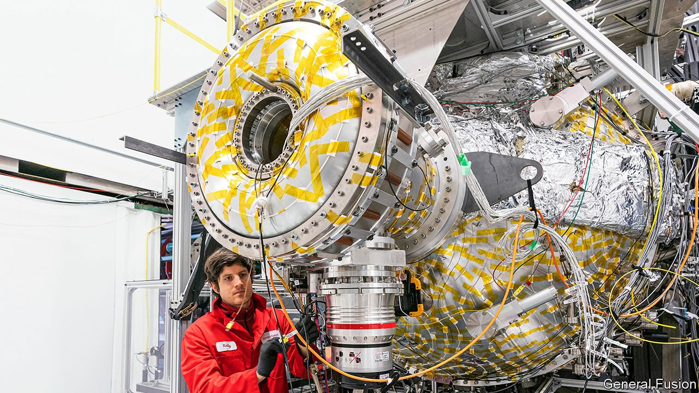
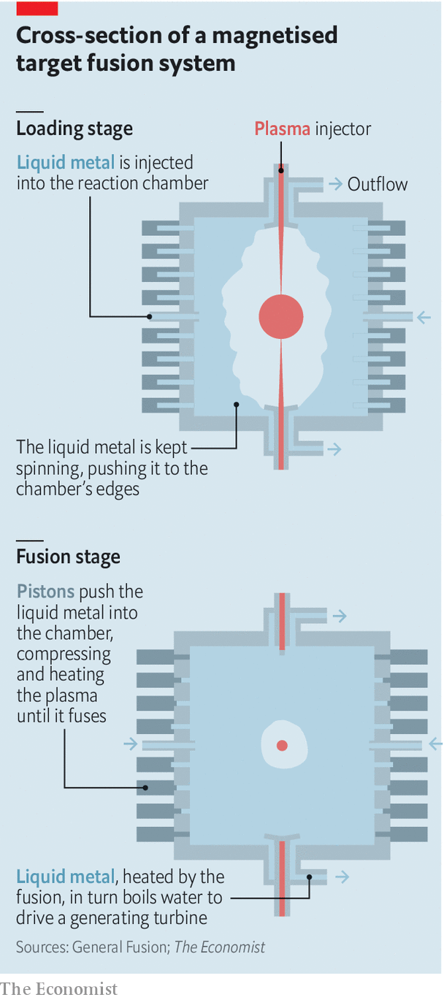
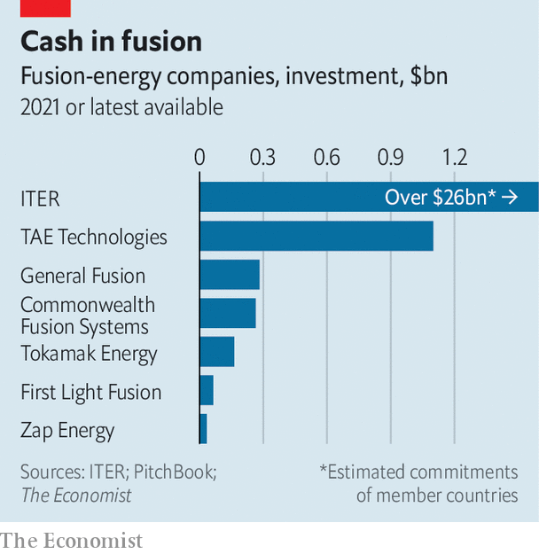

###### Fusion power

# The race to build a commercial fusion reactor hots up 

##### A Canadian firm plans a demonstration machine in Britain 

 

> Jun 24th 2021 

AN OLD JOKE about nuclear fusion—that it is 30 years away and always will be—is so well-known that The Economist’s science editor forbids correspondents from repeating it. No one doubts sustained fusion is possible in principle. It powers every star in the universe. Making it work on Earth, though, has proved harder. Engineers have tried since the 1950s, so far without success. The latest and largest attempt—ITER, a multinational test reactor in southern France—has been under construction for 11 years and is tens of billions of dollars over its initial, $6bn budget.

But that record does not dismay a growing group of “alternative fusion” enthusiasts. Through a combination of new technology and entrepreneurial derring-do they hope to beat ITER to the punch. On June 17th one of their number, a Canadian firm called General Fusion, put its investors’ money where its mouth is. It said it would build a demonstration reactor, 70% the size of a full-blown commercial one, at Culham, the site of the Culham Centre for Fusion Energy, Britain’s national fusion-research laboratory. Like ITER, it hopes its reactor will be up and running by 2025.


Power play

On paper at least, fusion is attractive. Existing nuclear plants rely on fission—the splitting of heavy atoms, usually of uranium, into lighter ones. The energy thus liberated is used to boil water into steam, which then turns turbines that make electricity. Fusion plants attempt to do the opposite, generating heat by combining light atoms to make heavier ones.

Unlike coal or natural gas, fusion would produce no planet-heating carbon dioxide. Unlike solar panels and wind turbines, fusion plants could operate in any weather. Unlike fission plants, they pose no risk of spreading nuclear-weapons technology, and should generate much less radioactive waste. They offer safety, too. “I like to say that fission is easy to start and hard to stop,” says Christofer Mowry, General Fusion’s boss. “Fusion is the opposite.”

Fusion is hard to start because it requires extreme conditions. Most Earthly fusion reactors aim to combine deuterium with tritium. (Both are isotopes of hydrogen, in which the single proton in that element's nucleus is joined by either one or two neutrons.) Protons have a positive electrical charge, and like charges repel. Persuading two atoms to join forces therefore means overcoming this repulsion. And that requires a great deal of energy.

General Fusion’s idea is to forge a middle path between two existing approaches, magnetic-confinement fusion (MCF) and inertial-confinement fusion (ICF), with less need for heroic engineering than either. ITER is a doughnut-shaped type of MCF reactor called a tokamak. It is intended to use carefully controlled, high-intensity magnetic fields to heat a hydrogen plasma to hundreds of millions of degrees Celsius, and then hold that plasma stable while its atoms combine. The trick is to control the fields precisely enough to keep the super-hot plasma together for long enough to allow a significant amount of fusion to happen. The present record, held by an experimental reactor in France, is six-and-a-half minutes. ITER’s goal is a reaction that lasts up to ten minutes.

ICF forgoes finicky magnetic fields in favour of super-powerful lasers. Experiments like the National Ignition Facility, in California, use carefully timed pulses to smash fuel pellets from all sides, heating them to temperatures similar to those in MCF plants, but also compressing them by the application of billions of atmospheres of pressure. Thanks to this crushing pressure, fusion happens much more quickly. The hope is that, one day, a useful amount of energy can be produced and harvested in the tiny fraction of a second before the zapped pellet blows itself apart. Once again, though, properly controlling the lasers and ensuring that the pellet is evenly compressed has proved tricky.

General Fusion calls its own approach “magnetised target fusion”. The basic concept dates back to the 1960s. The firm’s reactor, says Mr Mowry, does away with magnetic confinement by using powerful electric pulses to create self-stabilising blobs of plasma that are injected into the reactor’s core. He compares this to blowing a smoke ring, in which the air currents within the ring allow it to maintain its shape for a few seconds before it dissipates.

The puffs of plasma actually last around 20 milliseconds. That would not be long enough to extract much energy were they to be injected into an MCF reactor. But it is long enough for them to be compressed, as in an ICF machine—and by something far less exotic than banks of advanced lasers. The core of General Fusion's British reactor will be lined with molten lithium and lead. Once a puff of plasma has been injected, ranks of gas-driven pistons will compress the core, changing it from a cylinder to a sphere and drastically boosting the fusion rate (see diagram).

 


But while laser compression happens in mere billionths of a second, General Fusion's takes thousandths—comparable with the timescales on which internal-combustion engines operate, and well within the capabilities of digital electronics to fine-tune. The upshot, the firm hopes, is a reactor which should be cheaper and simpler to build and operate than either an MCF or ICF machine.

Critical mass

Besides compressing the plasma, the liquid-metal jacket serves to capture the energy from the reaction. Heated metal will be piped to a heat exchanger and used to raise steam. Neutrons from the fusion reaction, meanwhile, will transform some of the lithium into more tritium fuel, which would otherwise be rare and expensive. Or at least, it will one day. General Fusion's demonstration reactor will only fuse deuterium with deuterium, to keep things simple.

Still, the firm hopes that a full-fledged commercial reactor—which might be built in the early 2030s—could compete with other forms of electricity. It is aiming at a cost of $50 per megawatt-hour, which Mr Mowry says ought to make it competitive with coal. Renewable energy may prove cheaper, he concedes, but it is hampered by intermittency. And the plant will have one more advantage over existing, fission plants, the electricity production of which cannot quickly be raised or lowered. General Fusion’s reactor can increase or decrease power output ten-fold by changing the speed at which the core cycles. That should allow it to “load-follow”, ramping up production when electricity prices are high and cutting back when they are low.

And General Fusion is not the only firm pursuing commercial fusion. On April 8th TAE Technologies, a rival based in California, which was founded in 1998, said it had raised $280m for a demonstration reactor of its own, bringing the total invested in the firm to $1.1bn (see chart). Like General Fusion, TAE relies on puffs of self-stabilising plasma. Unlike General Fusion, it aims to produce electricity by combining hydrogen with boron, a process that needs temperatures of billions of degrees, but which should require less radiation shielding.

 


General Fusion’s other rivals include two British firms, First Light Fusion and Tokamak Energy, both based near Culham, and a pair of American ones, Commonwealth Fusion Systems and Zap Energy. Nor are governments putting all their eggs in the ITER basket. The Max Planck Institute for Plasma Physics, a German government agency, is trying to build a power station based on a device called a “stellarator”—a twist on the MCF approach. Its Wendelstein-7X device began working in 2015. And the Culham Centre for Fusion Energy’s STEP reactor, scheduled to open in 2040, is intended to demonstrate the commercial practicality of fusion. One reason General Fusion chose Culham, says Stephen Dean, who runs Fusion Power Associates, a research and education foundation which covers the field, is that this lab has a focus on getting to market quickly.

For his part, Dr Dean sees no fundamental reason why one or more of the current crop of contenders should not succeed in building a reactor that generates useful quantities of energy. But it is economics, not physics, that will have the final word. High-tech fusion reactors, assuming they are ever built, will have to compete in a world in which the price of solar and wind power is falling steadily. Fossil-fuel companies, meanwhile, are trying to work out how to capture and bury the carbon dioxide emitted from their power stations. Advanced fission reactors are attracting private interest of their own—on June 2nd TerraPower, a firm backed by Bill Gates, a founder of Microsoft, announced plans for a high-tech nuclear plant in Wyoming. All that competition is good news in a warming world. But it promises a white-knuckle ride for investors. ■

A version of this article was published online on June 23rd 2021

