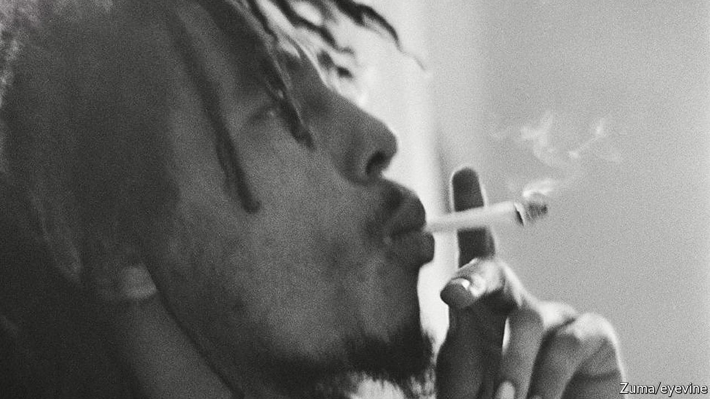

###### Puffalo soldiers

# Bob Marley’s heirs boost Jamaica’s ganja industry 

##### But islanders are waiting in vain for rules that will satisfy their souls 

 

> Jun 26th 2021 

HE WAS HARDLY a capitalist icon. When Bob Marley died in 1981, at the tragically young age of 36, his final words were, apparently, “Money can’t buy life.” But on June 7th his estate, managed by several of his children, announced that money can buy some of the Rastafarian lifestyle—and that this year the Bob Marley museum in Kingston would become one of several “herb houses” in the capital where people can buy its brand of ganja for therapeutic use. The estate’s cannabis brand, Marley Natural, offers various herbs and vapes, including the reggae singer’s favourite strains of pot, “famously blessed with transcendent positivity”. The venture is backed by American investors.

For years Jamaicans have been getting up and standing up for their right to smoke ganja. But it was only six years ago that the island decriminalised the possession of small amounts of cannabis for recreational use and made growing five plants at home perfectly legal. Since 2015 it has also allowed medical, therapeutic, sacramental and scientific use. The law stipulates that any cannabis-related business must be half-owned by Jamaicans.


Large-scale cultivation for recreational use remains illegal, partly because the government is wary of stirring it up with the heart of America. “We didn’t want to be a pariah, so we had to tread carefully,” says Norman Dunn, a minister who chairs the Cannabis Industry Development Taskforce. The law is widely disregarded, however. Jamaica is the largest source of illegal marijuana in the Caribbean; some of that will go to the United States, too.

So the country finds itself in the odd situation of waging war on drugs while simultaneously trying to capitalise on tokes. In the first nine months of 2020 it seemed as if everywhere was war: Jamaican police burned 253 hectares of cannabis plants and seized 26 tonnes of cured marijuana. By contrast Nevada, where recreational use is legal, collected $188m in taxes from cannabis last year.

Red tape is another come-down. Until recently not a single commercial export licence had been granted to ship medical marijuana to European countries where it is legal. Some companies went to Colombia rather than jumping through endless hoops in Jamaica, claims Rory Liu, who got the country’s first processing licence.

The biggest blunder has been the failure to establish a way for local farmers to move away from the illegal industry. Licence fees can be up to $10,000. Then there is the extra cost of security guards and video cameras, says Triston Thompson, a cannabis consultant. Wealthy Jamaicans and foreigners can afford the start-up costs. But Jamaica’s edge comes from a reputation for the quality of plants lovingly reared by Rasta and Maroon growers. If they could more easily cultivate and process ganja legally, then a thriving Jamaican cannabis industry might become more than just a pipe-dream.■

