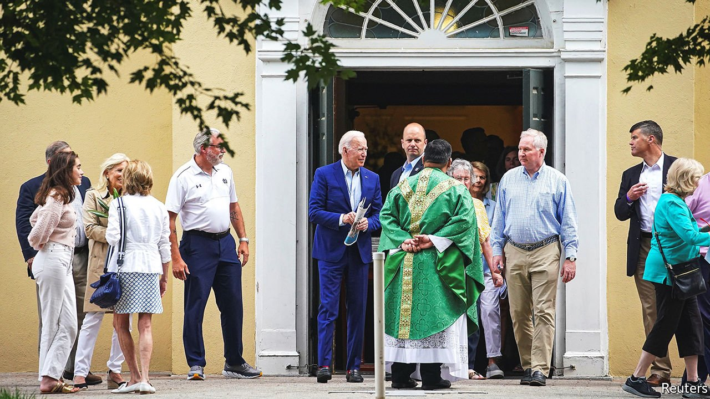

###### Biden and the bishops

# American bishops want to deny Joe Biden Catholic holy communion 

##### If that leads to a smaller church, some would not mind 

 

> Jun 24th 2021 

WHILE CAMPAIGNING in South Carolina in October 2019, Joe Biden went to mass, as he does every Sunday. But he was not allowed to receive holy communion at St Anthony’s Catholic church. Father Robert Morey later explained that he had to refuse Mr Biden: “Any public figure who advocates for abortion places himself or herself outside of church teaching.”

Many American bishops want to formalise this sort of action. The United States Conference of Catholic Bishops voted to draft a statement examining the “meaning of the eucharist in the life of the church”, a decision made public on June 18th. It could allow bishops to deny communion to Catholic politicians who support abortion. According to the reports of the contentious debate preceding the vote, Mr Biden was referred to or alluded to several times during the debate. Despite assertions by Bishop Kevin Rhoades of Indiana that it was not a single issue or driven by a single person, it rather clearly was.


Mr Biden is only the second Catholic president, after John Kennedy. Like some other recent presidents, such as George W. Bush and Jimmy Carter, he is deeply religious. He attends mass regularly and even considered the priesthood. Having such a devout Catholic in the White House raises the stakes for the American church’s conservative wing. Michael Pfeifer, a retired bishop from Texas, said Mr Biden’s policies are akin to “infanticide”.

Another Texan bishop, Robert Coerver, said: “I can’t help but wonder if the [election] years 2022 and 2024 might be part of the rush and I think we need to be careful not to get embroiled in the political situation.” Too late. The bishops have “become totally identified with Republican political culture, which has made abortion the symbol of the culture war,” says Massimo Faggioli, author of the book, “Joe Biden and Catholicism in the United States”.

Two-thirds of American Catholics think Mr Biden should be allowed to receive communion, according to a poll from the Pew Research Centre. The vote shows the gap between church hierarchy and its flock. Yet for some conservative bishops this is no great concern. As Charles Chaput, Philadelphia’s former archbishop, said in 2016, “We should never be afraid of a smaller, lighter church if her members are more faithful, more zealous.”

Denying someone the eucharist is rare. When John Kerry ran for president in 2004, some bishops wanted to deny him communion, but never did. The latest dispute has sharpened the rift between the American church and Rome. The Vatican issued a letter telling the American bishops to back off. They ignored it. Meanwhile, politicians who favour the death penalty (which Pope Francis wants abolished) face no such sanction from the church.

Stephen Schneck of the Franciscan Action Network, an advocacy group, who does not approve of abortion, cannot see the point of this measure. The Vatican will not approve it. It is unlikely to shame Mr Biden into reversing his stance. Wilton Gregory, archbishop of Washington, DC, has said he will not deny Mr Biden communion. John Carr, a former spokesman for the Conference now at Georgetown University, a Catholic institution, believes that “we would all be better off if the bishops walked away from using the eucharist as a punishment.” ■

For more coverage of Joe Biden’s presidency, visit our dedicated 

