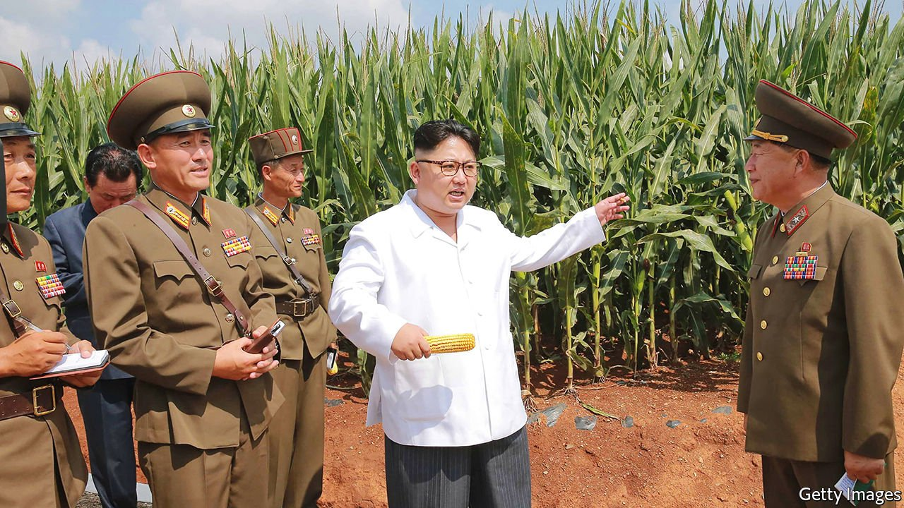

###### Taking back control

# Kim Jong Un rediscovers his love of central planning 

##### The dictator is cracking down on North Korea’s small market economy 

 

> Jul 3rd 2021 

THE NORTH KOREAN dictator’s love of high-end products from evil capitalist countries is well documented. The import of luxury goods into North Korea has been banned by UN sanctions since 2006. Yet Kim Jong Un parades around Pyongyang in a million-dollar Maybach car, drinks rare whiskies and has a magnificent yacht moored off Wonsan, a seaside resort whose beaches Donald Trump correctly identified as prime property when the two men held a summit in Singapore three years ago.

For a while Mr Kim had seemed inclined to let his subjects have a taste of the good life, too. He said in 2013 that economic prosperity was just as important as military might. He tolerated grey markets and expanded the freedoms of farmers and of managers of state enterprises. The result was modest economic improvement, both for the privileged and ordinary people. That experiment appears to have been short-lived. Entrepreneurial freedoms are being curtailed. State media and party economists have returned to the familiar old rhetoric of autarky and central control. Combined with pandemic-induced isolation, the economic effects of re-centralisation are likely to be disastrous.


North Koreans began to set up grey markets to avoid starving to death when the public-distribution system collapsed in the 1990s. Mr Kim’s father, Kim Jong Il, tried to dismantle the grassroots marketisation. Mr Kim mostly let them be.

Reforms implemented by Mr Kim in 2014 gave some farmers and state enterprises a few freedoms. As long as they paid taxes they were allowed to decide what to produce, set their own prices, trade with the outside world and find their own staff and suppliers. The reforms legitimised the activities of a new class of donju, or “money men”, who nominally work for the state but function like businessmen. Some spent their cash in newly opened coffee shops, cocktail bars and foreign restaurants in Pyongyang, the capital.

None of this led to any loosening of government control in other areas. Even as money-making was welcomed, border controls were reinforced, prison camps expanded and political crimes ever more harshly punished. That hard line continues. Over the past few months Mr Kim has taken a renewed interest in people’s private lives, condemning “anti-socialist” tendencies in areas such as music and fashion (which he regards as too heavily influenced by the decadent southern neighbour) and lecturing women on how to look after their husbands and children properly.

The money men seem to have started to worry Mr Kim, too. In 2018, at the height of the regime’s detente with America, it revoked managers’ overseas trading rights and re-established control over export prices. Since then state media have called for more central control over investment and jobs in the name of fighting corruption. They also argue for the restoration of state control over the food supply and the revival of the public distribution system. Economic journals with ties to the ruling party have published guidance which reinterprets the reforms of 2014 to eliminate any market-friendly elements. “Managers are still supposedly in charge of designing products, signing supplier contracts and setting prices, but they have to do it all under the purview of the state,” says Peter Ward of the University of Vienna.

Propaganda organs argue that the changes are supposed to prioritise the interests of the masses over those of money-grubbing traders. But there are other explanations. One is that controlling state enterprises and substantial amounts of foreign currency gives people power. Mr Kim may be worried that the donju are growing too big for their boots. Another is that the reforms have not improved the economy as much as hoped, perhaps because the easing of sanctions that was meant to go with them never came. The state may be trying to get a bigger slice of a shrinking pie.

Small traders and donju will probably resist the attempts to take away their powers. Mr Ward believes that marketisation has gone too far in most areas to be rolled back entirely. But even the attempt could be damaging. Expecting businesses to produce according to state planning rather than market demands means resources are more likely to be misallocated. Opportunities for innovation will decline too.

The covid-19 pandemic has not helped. Except for two brief revivals of trade last summer and earlier this year, the border has been closed since January 2020. Traders who have tried to import or export goods anyway are punished as “smugglers”, according to reports by Daily NK, a specialist news service in Seoul with sources in the North.

The economic situation continues to deteriorate. Food prices fluctuate wildly and increasing numbers of people are going hungry. In June Mr Kim, who has shown unusual contrition for his people’s suffering ever since the pandemic began, admitted that the food situation was “tense” but said that the border would remain closed to keep out the virus. This week he called a politburo meeting to chastise and dismiss senior officials who had neglected their pandemic-fighting duties. The whole thing appears to be taking a toll on the leader. Observers have noted that the usually well-fed despot looked lighter during his most recent public appearances. North Korean state media rolled out locals who said they felt “heartbroken” at Mr Kim’s “emaciated” state.

In theory, the dire situation should provide an opening for re-engagement with the outside world. South Korea has repeatedly offered to send food aid and, more recently, vaccines. Sung Kim, America’s special envoy for North Korea, said during a visit to Seoul in June that he is willing to meet his counterpart “anywhere, anytime, without preconditions”. North Korea has publicly rebuffed all overtures. Mr Kim’s slightly less corpulent appearance suggests not so much a sense of crisis as that, as always, he is looking after himself.■

