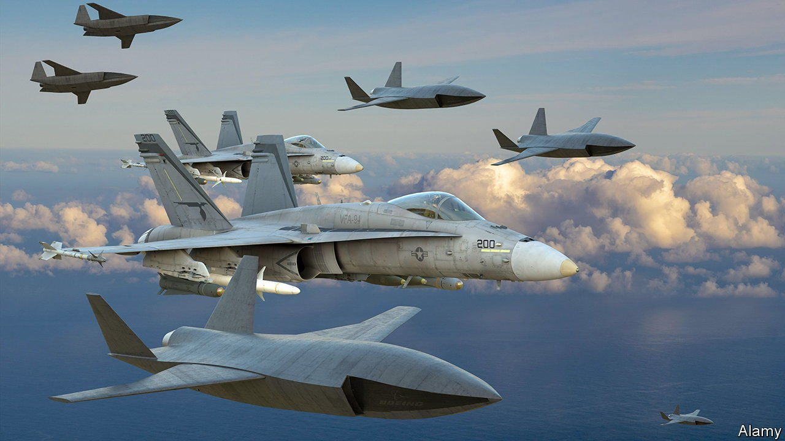

###### The future of war

# A thought-provoking reflection on how AI will change conflict 

##### Algorithms may make proficient soldiers but poor generals 

 

> Jul 3rd 2021 

I, Warbot. By Kenneth Payne. Oxford University Press; 336 pages; $29.95. Hurst; £20

THE UN’S Panel of Experts on Libya rarely grabs the headlines. But its valedictory report in March caused a furore. It noted that in a battle around Tripoli last year, Libya’s government had “hunted down and remotely engaged” the enemy with drones—and not just any drones. The Kargu-2 was programmed to attack “without requiring data connectivity between the operator and the munition”. The implication was that it could pick its own targets.


Was this a true autonomous weapon, or just a clever missile? In June the Turkish manufacturer insisted that, contrary to its own marketing, for now the drone required a human to push the button. This sort of technology is at the heart of “I, Warbot” by Kenneth Payne, a thought-provoking reflection on how artificial intelligence (AI) will change conflict.

In some ways, the story is familiar. It involves the entwined histories of computing and warfare; the recent evolution of new, powerful forms of AI modelled on the neurons of the brain rather than the logic of the mind; and the ensuing possibilities for weapons to see what is around them—and strike with superhuman speed and precision. Mr Payne, an academic at King’s College London, is especially bullish on the potential of swarms, “a menagerie of specialist robots” that can concentrate to attack and melt away just as quickly.

“The tactical implications are profound,” he predicts. The offence will dominate. Defenders will have to rely on deception, generating clouds of decoy targets, rather than on protections like armour and fortification. Martial virtues such as courage and leadership will give way to technical competence. Dividing armed forces into services optimised for land, air and sea may look increasingly strange in a world of machines that can range across them.

Above all, though, “I, Warbot” is a reminder that war is about more than tactics. It is about choosing which battles to fight, how to knit them into a successful campaign and how to connect military victories to political aims—in short, war is about strategy. And soldiery and strategy are fundamentally different. Computer programs can already defeat human pilots in simulated dogfights. But could they come up with the bold, swift and visionary attacks that let Napoleon Bonaparte knock out one European army after another?

Algorithms can certainly outwit opponents in games that blend skill, chance and psychology. In 2017 Libratus, a computer program, saw off four poker stars. AI can also innovate: in 2016 AlphaGo, another program, thrashed a world champion of Go, an ancient Chinese board-game, with moves that dazzled onlookers.

But, argues Mr Payne, this is a simulacrum of genius, not the real thing. These gizmos exhibit “exploratory creativity”—essentially a brute-force calculation of probabilities. That is fundamentally different from “transformational creativity”, which entails the ability to consider a problem in a wholly new way, and requires playfulness, imagination and a sense of meaning. All that may depend on emotion, and thus on parts of human biology alien to computers. “AI is a statistical processor par excellence”; but in essence it remains “a wonderfully sophisticated abacus”.

A proficient soldier, the warbot may thus be a limited general. The problem is that the line between tactics and strategy can blur. Battlefield decisions can have geopolitical ramifications. Consider the case of B-59, a Soviet submarine pounded by American depth-charges during the Cuban missile crisis of 1962. The frazzled captain ordered the use of a nuclear-tipped torpedo. Conscious of the stakes, Vasily Arkhipov, the second-in-command, refused to authorise the launch.

Would a computer have done so? “A warbot is likely to be more accurate, proportionate and discriminate” than humans, says Mr Payne. The risk is that “a machine is undeterred by the sobering fear of things getting out of hand.” ■

