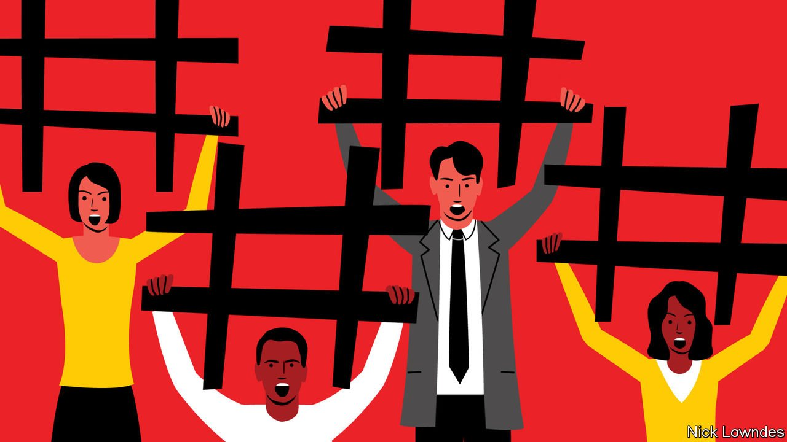

###### Johnson

# Culture-war terms can compress complex ideas in an unhelpful way 

##### In discussions of group differences and grievances, nuance is vital 

 

> Jul 3rd 2021 

IF YOU SET out to design a drearily predictable identity-politics ding-dong in a laboratory, you could do little better than the one that broke out in Britain on June 22nd. A parliamentary committee released a report into underperforming working-class white pupils. It was long and in places thoughtful, but one seven-paragraph section hogged all the attention after it was released.

That bit of the introduction fretted that the use of the phrase “white privilege” may harm poor white youngsters who, by definition, are nearer the bottom of the socioeconomic pyramid than the top. It argued that the term may lead to divisions among students and distract them from the real causes of their hardships. The appendices to the report reveal that four MPs, all from the opposition Labour Party, disagreed with this characterisation of “white privilege”. The other six, all from the ruling Conservative Party, approved of it.


As is often the case, the two sides of this debate seem to mean very different things by this concise but explosive term. Sensible folk who give credence to the idea of “white privilege” argue that, whatever their other problems, white people do not face the same race-based disadvantages as ethnic minorities, from the minor (a shopkeeper training a wary eye on them) to the more serious (teachers reflexively judging them to be less capable than they really are). But some sceptics of “white privilege” think it implies that every white person is privileged in an overall way—or even that, merely by existing, white people are complicit in the discrimination suffered by minorities. For some who interpret it this way, the concept is discredited by the existence of poor white people.

One reason the idea of “privilege” may be so divisive is that its meaning has shifted over time. Its first use was to describe special exemptions from religious law, given to very few. It was then extended to similar non-ecclesiastical privileges, and later to the general condition of being at the top of the socioeconomic pile, as in phrases such as “bastions of privilege”. The entry for the word in the Oxford English Dictionary includes only senses in which “privileges” accrue to a minority. The Economist’s style guide, following this logic, says the word “underprivileged” is an absurdity, as it is not normal or standard to be privileged.

In recent years, however, the word has been widely used to refer to the advantages enjoyed by the white majority in countries such as Britain and America. In the raging culture wars, “white privilege” is now among the many phrases lobbed like online grenades between opposing camps. Since the combatants cannot agree on what it means, it is not surprising that there is no consensus on whether it exists and what should be done about it.

It is not alone. To take another contemporary bugbear, consider “toxic masculinity”. To those who encounter this in passing, it may appear to mean something like “all masculinity is toxic”. This sounds like a counsel of despair, and naturally upsets plenty of men and boys.

For some feminists and others, though, the expression is really meant to highlight the influence of a certain, pernicious type of masculinity, in which men and boys compete to be dominant, and put each other down as well as keeping women in their supposed place. “Toxic masculinity” in its best sense thus points to the availability of other, more expansive and positive kinds. As commonly understood, it is just another blunt blast of identity politics.

The problem with these terms is their compression. They are signposts rather than arguments, only making sense in the context of more elaborate reasoning. Those who use them often seem to hope that the catchphrases invoke all the nuances of the underlying concepts. In the vituperative, tweet-length exchanges that now pass for political debate, that is usually wishful thinking.

Good style requires omitting needless words. But talking about big demographic groups warrants patient, careful language, even at the expense of zingers. That may involve statistical caution, signalled with “on average” and the like; after all, variation within groups (white people, men) is often greater than between them. That fact may not be headline-friendly, but it bears repeating in every discussion of grievances and difference. If you think a concept like white privilege has some validity, best to explain carefully what you mean by it, and what you don’t. If you do that, you might find that you no longer need those combustible buzzwords after all.

