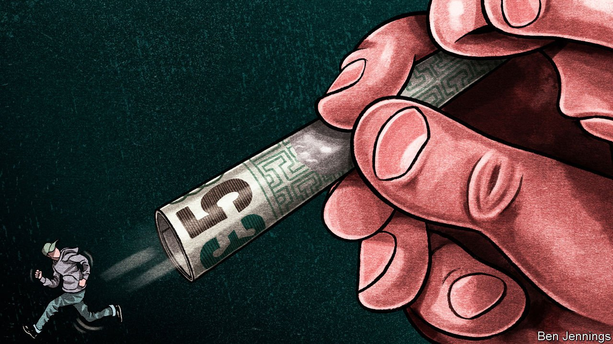

###### Dealing, with stress

# Drug-dealers are finding the always-on culture a chore 

##### Information technology makes it hard for them to switch off 

 

> Jul 1st 2021 

THERE ARE many reasons to avoid a career as a drug-dealer. The industry offers erratic career progression, no pension and low average earnings. Despite a few notable success stories (Pablo Escobar earned enough to enjoy a private zoo with hippos), one often-cited American study found that lower-ranking dealers averaged a meagre $3.30 an hour ($5.80 in today’s money), a lower wage than cleaners. Now there is another reason to just say no: workplace stress.

In conventional business, “you are always anticipating with anxiety the email from your boss that is going to blow up your weekend,” says James Densley, a criminologist at Metropolitan State University in Minnesota, who spent years researching gangs in London. Now the always-on culture has reached drug-dealing, and particularly gangs. It has brought with it the same online monitoring techniques used to track delivery riders and warehouse workers, such as GPS tracking, location tags and demands from the boss for frequent check-ins. “The anxiety that we feel as adults in the workplace is sort of amplified,” says Mr Densley. For dealers, “it’s not ‘get down here or you’ll be fired.’ It’s ‘get down here now or you’ll be stabbed.’”


The “toad work” has always squatted on life. Philip Larkin complained that his toad soiled six days of the week, but then the poet didn’t have a smartphone. In the always-on world, more than ever before, workers are struggling to switch off. Increased connectivity, a fashion for “extreme working”—more than 50 hours a week—and now the pandemic have enabled the toad to triumph at all hours. Figures from the Office for National Statistics show that those who work from home are likely to do more overtime and work later into the night than those who go out to work.

As so often, the digital revolution has intensified existing industry problems. Online ordering of everything from pizzas to cocktails to ketamine is flourishing. This is good news for customers, who can cater for a lively evening from their sofa with increased comfort and, arguably, quality. With ketamine, as with cocktails, online ratings seem to nudge the market into performing better.

But as delivery riders and warehouse workers might argue, what is good for customers is not always good for workers. Like the narcotics equivalent of call-centres, drug bosses micromanage their workforce with WhatsApp, impromptu FaceTime calls and “find my phone” apps. Fifteen years ago, says Mr Densley, “if you sent somebody to go deal drugs somewhere you had no real way of checking in on them.” But now you can FaceTime and ask your underling to show you their location on their phone, or demand regular check-ins, he says. “There is never a break. You are always on…always at the beck and call.”

As a result, dealers are feeling under pressure and overwhelmed. Liam, a part-time, on-and-off dealer from the south of England (the name is assumed), says the job consists of “being harassed, basically, all the time”. He has returned to college—though the pressures of connectivity have followed him there. In the past year his lecturers have adopted Zoom and other online teaching methods. “Now, my lecturers can message me whenever they want,” he says. Of the two careers, he considers that “definitely education is more stressful”.

