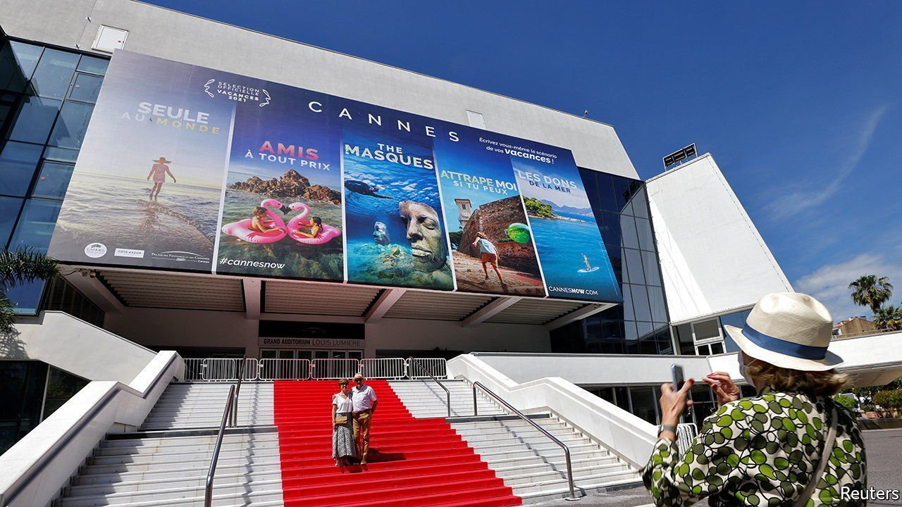
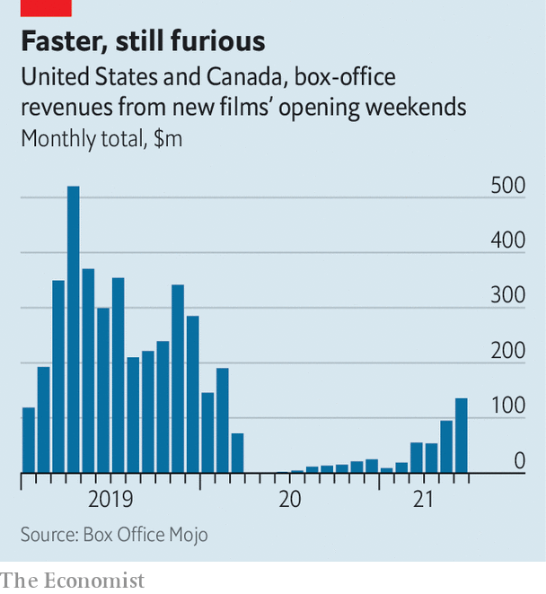

###### Curtain-raiser

# Cannes kicks off a brighter blockbuster season 

##### Backstage, things look bleaker 

 

> Jul 1st 2021 

LAST SPRING at the Palais des Festivals in Cannes couture-clad film stars gave way to camp beds and showers. When France went into lockdown and the city’s film fete was postponed, then cancelled, the glitzy events space became a homeless shelter. This year’s bash, which begins on July 6th, offers a dose of Hollywood escapism. Screenings will be indoors, at full capacity. Stars will strut the red carpet (with designer face-masks and whiff of disinfectant the only giveaways). Yet backstage, covid-19 has changed the film business for good.

Few industries were hit as hard. In 2020 global box-office takings fell by 80%, to $7.9bn. Still, the show has gone on. In China, the world’s biggest market, theatres are nearly as busy as in 2019. Though America’s reopening has been slower, “F9”, the latest “Fast and Furious” film released on June 25th, took $70m in the best opening weekend since 2019. A pile-up of delayed blockbusters, from Spiderman to James Bond, will tempt audiences to return all year.


Not all will, thanks to a choice of formats that was “unimaginable” before the pandemic, notes Robert Fishman of MoffettNathanson, a research firm. Previously, films spent about 90 days in cinemas before making it to DVDs or streaming. Covid-19 shattered this “theatrical window” and this year’s slate of releases suggests it is broken for good. Universal Pictures has the option to put “F9” online just 31 days after its cinematic release. Its new “Boss Baby” film will be free to watch on Peacock, its sister streaming platform, when it enters theatres on July 2nd. Paramount will release “Paw Patrol: the Movie” on its Paramount+ service next month on the same day that it hits cinemas. Warner Bros has said that all its films this year will stream simultaneously on its HBO Max service.

 


The five big Hollywood studios look poised to release about 40% fewer films exclusively in theatres than before the pandemic, reckons Mr Fishman. Had studios applied this new approach to their slate in 2019, 17% of America’s box-office receipts would have been cannibalised by streaming. For studios keen to promote their online platforms, this may be a price worth paying. For cinemas it is a straight loss.

“We’re in a box-office laboratory,” says Paul Dergarabedian of Comscore, a research firm. Disney, the biggest studio, is experimenting the most. Last month it sent “Luca”, a Pixar animation, straight to streaming on Disney+. In September it will give “Shang-Chi”, a superhero flick, 45 days in cinemas. The next big test is on July 9th, when “Black Widow” will launch simultaneously in cinemas and on Disney+ (for a surcharge), a first for a Marvel movie. Audiences will be on the edge of their seats. Studio executives still more so. ■

