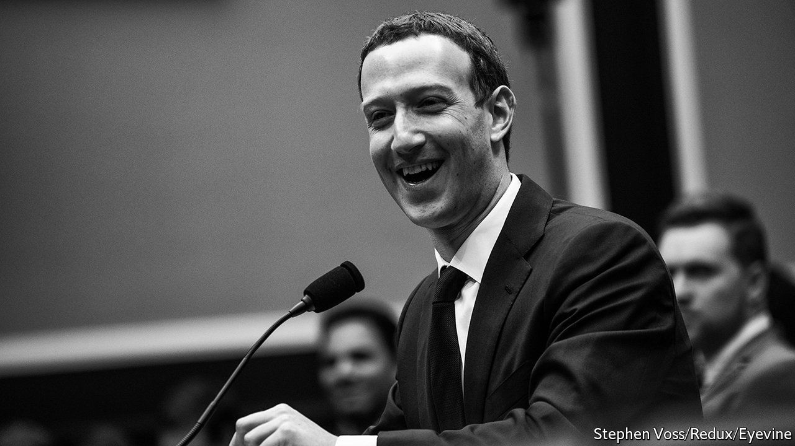
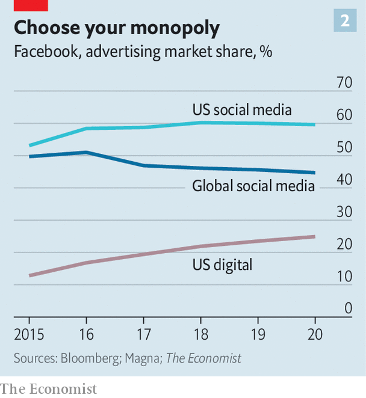

###### The defining issue of the day

# Is Facebook a monopolist? 

##### A judge rules there is no simple answer 

 

> Jul 3rd 2021 

AT LAST, IT’S happening. Or so big tech’s critics thought. President Joe Biden has named one of their own, Lina Khan, to head the Federal Trade Commission (FTC). A Congressional committee has approved six bills to rein in Alphabet, Amazon, Apple and Facebook. Then, on June 28th, a federal judge provided a heavy dose of realism by summarily dismissing two antitrust cases against Facebook.

The unexpected ruling, which sent Facebook’s market value past $1trn, was a reminder that, in America, the swelling “techlash” may yield meagre results (see chart 1). Judge James Boasberg—appointed by Mr Biden’s former boss, Barack Obama—threw out one of the cases, brought by 46 states, on a technicality. The complaint, which accused Facebook of acquiring nascent rivals, such as Instagram in 2012 and WhatsApp in 2014, to cement its social-networking dominance, was deemed too tardy. More profoundly, the judge found the second case, lodged by the FTC, “legally insufficient”. “It is almost as if the agency expects the Court to simply nod to the conventional wisdom that Facebook is a monopolist [in social-networking],” he wrote.


That indeed seems to be what the FTC expected. It asserted that Facebook has a “dominant share of the market (in excess of 60%)” without explaining what that market is. And it defined “personal social networking” to exclude things like professional networks (LinkedIn) or video-sharing sites (YouTube).

 


To give the FTC its due, delineating digital markets is devilishly tricky. Like Facebook, most social-media firms do not charge users, so the typical approach of looking at an industry’s consumer-derived sales is no use. Facebook does have paying customers, firms that buy ads on its platforms, but the extent of that market, too, is hazy. If all American online advertising counts, its share is 25%, according to an estimate by The Economist (see chart 2). Looking just at social-media advertising it does rise to 60% in America (though globally Facebook’s share is declining). But what qualifies as social media is amorphous, as features and rivals pop up and fizzle.

 


The judge conceded that Facebook has market power (“no one who hears the title of the 2010 film ‘The Social Network’ wonders which company it is about”) and he has given the FTC 30 days to show this more precisely. However, he also threw out one of the agency’s core claims. The FTC accused Facebook of stifling competition by blocking rivals from its platform. According to Supreme Court precedents, the judge pointed out, such conduct is legal: monopolists have no “duty to deal”.

That may make sense in the analogue world. Critics like Ms Khan argue that in the digital one, where dominant platforms look a lot like pipe-owning utilities, it amounts to a licence to kill competition. If more cases against big tech stumble—as may happen to those involving Apple and Google—that would lend weight to demands to reform antitrust laws. Even this may not be enough to get any of the six bills, or anything like them, passed by the gridlocked Senate. Despite a bipartisan consensus in Washington that big tech is too powerful, Democrats and Republicans are unlikely to agree on the details of what to do about it. ■

