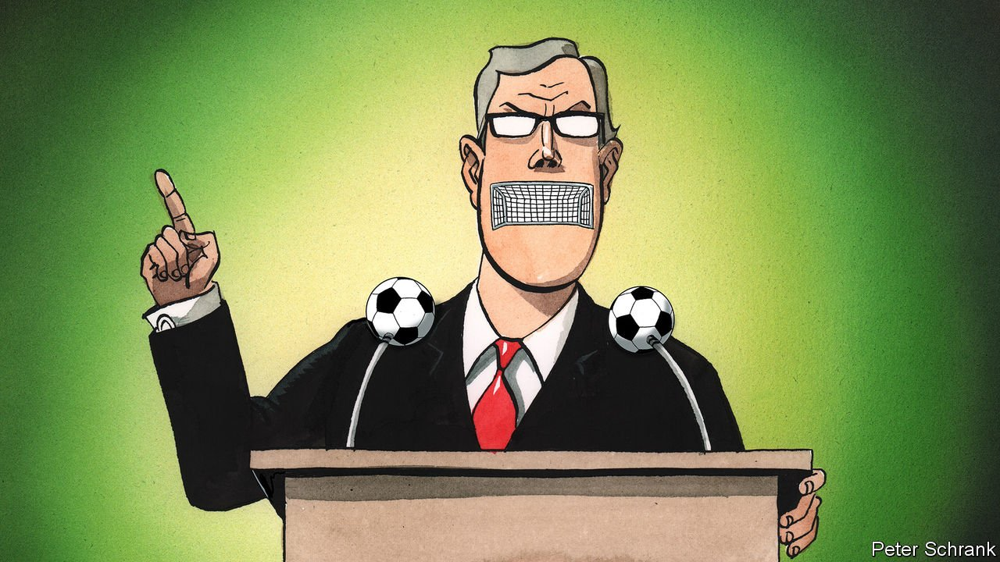

###### Charlemagne

# Euro 2020: politics by other means 

##### Why football can never escape politics at the European Championship 

 

> Jul 1st 2021 

ANY HOPE of a relaxing football tournament between friendly rivals disappeared in the 89th minute of a match between Austria and North Macedonia. Marko Arnautovic, a combustible Austrian striker of Serbian descent, slotted home the third goal in a 3-1 victory. He celebrated by screaming “I’m fucking your Albanian mother” at an opponent, knowing that North Macedonia is home to a large ethnic-Albanian population.

It was not the first such incident at Euro 2020, the delayed competition between 24 of Europe’s best national teams. Russia protested after Ukraine’s team wore kit with an outline of their country that included Crimea, which Russia annexed in 2014. In another game a Greenpeace protester sent debris spiralling onto people—nearly whacking the French manager—after misjudging his parachute landing. Rows about gay rights in Hungary, one of the hosts, rumble on. Before games some teams decided to take to their knees, to symbolise opposition against racism; others decided against. Some fans booed; others cheered. At Euro 2020, politics is everywhere.


Football, after all, is a potential ally of every ideology, a perfect canvas on which to project a worldview. Socialists can hail an industry in which nearly all the money goes to the workers. Statists can applaud how government-funded football camps on the edge of Paris churn out a stream of world-class footballers (albeit ones incapable of beating Switzerland). Capitalists point out that the sport’s explosion came thanks to free markets, allowing footballers to play wherever they liked and clubs to pay whatever they pleased. Autocrats are reminded that ends trump means, as football fans accept glory no matter how dodgy the money that bought it. Conservatives, meanwhile, can hold onto the sport as the last stand of the nation-state. Where there is attention there is politics, and football is simply too big to ignore.

In Europe the sport has always been political with a small “p”. Football offers a more glamorous story of European integration than the lawyers and officials grinding the continent together in Brussels and Luxembourg. UEFA, the sport’s administrator on the continent, started life in 1954 as European politicians were scouting for means to make war impossible. Like its duller sibling, the European Coal and Steel Community, which preceded the EU, UEFA’s main creator was a Frenchman who had to win over holdouts and sceptics for his idea of regular international events. (Typically, British teams skipped the first few tournaments, only joining later.) There was a difference. Europe’s economies were melded together to stem competition between countries; UEFA was founded to promote it. An Italian official panicked that playing each other “risked exciting national passions” a decade after such passions had left millions dead. And national passions were indeed unleashed, thankfully in a much less deadly manner. Flags are waved and, occasionally, Albanian mothers are insulted, but in a pantomime of once fatal feelings. When it comes to European integration, football is the animalistic id to the EU’s rational superego.

Yet the global pre-eminence of European football is a product of that integration. The EU’s free-movement rules meant countries could no longer limit foreign labour. Domestic second-raters could be replaced with better, cheaper foreign players. The Bosman ruling in 1995 from the European Court of Justice let players leave a club without a release fee at the end of a contract. Wages shot up as clubs battled to attract players. TV cash poured in as the quality of the game improved. International owners, attracted by a mixture of prestige and reputation-laundering rather than profitability, bought up clubs. While Europe has slowly become a backwater for business in general, it is dominant in football. The top leagues are all in Europe, which has led to international success, too: European teams have won five of the past six world cups. For a continent obsessed with its shrinking place in the world, football offers an arena where it is still supreme.

UEFA tries to create a politics-free environment for its lucrative tournaments. But its choice of sponsors has already ruled that out. Many Europeans have probably not heard of Nord Stream 2, a controversial pipeline running from Russia to Germany, which has set Angela Merkel’s government against both her eastern neighbours and America. Yet they may know Gazprom, the Russian state-owned gas company helping to build it. It sponsors both the Champions League, where elite European clubs compete, and Euro 2020. Its azure logo gleams from every surface. In exchange for its money, Gazprom receives a glut of corporate tickets, allowing executives and business partners to scoff canapés and mingle with dead-eyed models paid to attend. More importantly, sponsorship associates Gazprom primarily with football rather than being a limb of a gangster state. Even UEFA is keen on politics in football, for a price.

Life or death? It’s much more important than that

On a continent where the facets of nationhood are disappearing, be they banal (customs arrangements), the everyday (currency) or the emotive (borders), football is a way of clinging on. Belgian national identity extends to a king, a large pile of debt and its surprisingly good football team. A hipster analysis of Croatia’s path to independence starts with Dinamo Zagreb’s Zvonimir Boban aiming a flying kick at a Yugoslav policeman during an on-pitch riot in 1990 and ends with Davor Suker dinking Denmark’s goalie in Euro 96, its first tournament as an independent country. When Czechoslovakia won the championship in 1976, the team was dominated by Slovak players, kick-starting a successful push for independence, argues David Goldblatt, a historian of the sport. At its best, international football is a bastion of a benign, diluted nationalism; a place where politics can be a carnival, rather than a rally. At its worst, it is an arena where carefully buried political disagreements are dug up—particularly if Mr Arnautovic is playing. ■

