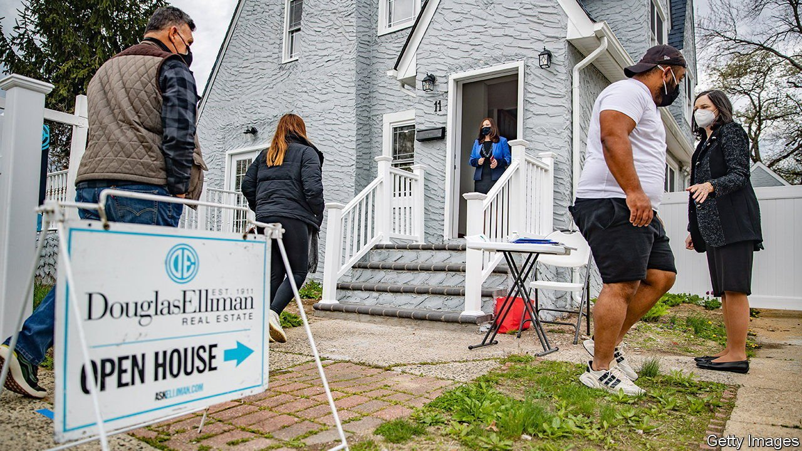

###### On the simmer

# Does America’s hot housing market still need propping up? 

##### Fed officials debate whether and when to taper support 

 

> Jul 1st 2021 

“TRULY EXTRAORDINARY.” That was how Craig Lazzara of S&amp;P Global, the firm that compiles a widely watched measure of house prices in America, described its reading for the month of April, released on June 29th. House prices rose by 14.6% year over year, the fastest rate in the 34-year history of the index (see chart, top panel). Houses listed for sale are on average snapped up in just 17 days, a record low. On Reddit, a social-media site, would-be buyers bemoan missing out on house after house because they are unwilling to forgo inspecting the property on which they plan to spend hundreds of thousands of dollars, something that most successful buyers are apparently doing.

The Federal Reserve still has monetary policy on ultra-loose mode. Interest rates are anchored at zero and the central bank is buying $120bn-worth of assets each month—$80bn of Treasuries and $40bn of mortgage-backed securities—in order to depress long-term interest rates. This stance is in many ways still justified. There are 7.6m fewer jobs in America than there were before the pandemic. A large minority of adults remains unvaccinated. And yet consumer-price inflation has climbed to an annual rate of 4.9%, and commodities and labour are in short supply. A real-time estimate of economic output compiled by the Federal Reserve Bank of Atlanta puts annualised GDP growth in the second quarter at a heady 8.3%. If true, America has recovered all the output lost during the pandemic and even added more.


The case of the housing market aptly illustrates how different corners of the economy are pulling the Fed along at different speeds, if not in different directions. The current property craze is at least in part spurred on by loose monetary policy. Low mortgage rates, which are a function of prevailing yields on mortgage-backed securities, tend to entice would-be homebuyers. Given that the housing market is already fired up, it might seem odd that the Fed is juicing it further by buying mortgage-backed securities and suppressing mortgage rates.

 


Even some Fed officials are discomfited by this turn of affairs. In an interview with the Financial Times on June 27th Eric Rosengren, the president of the Boston Fed, said that America could not afford a “boom-and-bust cycle” in the housing market that would threaten financial stability. He is not alone. Robert Kaplan, the head of the Dallas Fed, has said that there are “some unintended consequences and side-effects of these [mortgage-backed-security] purchases that we are seeing play out”, including contributing to rocketing house prices. James Bullard, the president of the St. Louis Fed, told CNBC on June 18th that “maybe we don’t need to be in mortgage-backed securities with a booming housing market.”

At the Fed’s monetary-policy meeting on June 15th and 16th Jerome Powell, its chairman, made clear that the central bank is not yet ready to stop buying assets, but has begun to discuss when might be appropriate. One option might be to do what Mr Rosengren called a “two-speed taper”, slowing mortgage purchases more quickly than purchases of Treasuries. If housing needs less support than the wider economy this seems a sensible step. The Fed has already begun to offload corporate bonds bought through an emergency programme launched in spring 2020, because the liquidity crunch that prompted intervention has abated.

A two-speed taper probably would not dent the housing market by much. For a start, the heat seems also to reflect a fall in supply during the pandemic, rather than low rates alone. And in any case, it is not as if the mortgage-backed-security market operates in isolation from broad monetary conditions. Yields tend to closely track those of Treasuries, even when the Fed is not buying up assets (see chart, bottom panel). If the central bank is not ready to tighten monetary policy yet, then a hot housing market might be a side-effect it has to live with. Still, it probably does not need to egg property prices on. ■

A version of this article was published online on June 30th 2021

